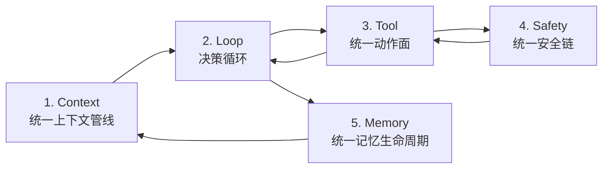

# SunshineX

通用 AI Agent 工程化骨架：云端大模型负责推理，本地负责编排、执行、安全与记忆。采用 Harness / Loop / Graph 三层嵌套范式，对标 Claude Code / OpenAI Codex / Hermes。

## 当前架构

核心是**统一运行时主链**——五个环节按数据流串联成闭环，单一数据流、无旁路，而非多套实现逻辑拼接：



```text
src/
  index.ts            # 运行入口（自动装载 .env）
  types.ts            # 全局共享类型
  config.ts           # SUNSHINE.md 解析
  config/env.ts       # 零依赖 .env 装载（已导出环境变量优先）
  result.ts           # Result 统一结果类型
  harness/            # 运行时底座（核心闭环已落地）
    index.ts          # Harness 门面
    perception.ts     # 项目感知（目录/依赖/SUNSHINE.md/Git）
    reactor.ts        # 最小闭环引擎（observe→think→act）
    tools.ts          # 工具注册表
    tools/builtin.ts  # 内置工具（read/write/grep/glob/exec）
    memory.ts         # 三级记忆（统一生命周期，经 context/memory-lifecycle）
    skills.ts         # 技能加载
    security/         # guard/policy/modes/sandbox/dryrun
    context/          # loader/rules/auto-memory/window/session
  loop/               # Loop 引擎（engine + 四类节点 + 三大模板，已实装）
  graph/              # DAG 编排（engine/agents/nodes/templates，已实装）
  model/adapter.ts    # 模型适配 + 三档算力路由
  storage/            # 本地 JSON 存储底座
  plugins/loader.ts   # 插件加载
  cli/                # CLI 执行面（selfcheck / run / pipeline）
```

分层依赖：`graph → loop → harness → model / storage / plugins`。Graph 节点可嵌入 Loop 子流程，二者都运行在 Harness 底座之上。

## 设计亮点

- **统一主链，而非能力拼接**：Claude Code 的指令分层/路径规则、Codex 的算力路由/多执行后端、Hermes 的持久记忆/自我验证，均被拆解为「能力本质」后映射到主链对应环节（Context / Loop / Tool / Safety / Memory），通过统一接口协同。
- **单一数据流、无旁路**：上下文只能从 Context 进、动作只能从 Tool 出、执行必经 Safety、记忆只走 Memory，每条验收可证伪（反例即不合格）。
- **工程纪律**：TypeScript strict、CommonJS、`node --test`、TDD 先行；依赖引入从克制不从封闭——优先 node: 内置，允许引入优秀且必要的第三方依赖（详见 CLAUDE.md 依赖引入原则）。
- **生产级底座**：项目感知、权限三态（deny→ask→allow）、dry-run、上下文窗口压缩（分块确定性 + checksum）、模型 SDK 可插拔。

## 最终产品形态（v1.0 个人开发者版）

- **三面入口**：CLI 基础执行面（已交付）+ 交互式 TUI（对标 Claude Code，v1.0 默认入口）+ Electron 桌面端（对标 Codex 工作台）；CLI 专项命令（`chat/edit/test/review/doc/run`）随阶段四扩展。
- **云本地分工**：任意 OpenAI 协议兼容供应商（`.env` 配置）负责推理，本地负责编排、执行、安全、记忆，数据可控。
- **三层能力全落地**：Harness 底座 + Loop 自主迭代（生成→校验→修正→终止）+ Graph 多角色协作编排。
- **生产级特性**：dry-run 预览、分级沙箱、三级持久记忆（技能/项目/用户）、MCP 协议兼容、审计回滚。

## 快速开始

```bash
corepack enable                  # 启用 Node 自带 corepack（pnpm 版本由 package.json 钉定）
pnpm install                     # 安装依赖（.npmrc 已固定 store 到仓内 .pnpm-store）
pnpm build                       # tsc 严格模式编译
pnpm selfcheck                   # 编译 + 骨架自检
pnpm start                       # 运行入口（自动从 .env 加载模型配置）
```

## Quick Start（CLI）

```bash
copy .env.example .env   # 填入真实 OPENAI_API_KEY（Windows；macOS/Linux 用 cp）
pnpm cli -- selfcheck                                   # 骨架自检
pnpm cli -- run tests/fixtures/demo --template test-loop --goal "修正 math.test.js 断言使其通过（验收标准：c1=断言 add(1,2)===3）"   # Loop 修正环（PowerShell/cmd 请保持单行）
pnpm cli -- pipeline tests/fixtures/demo --yes --goal "实现 add 函数并保证测试正确（验收标准：c1=math.test.js 断言 add(1,2)===3）"  # 全链路流水线（PowerShell/cmd 请保持单行）
```

需配置 `.env`（OPENAI_API_KEY / OPENAI_BASE_URL / OPENAI_MODEL，任意 OpenAI 协议兼容供应商）。CLI 与 `pnpm start` 启动时自动从当前目录装载 `.env`（已导出的环境变量优先，不被文件覆盖），无需手动 source。

## 文档导航

| 文档 | 内容 |
|------|------|
| `docs/Arch-Plan.md` | 架构设计方案与分阶段规划（原 README 全文） |
| `docs/PLATFORM.md` | 平台兼容性与部署条件（三平台矩阵、exec shell 解析、部署清单） |
| `docs/ROADMAP.md` | 开发路线图（6 阶段、28 周） |
| `docs/superpowers/specs/` | 设计 spec（阶段一底座 + 统一运行时主链） |
| `CLAUDE.md` | AI 协作规范 |
| `SUNSHINE.md` | 项目业务配置 |
