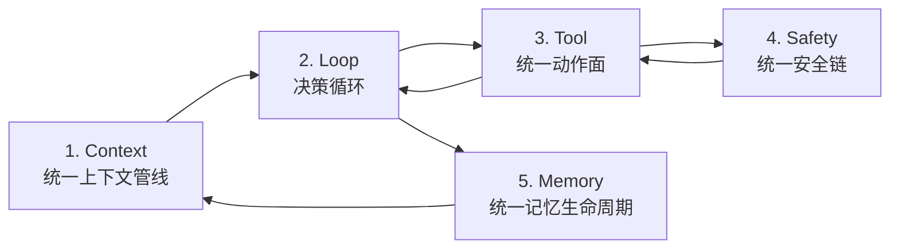

# SunshineX

通用 AI Agent 工程化骨架：云端大模型负责推理，本地负责编排、执行、安全与记忆。采用 Harness / Loop / Graph 三层嵌套范式，对标 Claude Code / OpenAI Codex / Hermes。

## 架构

核心是**统一运行时主链**——五个环节按数据流串联成闭环，单一数据流、无旁路：



```text
src/
  cli/       # CLI 执行面（selfcheck / run / pipeline；裸命令进交互终端）
  harness/   # 运行时底座：闭环引擎、工具面与内置工具、安全链、上下文、记忆、技能、MCP、子代理、知识库
  loop/      # Loop 引擎（生成→校验→修正）
  graph/     # DAG 多角色协作编排
  model/     # 模型适配 + 三档算力路由
  config/ storage/ plugins/   # 配置装载、存储底座、插件加载
```

分层依赖：`graph → loop → harness → model / storage / plugins`；Graph 节点可嵌入 Loop 子流程，二者都运行在 Harness 底座之上。文件级结构详见 [CLAUDE.md](CLAUDE.md)。

## 设计亮点

- **统一主链，而非能力拼接**：Claude Code 的指令分层/路径规则、Codex 的算力路由/多执行后端、Hermes 的持久记忆/自我验证，均被拆解为「能力本质」后映射到主链对应环节（Context / Loop / Tool / Safety / Memory），通过统一接口协同。
- **单一数据流、无旁路**：上下文只能从 Context 进、动作只能从 Tool 出、执行必经 Safety、记忆只走 Memory，每条验收可证伪（反例即不合格）。
- **工程纪律**：TypeScript strict、CommonJS、`node --test`、TDD 先行；依赖优先 node: 内置、引入优秀第三方不设禁区；TUI/GUI 一律开源组件优先，好用易用对标明星产品（详见 [CLAUDE.md](CLAUDE.md)）。
- **生产级底座**：项目感知、权限三态（deny→ask→allow）、dry-run、上下文窗口压缩（分块确定性 + checksum）、模型 SDK 可插拔。

## 产品形态（v1.0 个人开发者版）

> 目标形态以 [docs/GOAL.md](docs/GOAL.md) 为单一权威，本节为概览。

- **三面入口**：CLI 基础执行面（已交付）+ 交互式 TUI（对标 Claude Code，ink + React 构建，v1.0 默认入口）+ Electron 桌面端（对标 Codex 工作台，开源组件优先）。TUI 内 `/goal <目标>` 触发标准验收修正环，目标支持自然语言条件。
- **云本地分工**：任意 OpenAI 协议兼容供应商（`settings.json` 配置）负责推理，本地负责编排、执行、安全、记忆，数据可控。
- **三层能力全落地**：Harness 底座 + Loop 自主迭代（生成→校验→修正→终止）+ Graph 多角色协作编排。
- **生产级特性**：dry-run 预览、分级沙箱、三级持久记忆（技能/项目/用户）、MCP 协议兼容、审计回滚、子代理并行派发。

## 快速开始

```bash
corepack enable                # 启用 Node 自带 corepack（pnpm 版本由 package.json 钉定）
pnpm install                   # .npmrc 已把 store 固定到仓内，依赖安装不依赖外部缓存目录
pnpm cli                       # 构建并启动交互式终端（缺省 manual 权限模式）
```

模型配置写进 `~/.sunshinex/settings.json`（语义键承载设置、`env` 块放密钥，任意 OpenAI 协议兼容供应商）：

```json
{
  "version": 1,
  "model": "glm-5.3-flash",
  "baseUrl": "https://open.bigmodel.cn/api/paas/v4",
  "env": { "SUNSHINEX_API_KEY": "sk-…" }
}
```

配置优先级：已导出环境变量 > 项目级 `.sunshinex/settings.json` > 全局级 `~/.sunshinex/settings.json` > 内置缺省。全部配置项见 [MANUAL](MANUAL.md)；旧 `~/.sunshinex/.env` 已退役——设置键转语义键、密钥原样进 `env` 块。

### 长任务终止参数

- `maxSteps`（缺省 400）：Reactor 单 run 步数上限
- `maxLoopIterations`（缺省 200）：Loop 修正环节点执行步上限
- `maxGraphNodes`（缺省 1000）：Graph 全链路节点步累计上限

思考强度（reasoning effort）：`settings.json` 语义键 `reasoningEffort`（none|minimal|low|medium|high|xhigh|max，缺省不下发即用端点默认），或启动参数 `--effort=<档>`、会话内 `/model-effort` 选择卡切换；端点不支持该参数时按阶梯逐档降级、全不支持自动省略。

常用入口：

```bash
sunshinex                      # 当前工作区进终端（需全局安装，见下节）
sunshinex ../my-project        # 指定项目目录启动（路径形态位置参数；或 --workdir=../my-project）
sunshinex --mode=manual|dontAsk|plan   # 权限模式
sunshinex --language=zh        # 界面语言（缺省 en；提示词恒英文单语不受影响）
sunshinex <目录> --worktree[=<name>]  # 在隔离 git worktree 内启动（裸旗标自动命名；干净树随会话自动清理，脏树保留待处置）
                               # 会话内亦可经 worktree 工具 create/exit/list 管理隔离树；子代理经 agent.md `isolation: worktree` 声明获得独立树
pnpm test && pnpm selfcheck    # 全量单测 / 骨架自检
```

## 全局安装

三选一：

```bash
# ① GitHub Release 链接直装（推荐，无需 npm 账号）
npm install -g https://github.com/searchforsun/sunshinex/releases/download/v0.2.0/sunshinex-agent-0.2.0.tgz

# ② npm registry（正式发布后可用）
npm install -g sunshinex-agent

# ③ 本地打包安装
npm pack && npm install -g ./sunshinex-agent-0.2.0.tgz
```

> npm ≥ 12 走 ① 报 `EALLOWREMOTE`（`allow-remote` 缺省禁止从 URL 取包）：加 `--allow-remote=all`，或先 `curl -LO` 下载 tarball 再按 ③ 本地安装（不受该限制）。

> **端点要求**：工具调用恒走原生 function calling（`tools` 字段下发），要求所配端点支持 function calling——模型不支持就换模型，产品侧无文本协议回退。探针实测：open.bigmodel.cn · glm-5.3-flash 于 2026-09-20 五项全过（tools 下发 / 并行 tool_calls / role:tool 回喂 / usage 三字段 / 前缀缓存）。

## 发版（维护者）

```bash
scripts/release.mjs                            # 按 package.json 当前版本发版
scripts/release.mjs --bump patch|minor|major   # 递增版本号，随发版提交推送
scripts/release.mjs --version 0.2.0            # 指定版本发版（写回 package.json）
scripts/release.mjs --dry-run                  # 只验证 + 打包预览，不触网不落库
scripts/release.mjs --version 0.2.0 --clobber  # 同版本重发（覆盖附件，须显式授权）
```

- 版本语义：默认不覆盖、不递增，每个版本一个新 tag + 新安装链接，旧链接永久可回溯。
- 前置：工作区干净且已推送；上传 Release 需仓库写权限凭据（classic PAT 勾 `repo`，fine-grained 勾 Contents: Read and write）。
- 上传通道按序探测：`gh` CLI → `GITHUB_TOKEN` → git 凭据助手已存凭据（REST API 上传附件）；缺通道或权限不足在开头预检即报错。
- PAT 交给凭据助手（push 与发版共用）：`printf "protocol=https\nhost=github.com\nusername=<用户名>\npassword=<PAT>\n\n" | git credential approve`；换令牌前先 `git credential reject` 清旧。

## 扩展机制

- **技能**：标准形态 `{根}/skills/{id}/SKILL.md`，同名就近遮蔽——项目级兼容链（`.cursor < .codex < .claude < .agents < .sunshinex`，只装载标准形态）> 全局级 `~/.sunshinex/skills/` > 学习级（任务成功自动沉淀，FIFO 上限）。技能清单随会话注入，模型经内置 `skill` 工具按需加载全文。
- **子代理**：`agents/{id}/agent.md` 注册制；**插件**：`plugins/{id}/plugin.json`；**第三方工具**：经 MCP 协议接入。
**问询交互**：模型可经内置 `ask_question` 工具主动向你发起选择题（单选 / 多选 / 「Other…」自由输入），TUI 呈现选择器卡，`↑`/`↓` + `Enter` 作答，`Esc` 跳过。

## 文档导航

| 文档 | 内容 |
|------|------|
| `docs/GOAL.md` | 目标形态定稿（定位 / 北极星 / 可靠性口径 / 非目标，单一权威） |
| `docs/Arch-Plan.md` | 架构设计方案与分阶段规划 |
| `docs/PLATFORM.md` | 平台兼容性与部署条件（三平台矩阵、部署清单） |
| `docs/ROADMAP.md` | 开发路线图 |
| `docs/superpowers/specs/` | 设计 spec 归档 |
| `MANUAL.md` | 使用手册（CLI + TUI：命令、快捷键、权限模式、配置全表） |
| `CLAUDE.md` | AI 协作规范（完整目录结构 / 编码规范 / 架构约定） |
| `SUNSHINE.md` | 项目业务配置；另有全局约定 `~/.sunshinex/SUNSHINE.md`（对标 `~/.claude/CLAUDE.md`，`SUNSHINEX_GLOBAL_SUNSHINE` 覆盖） |
