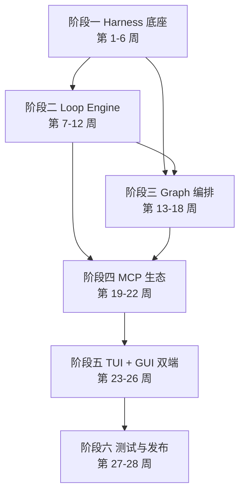

# SunshineX 开发路线图（Roadmap）

> 本文档从全局视角规划 SunshineX 从骨架到 v1.0 的完整落地路径，共 6 个阶段、28 周。
> 依据：目标形态定稿（docs/GOAL.md，单一权威）＋《SunshineX 架构设计与技术选型》（docs/Arch-Plan.md）。设计原文存档于 docs/superpowers/specs/、plans/、reports/。
> 每个阶段以「可交付 + 可自检」为验收原则，阶段未通过自检不得进入下一阶段。

## 1. 总览

- **总目标**：交付 v1.0 个人开发者版（TUI 第一入口 + CLI 执行面 + Electron 桌面端），完整落地 Harness / Loop / Graph 三层范式。
- **总周期**：28 周，6 个阶段。
- **交付形态**：GitHub Release 附件直装 + npm 全局包（CLI 与交互式 TUI）+ 桌面端安装包（Windows / macOS / Linux）。
- **核心原则**：按层迭代，先 Harness → Loop → Graph，再生态与终端双端（TUI/GUI），最后测试发布。

## 2. 里程碑总览

| 阶段 | 周期 | 主题 | 核心交付物 |
|------|------|------|-----------|
| 一 | 第 1-6 周 | Harness 底座核心 | 可运行底座 + 项目感知 + 安全沙箱 + 基础工具集 |
| 二 | 第 7-12 周 | Loop Engine 与模板 | Loop 引擎 + /goal 验收修正环 + CLI 可执行 |
| 三 | 第 13-18 周 | Graph 编排层 | DAG 引擎 + 多角色协作 + 全链路流水线模板 |
| 四 | 第 19-22 周 | MCP 生态与全场景 | MCP 兼容 + 技能系统 + 向量知识库 |
| 五 | 第 23-26 周 | 终端双端（TUI + GUI） | 交互式 TUI（对标 Claude Code，含会话持久化 / resume / rewind / fork）+ 桌面端 GUI v1（对话 / 预览 / diff）+ 三面数据同步 |
| 六 | 第 27-28 周 | 测试优化与发布 | v1.0 正式版 + 长任务基准集 + 完整文档 + 安装包 |

## 3. 阶段推进与依赖

> 关键依赖：Graph 编排层（阶段三）同时依赖 Harness 底座（阶段一）与 Loop 引擎（阶段二）；MCP 生态（阶段四）依赖 Loop 与 Graph 双线收敛。

## 4. 各阶段详细规划

### 阶段一：Harness 底座核心（第 1-6 周）

**目标**：搭建生产级 Harness 底座，落地项目感知、工具、安全、记忆四大基础能力。

- [x] 项目初始化与工程化规范（pnpm 钉版、tsc strict、三平台 CI 矩阵）
- [x] 统一上下文管理（单一基座 + fork 会话链模型，快照冻结 + 压缩 + 尾追；设计规格 2026-09-14-context-fork-design）
- [x] 统一工具框架与内置工具集（read/write/grep/glob/exec/webfetch/websearch/kb_search/skill/memory_write/ask_question，参数 JSON Schema 声明化）
- [x] 项目深度感知引擎：目录扫描、依赖解析、SUNSHINE.md 配置、Git 读取
- [x] 记忆双轨体系：程序性（learned 技能沉淀）+ 陈述性（auto memory，MEMORY.md 索引 + 记录文件）
- [x] 分级沙箱与权限管控（ProcessSandbox 单点、权限三态、SafetyChain、路径判界 isWithin 单点）
- [x] 模型适配层与三档算力路由（tier 为用户级会话参数，请求级字段不进提示词）
- [x] 全局配置 settings.json 两级装载 + 全局约定层 ~/.sunshinex/SUNSHINE.md

**交付物**：可运行 Harness 底座、项目感知能力、安全沙箱、统一工具面、双轨记忆。
**验收**：`pnpm build` + `pnpm selfcheck` 通过，四大能力可实例化。

### 阶段二：Loop Engine 与验收修正环（第 7-12 周）

**目标**：落地完整 Loop Engine 与自我验证机制。

- [x] Loop 核心执行引擎：节点调度、流转控制、状态管理
- [x] 四类核心节点：Agent、Check、Gate、Router
- [x] `/goal` 验收修正环（模型判据 verdict 三值 met/not-yet/impossible、错误分级重试 ≤3 次、impossible 终局、paused 可续走）
- [x] 终止控制与成本管控（步数/轮次/节点宽预算收编 settings.json，token 预算，墙钟仅失控保底）
- [x] CLI 执行面接入（selfcheck / run / pipeline）

**交付物**：完整可用 Loop Engine、/goal 标准验收修正环、CLI 可执行。
**验收**：Loop 闭环跑通「生成→校验→修正→终止」，/goal 端到端可演示。

### 阶段三：Graph 编排层（第 13-18 周）

**目标**：实现 DAG 工作流编排、多角色 Agent 协作、全链路流水线。

- [x] DAG 工作流核心引擎：节点调度、依赖解析、并发控制（环检测携带环路径）
- [x] 四种流程模式：串行、并行、分支、汇合
- [x] 多角色子 Agent（SubagentRunner fork 单点 + agents/ 目录注册制 + 并发上限 4 + 预算换算）
- [x] 软件工程全链路流水线模板（五节点）
- [x] CI/CD 集成节点（工作流内编排执行）
- [x] 人工审批节点与错误局部化（gate 审批、节点私有 fork、终态一行结论回写）

**交付物**：Graph 编排引擎、多角色协作、全链路流水线模板。
**验收**：DAG 环检测生效，多角色协作流水线可编排执行，Loop 子流程可嵌入 Graph 节点。

### 阶段四：MCP 生态与全场景能力（第 19-22 周）

**目标**：兼容 MCP 协议，完善全场景业务能力，优化体验。

- [x] MCP 协议兼容，支持第三方工具接入（官方 SDK stdio/http/sse 三传输，装配期 fail-fast 注册）
- [x] 内置工具集扩展（grep 目录级升级 + 网络双工具；git/db 专项经评审不做）
- [x] 模型路由观测与成本账本（route(hint) 可观测 + per-run 成本账本 + usage/缓存命中标准口径）
- [x] 本地向量知识库（sqlite-vec 可插拔后端，conformance 双后端全绿）
- [x] 技能体系（三级根装载 + 渐进披露：清单冻结注入 + skill 工具按需加载正文 + 语义化提炼 lessons-not-logs）

**交付物**：MCP 兼容、全场景基础能力、技能系统。
**验收**：标准 MCP 工具可注册并调用，技能模板可被 Harness 统一调度。

### 阶段五：终端双端——TUI + GUI（第 23-26 周）

**目标**：交付两种交互面——交互式 TUI 对标 Claude Code（个人开发者第一入口，优先交付），桌面端 GUI 对标 Codex 工作台；双端共享同一 Harness / Loop / Graph 运行时与数据底座。

**5A 交互式 TUI（对标 Claude Code）**：

- [x] 交互式会话 REPL：连续对话式任务下达，会话内多任务上下文延续
- [x] 流式输出：token 流与工具调用事件逐条实时渲染（Markdown 全框线表格、代码高亮、流式切块增量入档）
- [x] plan-mode：先出执行计划、用户确认后再动代码
- [x] 待办清单展示：任务拆解与状态实时同步（Tab 两态两全）
- [x] 权限与审批终端化：deny/ask/allow 审批卡 + OptionSelector 统一选择器（对标 CC 交互）
- [x] 会话持久化 + resume（journal 逐事件落盘、崩溃丢失窗口收敛至在飞一个工具步；/resume、--continue、/rewind 代码回退、/fork 不可变分档）
- [x] 运行控制：中断停止（Esc/Ctrl+C）、steering 穿插提示词（↑ 撤回重排）、ask_question 工具
- [x] 思考强度 effort 七档（/model effort 会话内切换、端点能力阶梯降级探测）
- [ ] 斜杠命令选择题化 + 命令面扁平化 + CLI 入口判界统一（设计规格 2026-09-21-cli-tui-interaction-redesign 已定稿，待实施）
- [ ] Worktree 隔离特性线（设计规格 2026-09-20-worktree-isolation-design 已定稿，待实施）

**5B 桌面端 GUI（对标 Codex 工作台，spec 先行）**：

- [ ] GUI 设计规格（复用 SessionEvents 事件面与 asker 契约，三面同源）
- [ ] 对话交互、代码预览、diff 对比（GUI v1 范围）
- [ ] 工作流可视化编排与实时监控（任务委派式看板，后置 GUI v2）
- [ ] 项目记忆管理、技能管理、插件管理
- [ ] 双端数据同步：配置、任务、记忆、日志（CLI/TUI/GUI 三面同源）
- [ ] 系统托盘、全局快捷键、消息通知

**交付物**：交互式 TUI（第一入口，含会话持久化 / resume / rewind / fork）+ 桌面端 GUI v1（对话交互 / 代码预览 / diff），CLI/TUI/GUI 三面数据互通。
**验收**：TUI 会话内完成一次含计划确认、审批与修正环的真实任务（流式可视、待办同步）；CLI 与 GUI 双端共享同一数据底座，核心功能可视化可用。

### 阶段六：测试优化与发布（第 27-28 周）

**目标**：全量测试、性能优化、打包发布。

- [x] 全量测试体系（node:test 全量 1100+ 用例，tsc strict 零报错 + pnpm selfcheck 双门禁，CI 双平台矩阵）
- [ ] 长任务基准集（目标形态可靠性口径）：固定任务库量化完成率与人工干预次数，可自动判定走脚本化、需人工判定走观察台账，不入提交门禁（防端点抖动污染 CI）
- [ ] 性能优化：缓存命中率观测（探针口径已建）、响应速度、内存占用
- [ ] 跨平台打包：CLI 全局包 + GitHub Release 发版链已交付（release.mjs），GUI 桌面端三平台安装包随 5B
- [ ] 完善文档：使用手册（MANUAL.md 拆分规划）、开发文档、插件开发手册

**交付物**：v1.0 正式版本、完整文档、安装包。
**验收**：全量测试通过，三平台安装包可安装运行。

## 5. 当前进度

阶段一至四已全部完成，阶段五 5A（TUI）已深度交付、5B（GUI）spec 未启动：

- [x] 阶段一 Harness 底座（perception / reactor / tools / security / context / memory / skills）
- [x] 阶段二 Loop Engine（engine + 四类节点、/goal 验收修正环、CLI run）
- [x] 阶段三 Graph 编排（DAG 引擎 + 四类节点 + 五节点流水线、CLI pipeline）
- [x] 阶段四 MCP 生态（三传输 + sqlite-vec 知识库 + 技能体系）
- [x] 模型 SDK 接入 OpenAI 协议兼容供应商（settings.json 配置，模型侧原生 function calling）
- [x] 阶段五 5A 主体（会话 REPL、流式渲染、plan、审批与选择器、会话持久化 + resume + rewind/fork、中断与 steering、记忆/技能命令族、effort、上下文压缩模型驱动六要素）

当前基线（2026-09-21 实测）：tsc strict 零报错、全量 1106/1106 fail 0、selfcheck OK；CLI 执行面 selfcheck / run / pipeline 冒烟验证。实施记录见各 plan 执行回写与 reports/。

下一步（目标形态排期，见 docs/GOAL.md）：斜杠命令选择题化 + CLI 入口判界统一（规格已定稿待实施）∥ Worktree 隔离（规格已定稿待实施）∥ GUI 设计规格（纸面）并行推进 → 长任务基准集建设 → 扩展生态深化（MCP 三传输生产化收尾 → 技能/子代理生态沉淀分享 → 插件生命周期与依赖管理）。

## 6. 验证策略

| 阶段 | 验证方式 |
|------|---------|
| 一 | `pnpm build` + `pnpm selfcheck` 零报错 |
| 二起 | 每个 Loop / Graph 模块补充单测，CI 跑通 |
| 六 | 全量单测 / 集成 / 安全测试 + 三平台打包 |

- 每阶段结束必须 `pnpm build`（tsc 严格模式零报错）+ `pnpm selfcheck` 输出正确。
- 涉及加载 / 解析逻辑时补充示例物料并确保自检覆盖。

## 7. 目录结构

实装为 src/ 扁平分层（与历史规划中的 src/agent/* 嵌套示意不同，扁平分层为既定形态）：`src/harness`（perception/reactor/tools/mcp/subagent/worktree/knowledge/security/context/memory/skills）、`src/loop`、`src/graph`、`src/model`、`src/storage`、`src/plugins`、`src/config`、`src/runtime.ts`、`src/tui`、`src/cli`。逐文件说明见根目录 `CLAUDE.md §3`；`src/gui` 随阶段五 5B 建立。
