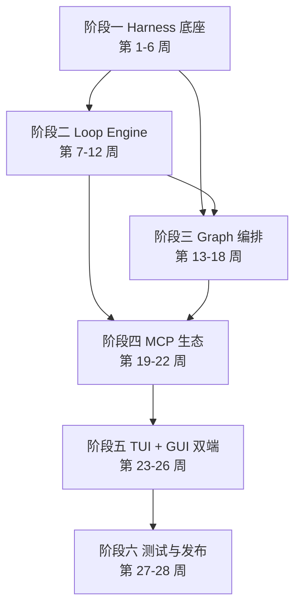

# SunshineX 开发路线图（Roadmap）

> 本文档从全局视角规划 SunshineX 从骨架到 v1.0 的完整落地路径，共 6 个阶段、28 周。
> 依据：《SunshineX 通用 AI Agent 项目工程化设计方案》（docs/Arch-Plan.md）与《统一运行时主链设计》（docs/superpowers/specs/2026-09-04-harness-unified-spine-design.md）。
> 每个阶段以「可交付 + 可自检」为验收原则，阶段未通过自检不得进入下一阶段。

## 1. 总览

- **总目标**：交付 v1.0 个人开发者版（CLI/TUI + Electron 桌面端），完整落地 Harness / Loop / Graph 三层范式。
- **总周期**：28 周，6 个阶段。
- **交付形态**：CLI 全局包（含交互式 TUI）+ 桌面端安装包（Windows / macOS / Linux）。
- **核心原则**：按层迭代，先 Harness → Loop → Graph，再生态与终端双端（TUI/GUI），最后测试发布。

## 2. 里程碑总览

| 阶段 | 周期 | 主题 | 核心交付物 |
|------|------|------|-----------|
| 一 | 第 1-6 周 | Harness 底座核心 | 可运行底座 + 项目感知 + 安全沙箱 + 基础工具集 |
| 二 | 第 7-12 周 | Loop Engine 与模板 | Loop 引擎 + 三大场景模板 + CLI 可执行 |
| 三 | 第 13-18 周 | Graph 编排层 | DAG 引擎 + 多角色协作 + 全链路流水线模板 |
| 四 | 第 19-22 周 | MCP 生态与全场景 | MCP 兼容 + 技能系统 + 向量知识库 |
| 五 | 第 23-26 周 | 终端双端（TUI + GUI） | 交互式 TUI（对标 Claude Code）+ 桌面端（对标 Codex）+ 三面数据同步 |
| 六 | 第 27-28 周 | 测试优化与发布 | v1.0 正式版 + 完整文档 + 安装包 |

## 3. 阶段推进与依赖

> 关键依赖：Graph 编排层（阶段三）同时依赖 Harness 底座（阶段一）与 Loop 引擎（阶段二）；MCP 生态（阶段四）依赖 Loop 与 Graph 双线收敛。

## 4. 各阶段详细规划

### 阶段一：Harness 底座核心（第 1-6 周）

**目标**：搭建生产级 Harness 底座，落地项目感知、工具、安全、记忆四大基础能力。

- [x] 项目初始化与工程化规范
- [x] 三级 KV 缓存与上下文管理
- [x] 统一工具框架与内置基础工具集
- [x] 项目深度感知引擎：目录扫描、依赖解析、SUNSHINE.md 配置、Git 读取
- [x] 三级持久化记忆体系
- [x] 分级沙箱与权限管控
- [x] dry-run 预览机制
- [x] 模型适配层与三档算力路由

**交付物**：可运行 Harness 底座、项目感知能力、安全沙箱、基础工具集。
**验收**：`npm run build` + `npm run selfcheck` 通过，四大能力可实例化。

### 阶段二：Loop Engine 与专用模板（第 7-12 周）

**目标**：落地完整 Loop Engine，实现三大专用 Loop 与自我验证机制。

- [x] Loop 核心执行引擎：节点调度、流转控制、状态管理
- [x] 四类核心节点：Agent、Check、Gate、Router
- [x] `/goal` 自我验证机制（规则校验器优先 + 模型判据兜底 + deficit 定向修正）
- [x] 三大专用 Loop 模板：代码重构、测试闭环、代码审查
- [x] 终止控制与成本管控模块（四重终止保护，超支 pause 不伪造完成）
- [x] CLI 专项命令接入

**交付物**：完整可用 Loop Engine、三大专用场景模板、CLI 可执行。
**验收**：Loop 闭环跑通「生成→校验→修正→终止」，三大模板各可端到端演示。

### 阶段三：Graph 编排层（第 13-18 周）

**目标**：实现 DAG 工作流编排、多角色 Agent 协作、全链路流水线。

- [x] DAG 工作流核心引擎：节点调度、依赖解析、并发控制
- [x] 四种流程模式：串行、并行、分支、汇合
- [x] 多角色子 Agent：规划师、开发者、测试工程师、审查员
- [x] 软件工程全链路流水线模板
- [x] CI/CD 集成节点
- [x] 人工审批节点与错误局部化
- [x] 工作流模板体系

**交付物**：Graph 编排引擎、多角色协作、全链路流水线模板。
**验收**：DAG 环检测生效，多角色协作流水线可编排执行，Loop 子流程可嵌入 Graph 节点。

### 阶段四：MCP 生态与全场景能力（第 19-22 周）

**目标**：兼容 MCP 协议，完善全场景业务能力，优化体验。

- [ ] MCP 协议兼容，支持第三方工具接入
- [ ] 补充内置工具集，覆盖开发全场景
- [ ] 优化模型路由与缓存策略
- [ ] 本地向量知识库增强
- [ ] 技能模板体系完善

**交付物**：MCP 兼容、全场景基础能力、技能系统。
**验收**：标准 MCP 工具可注册并调用，技能模板可被 Harness 统一调度。

### 阶段五：终端双端——TUI + GUI（第 23-26 周）

**目标**：交付两种交互面——交互式 TUI 对标 Claude Code（个人开发者默认入口，优先交付），桌面端 GUI 对标 Codex 工作台；双端共享同一 Harness / Loop / Graph 运行时与数据底座。

**5A 交互式 TUI（对标 Claude Code）**：

- [ ] 交互式会话 REPL：连续对话式任务下达，会话内多任务上下文延续
- [ ] 流式输出：模型 token 流与工具调用事件（exec/read/write）逐条实时渲染
- [ ] plan-mode：先出执行计划、用户确认后再动代码（复用 Graph 规划节点）
- [ ] 待办清单展示：任务拆解与状态实时同步（数据源为 Graph 节点状态）
- [ ] 权限与审批终端化：deny/ask/allow 实时询问，gate 审批在会话内完成
- [ ] 终端渲染选型：原生 ANSI 渲染 vs 成熟 TUI 库（如 Ink/blessed 一类候选），按依赖引入原则评审定案

**5B 桌面端 GUI（对标 Codex 工作台）**：

- [ ] 对话交互、代码预览、diff 对比
- [ ] 工作流可视化编排与实时监控（任务委派式看板）
- [ ] 项目记忆管理、技能管理、插件管理
- [ ] 双端数据同步：配置、任务、记忆、日志（CLI/TUI/GUI 三面同源）
- [ ] 系统托盘、全局快捷键、消息通知

**交付物**：交互式 TUI（默认入口）+ 完整功能桌面端，CLI/TUI/GUI 三面数据互通。
**验收**：TUI 会话内完成一次含计划确认、审批与修正环的真实任务（流式可视、待办同步）；CLI 与 GUI 双端共享同一数据底座，核心功能可视化可用。

### 阶段六：测试优化与发布（第 27-28 周）

**目标**：全量测试、性能优化、打包发布。

- [ ] 全功能单元测试、集成测试、安全测试
- [ ] 性能优化：缓存命中率、响应速度、内存占用
- [ ] 跨平台打包：Win/Mac/Linux 安装包、CLI 全局包
- [ ] 完善文档：开发文档、使用文档、插件开发手册

**交付物**：v1.0 正式版本、完整文档、安装包。
**验收**：全量测试通过，三平台安装包可安装运行。

## 5. 当前进度

阶段一至三已全部完成，阶段四待启动：

- [x] 阶段一 Harness 底座（perception / reactor / tools / security / context / memory / skills；统一运行时主链 1A-1E、Context Budget、安全加固全链交付，详见 specs/ 各设计文档）
- [x] 阶段二 Loop Engine（engine + Agent/Check/Gate/Router 四类节点、重构 / 测试闭环 / 代码审查三模板、/goal 自我验证、CLI run）
- [x] 阶段三 Graph 编排（DAG 引擎 + loop/agent/gate/ci 四类节点、五节点软件工程流水线、pause/resume 与预算跨层贯通、CLI pipeline）
- [x] 模型 SDK 接入 DeepSeek 兼容 OpenAI 协议（`.env` 配置，零新增依赖）

当前基线：npm run build（tsc strict）零报错、256 个测试全绿、npm run selfcheck 通过；CLI 执行面 selfcheck / run / pipeline 三命令级联部署冒烟验证。实施记录见各 plan 执行回写与 reports/ 真实场景验证报告。

下一步：阶段四（MCP 工具兼容、向量知识库、CLI 专项命令、技能模板体系完善）。

## 6. 验证策略

| 阶段 | 验证方式 |
|------|---------|
| 一 | `npm run build` + `npm run selfcheck` 零报错 |
| 二起 | 每个 Loop / Graph 模块补充单测，CI 跑通 |
| 六 | 全量单测 / 集成 / 安全测试 + 三平台打包 |

- 每阶段结束必须 `npm run build`（tsc 严格模式零报错）+ `npm run selfcheck` 输出正确。
- 涉及加载 / 解析逻辑时补充示例物料并确保自检覆盖。

## 7. 与目标目录架构的映射

当前骨架 → README 目标目录（阶段推进中逐步对齐）：

| 目标目录 | 当前状态 | 对应阶段 |
|---------|---------|---------|
| `src/agent/harness/` | 已建 `src/harness/`（skills/memory/tools） | 阶段一 |
| `src/agent/loop/` | 已建 `src/loop/`（engine + 四类节点 + 三模板，实装） | 阶段二 ✓ |
| `src/agent/graph/` | 已实装 engine/nodes/agents/workflow/templates（五节点链 + WorkflowDef 装配） | 阶段三 |
| `src/model/` | 已实装（adapter + 三档路由 bind/resolve/回退语义） | 阶段一 ✓ |
| `src/storage/` | 已实装（LocalStore 本地 JSON 存储底座） | 阶段一 ✓ |
| `src/plugins/` | 已建 loader.ts | 阶段四 |
| `src/cli/` | 已建（selfcheck / run / pipeline，实装） | 阶段二 ✓ |
| `src/tui/` | 未建（对标 Claude Code 交互式终端） | 阶段五 |
| `src/gui/` | 未建（对标 Codex 工作台） | 阶段五 |
| `src/server/` | 未建 | 按需 |

> 说明：骨架目录与 README 目标目录存在命名差异（如 `src/harness` vs `src/agent/harness`），随各阶段开发逐步迁移对齐。
