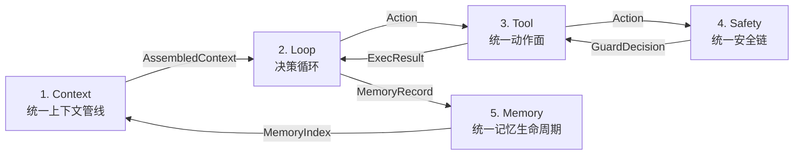
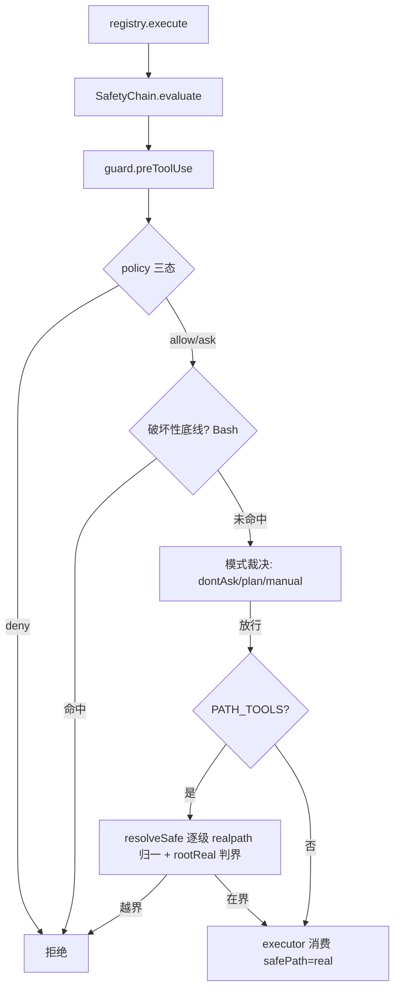
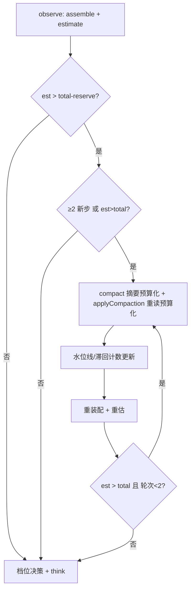
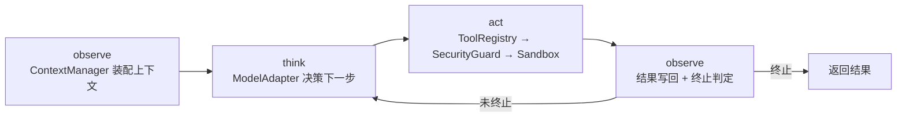

# 阶段一技术报告 · Harness 底座核心

> 所属项目：SunshineX（通用 AI Agent 工程化骨架）
> 阶段周期：第 1–6 周（ROADMAP 阶段一）
> 交付状态：✅ 已交付（子阶段 1A–1E 全部实施并端到端验收）
> 终态基线：`npm run build` 零报错 · 全量测试全绿 · `npm run selfcheck` 通过
> 依据文档：`docs/superpowers/specs/2026-09-03-phase1-harness-design.md`、`2026-09-04-harness-unified-spine-design.md`、`2026-09-04-harness-spine-1b-depth-design.md`、`2026-09-05-phase1-security-hardening-design.md`、`2026-09-05-phase2-context-budget-design.md`、`docs/superpowers/reports/2026-09-05-phase1-real-scenario-report.md`

---

## 1. 概览

阶段一是 SunshineX 的「地基」，交付一套**生产级 Harness 运行时底座**：项目感知、统一工具、安全管控、上下文与记忆四大基础能力，并以一个最小 Reactor 驱动循环把它们串成可运行的端到端闭环。

阶段一的根本转折，是把「模块齐全却未成链」的骨架，重构为**统一运行时主链（Unified Runtime Spine）**——五环节按数据流串联成单一闭环，而非多套实现逻辑的拼接。

### 1.1 交付物总览

| 能力域 | 核心模块 | 落点 |
|--------|---------|------|
| 项目感知 | `perception.ts` | 目录扫描、依赖解析、SUNSHINE.md 配置、Git 读取 |
| 统一工具 | `tools.ts` + `tools/builtin.ts` | 注册表 + read/write/grep/glob/exec 五件套 |
| 安全管控 | `security/`（policy/rules/modes/guard/sandbox/dryrun/chain） | 三态权限 + 沙箱 + dry-run + 凭据脱敏 |
| 上下文与记忆 | `context/`（loader/rules/window/session/memory-lifecycle） | 分层指令 + 自动记忆 + 窗口压缩 |
| 驱动循环 | `reactor.ts` | observe→think→act→observe 最小闭环 |
| 存储底座 | `storage/adapter.ts` + `store.ts` | StorageAdapter 接口 + 本地 JSON 实现 |
| 模型适配 | `model/adapter.ts` | OpenAI 兼容适配 + 三档算力路由 |

### 1.2 技术栈基线

- Node.js ≥ 22.9、TypeScript strict、CommonJS、`node --test`（零测试框架依赖）
- **零新增 npm 依赖**：全程使用 `fs / path / child_process / fetch / crypto` 等 Node 内置模块
- 模型调用经 Node 内置 `fetch` 直连 OpenAI 兼容 API（DeepSeek / 智谱 GLM 实测通过）

---

## 2. 核心架构：统一运行时主链

### 2.1 设计哲学：有机结合 vs 能力拼接

阶段一明确了 SunshineX 区别于「能力拼接」的分水岭——**有没有统一抽象、有没有单一数据流、有没有旁路**。不复制三大明星产品（Claude Code / Codex / Hermes），而是识别它们共享的「能力本质」，映射到同一条主链上。



五个环节按数据流串联（非并列模块），上一环节的输出即下一环节的输入，Memory 的产出回流 Context 形成闭环。**单向闭环、无旁路**：上下文只能从 Context 进、动作只能从 Tool 出、执行必经 Safety、记忆只走 Memory。

### 2.2 能力本质映射

| 明星产品 | 表面能力 | 拆解后的能力本质 | 归入主链环节 |
|---------|---------|----------------|-------------|
| Claude Code | CLAUDE.md 分层 / 路径规则 / 自动记忆 | 「该注入什么上下文」的统一来源 | Context 的 source |
| Codex | 三档算力 / 多执行后端 | 「用什么算力、在哪执行」的决策与动作面 | Loop 决策 + Tool 后端 |
| Hermes | 模型无关 / 持久记忆 / 自我验证 | 「如何沉淀、如何演进」的记忆生命周期 | Memory 环节 |
| 三者共通 | 权限 / 沙箱 / 脱敏 | 「所有动作不可旁路」的边界 | Safety 链 |

关键约束：任何产品的能力都**不整体搬入**某一环节，而是拆到能力本质后归位；横切关注点（安全）收敛为同一条链，不各做一份。

### 2.3 环节间传递的数据结构

| 边界 | 数据结构 | 说明 |
|------|---------|------|
| Context → Loop | `AssembledContext` | 分层指令 + 路径规则 + 记忆索引 + 预算水位 |
| Loop → Tool | `Action` | 工具名 + 输入 + 算力档位 |
| Tool → Safety | `Action` | 待守门的动作 |
| Safety → Tool | `GuardDecision` | allow（含脱敏后执行）/ deny（含 reason） |
| Tool → Loop | `ExecResult` | 动作执行结果 |
| Loop → Memory | `MemoryRecord` | 类型 + 内容 + 来源 |
| Memory → Context | `MemoryIndex` | 记忆索引摘要，供注入 |

---

## 3. 底层技术设计细节

### 3.1 项目感知引擎（perception.ts）

```text
scan(root)
 ├─ 目录扫描：递归遍历项目文件树（受 SCAN_SKIP_DIRS 约束，跳过 node_modules 等）
 ├─ 依赖解析：读取 package.json 识别技术栈与依赖；解析失败降级为「依赖未知」不阻断
 ├─ SUNSHINE.md 配置：注入编码规范、架构原则、行为边界
 └─ Git 读取：解析提交历史，理解项目演进与决策背景
```

设计要点：**感知类失败降级、执行类失败结构化**——感知不全是致命的（依赖未知也能继续），执行失败则返回可追溯的 `Result` 错误码。

### 3.2 统一工具框架

工具注册表采用「**元数据 + 执行器**」分离：工具只声明、不直接执行，执行器统一经过安全链。

```text
ToolRegistry.register(spec)   # 元数据（name/category/description/inputSchema）
ToolRegistry.execute(name, input)
  └─ canonical 归一 → SafetyChain.evaluate → executor 执行 → maskResult 脱敏
```

内置五件套：`read / write / grep / glob / exec`。关键约定：**所有工具（含 write/read）与 exec 走同一条 Safety 链**，消除「exec 进沙箱、write 直接 fs」的双轨。

### 3.3 安全与权限模型（吸收 Claude Code）

安全管控从「命令黑名单」升级为分层的安全链：`guard → sandbox(边界) → dryrun → mask → execute`。

#### 三态规则引擎

```text
PermissionDecision = 'allow' | 'ask' | 'deny'
求值顺序：deny → ask → allow，首个匹配生效（specificity 不改变顺序）
```

| Claude Code 设计 | SunshineX 落地 |
|-----------------|---------------|
| allow/ask/deny 规则 | `PolicyEngine` 三态规则 |
| `Bash(rm *)` 语法 | 通配符 + 复合命令拆分 + wrapper 剥离 |
| 只读命令内置集 | 白名单（ls/cat/pwd/grep/find/…）默认 allow |
| PreToolUse hook | `SecurityGuard.preToolUse` 决策点，deny 附原因 |
| 权限模式 | manual（默认）/ plan（只读）/ dontAsk（未批准即拒） |
| 凭据 mask | `maskResult` 统一脱敏出口 |

#### 路径越界校验（root 边界）

```text
abs = path.resolve(root, input.path)
判界：abs 必须等于 root 或以 root + path.sep 开头，否则 deny
allow 时返回 safePath，供工具直接执行（删除内置二次 resolve，消除双轨解析）
```

#### 凭据脱敏（单一代收点）

内置零依赖正则模式集：`sk-*` 密钥、`Bearer` token、AWS `AKIA`、PEM 私钥块、JSON/键值形态密钥。脱敏在**结果跨链出口一处生效**——observation 与 memory.record 的内容天然洁净，上下文与记忆无需第二套过滤。

#### 安全收尾补丁（真实场景验证后加固）

真实场景探针暴露两项缺口，阶段一以最小改动闭合：

1. **P0-1 软链接逃逸**：`path.resolve + startsWith` 判界不解析符号链接，root 内 `link.txt → root 外 secret.txt` 可读穿。修复：逐级上溯 `realpathSync` 归一 + `rootReal` 基准判界。
2. **P1-2 破坏性命令无防护**：dontAsk 下 `rm -rf` 直接执行。修复：guard 增加破坏性底线（递归删除、mkfs、dd/shutdown、下载执行管道），**任何 allow 规则都越不过**。



### 3.4 上下文与记忆管理（吸收 Claude Code）

阶段一将「三级记忆存储」升级为「**上下文与记忆管理**」——决定什么内容进入上下文窗口、何时进入、如何压缩、如何跨会话恢复。

| SunshineX 机制 | 对标 Claude Code | 落地 |
|---------------|-----------------|------|
| ContextLoader | CLAUDE.md 分层 + @import | SUNSHINE.md 多 scope 解析 + import 展开 |
| RulesRegistry | .claude/rules/ + paths | 规则目录扫描 + glob 匹配按需加载 |
| AutoMemory | Auto memory + MEMORY.md | 索引 + topic 文件，四类 type，200 行/25KB 上限 |
| ContextWindow | 自动 compaction | token 估算 + 触发压缩 + 摘要重注入 |
| SessionStore | session 持久化 | 本地 transcript 读写 + 恢复 |

四条设计原则：
1. **指令是上下文，不是强约束**——SUNSHINE.md 引导行为，强制拦截走 SecurityGuard。
2. **索引 + 详情分离**——记忆索引常驻限量，详情按需读。
3. **按需加载**——path-scoped 规则与 topic 记忆命中才加载，上下文预算是第一约束。
4. **压缩保底**——窗口接近上限自动 compaction，摘要 + 重注入指令/记忆/最近文件。

### 3.5 上下文窗口压缩（稳定性增强）

```ts
interface ContextWindow {
  estimate(items): { used, items };       // 加权估算 + 逐项 id
  shouldCompact(budget): boolean;
  compact(history, opts?): Promise<ContextChunk[]>;  // 结构化摘要（分块可重现）
  verifyChecksum(chunks): boolean;        // 摘要未变跳过重注入
  reinject(): ContextItem[];              // 重注入指令/记忆/最近文件/摘要
}
```

四条稳定性措施：

| 措施 | 实现 |
|------|------|
| 分块确定性 | 按 Markdown 边界切分，chunk id = `sha256(content)` |
| 摘要可重现 | 固定 prompt + temperature=0 |
| 去重合并 | 相同 id 或 Jaccard 相似度 > 0.9 合并 |
| Checksum 校验 | `sha256(JSON.stringify(chunks))`，一致则跳过重注入 |

Checksum 三态语义（1B 收紧）：

```text
首次调用  → 注册基线，视为通过
与基线一致 → 幂等重放（不重复注入、不重复记录）
与基线不同 → 新一轮压缩（更新基线，正常注入）
```

### 3.6 压缩预算闭环（真实场景病灶修复）

真实场景双轮探针实测压缩链路预算失控（prompt 曲线 337 → 25938 字符），定位出四个耦合病灶并逐一修复：

| 编号 | 病灶 | 根因 | 修复 |
|------|------|------|------|
| F-a | 记忆通道不过水位线 | 摘要与旧记忆叠加而非替换 | `tail()` 分层配额注入（skill 600 / episodic 700 / working 700） |
| F-b | 压缩后注入不复核预算 | applyCompaction 后从不重估 | Reactor 收敛环（至多 2 轮） |
| F-c | 摘要/重读无预算约束 | 块数无上限、重读仅限行数 | 摘要/重读各占 reserve/2 预算 |
| F-d | 估算系统性失准 | CJK 按 /4 折算被低估 2–8 倍 | 估算解耦：CJK×1 + 其余÷4 |
| F-e | 连轮压缩震荡 | 同批条目连轮重复压缩 | 滞回约束（距上次 ≥2 新步） |



### 3.7 模型适配层（三档算力路由）

```text
ModelRouter.route(hint?)  →  RouteDecision { tier, reason }
  ├─ flagship（旗舰档）：复杂架构设计、深度调试
  ├─ balanced（平衡档）：日常开发、代码生成
  └─ lite（轻量档）：简单修改、批量处理
```

- `OpenAIAdapter` 用 Node 内置 `fetch` 直连 OpenAI 兼容 REST API（零 npm 依赖）
- 降级链：`OpenAIAdapter`（有 key）→ `ScriptedAdapter`（脚本化）→ `StubAdapter`（离线兜底）
- 配置环境变量优先：`OPENAI_API_KEY / OPENAI_BASE_URL / OPENAI_MODEL`，baseURL 可配即天然兼容所有 OpenAI 兼容服务

---

## 4. 核心功能设计

### 4.1 最小 Reactor 驱动循环



关键设计：think 经真实发动机（无 key 降级 scripted）；act 复用安全链；observe 写回 context；终止保底 maxSteps（默认 8）+ 预算。

### 4.2 可插拔接口

```ts
interface StorageAdapter { read<T>(); write<T>(); }   // 默认 FileStore，预留 sqlite
interface Sandbox { run(cmd, opts?); }                 // 默认 ProcessSandbox，预留 docker
interface ModelAdapter { complete(prompt); }           // OpenAI / Scripted / Stub 同接口
```

---

## 5. 设计趋势

1. **从「能力补齐」到「统一抽象」**：不逐能力补差，而是收敛为单一数据流主链，每环节一个职责。
2. **安全从「黑名单」到「分层链」**：guard（策略）→ sandbox（边界）→ dryrun（预览）→ mask（脱敏）→ execute，横切关注点收敛为一条链。
3. **记忆从「存储」到「生命周期」**：working → episodic → skill 三级流转，同一份数据的沉淀演化。
4. **估算从「经验打折」到「真实近似」**：CJK×1 + 其余÷4 的真实 token 近似，取代「chars × 权重 ÷ 4」的系统性失准。

---

## 6. 优秀设计亮点

1. **无旁路可证伪**：每条验收以「反例即不合格」表述（如「Reactor 直接拼 goal/steps 即不合格」），而非「补差是否完成」。
2. **单一代收点脱敏**：`maskResult` 是所有工具结果跨链的唯一脱敏出口，杜绝密钥明文进入上下文/记忆的第二通道。
3. **真实场景驱动加固**：端到端探针（scripted + 真实模型 GLM 双轮）实测出 symlink 逃逸、破坏性命令无防护、预算失守三处缺陷，全部转为可验证修复。
4. **零依赖下的生产级底座**：路径判界、凭据脱敏、压缩稳定性、三档路由全部用 Node 内置模块自研落地。

---

## 7. 交付与验收

**交付物**：可运行 Harness 底座、项目感知能力、安全沙箱、基础工具集、统一运行时主链（1A–1E）、安全收尾补丁、压缩预算闭环。

**验收结论**：`npm run build` 零报错、全量测试全绿、`npm run selfcheck` 输出四大能力 + 一次真实沙箱执行结果、危险命令被拦截并返回结构化错误、最小闭环端到端跑通、压缩稳定性（误触发率 < 1% + checksum 可重现）达标。

---

## 附：阶段一关键提交链

| 子阶段 | 主题 | 提交链 |
|--------|------|--------|
| 基础闭环 | Harness 底座核心 | 7ab5584 → c095dcc |
| 1A | 串主链 | f141544 → 0c46132 |
| 1B | 补深度 | 7b81bc8 → 3fb250d |
| 1C | 内嵌路由 | 93fe719 → 9384497 |
| 1D | 多后端 | d0f0306 → 525b340 |
| 1E | 记忆沉淀 | a54236e → bcfcd1f |
| 安全收尾 | symlink + 破坏性底线 | 18f584b → 8ae093b → 2d7f10b |
| 预算闭环 | 压缩预算治理 | 见 Phase 2 预算 spec 执行记录 |
