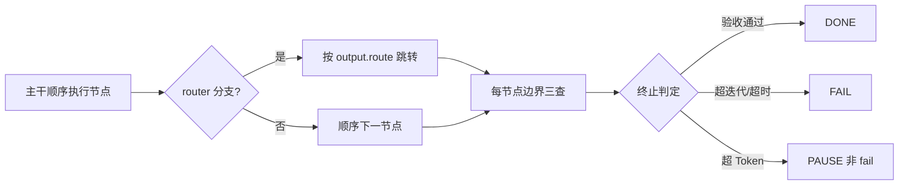

# 阶段二技术报告 · Loop Engine 与专用模板

> 所属项目：SunshineX（通用 AI Agent 工程化骨架）
> 阶段周期：第 7–12 周（ROADMAP 阶段二）
> 交付状态：✅ 已交付（T1–T6 收口，C1–C5 验收通过）
> 终态基线：`npm run build` 零报错 · 全量测试全绿 · `npm run selfcheck` 通过
> 依据文档：`docs/superpowers/specs/2026-09-06-phase2-loop-engine-design.md`、`docs/ROADMAP.md` 阶段二

---

## 1. 概览

阶段二在 Harness 底座之上交付 **Loop Engine**——把「单任务自主迭代」从阶段一 Reactor 的单轮 `observe→think→act` 循环，升级为多节点协作的「**生成 → 校验 → 修正 → 终止**」闭环。

设计立场：**有机结合而非能力拼接**。LoopEngine 只有一条执行主干（节点序列 + Router 分支），不存在第二条旁路执行逻辑。

### 1.1 交付物总览

| 能力域 | 核心模块 | 落点 |
|--------|---------|------|
| Loop 核心引擎 | `loop/engine.ts` | 节点调度、流转控制、状态管理、四重终止 |
| 四类节点 | `loop/nodes.ts` | Agent / Check / Gate / Router |
| 自我验证 | CheckNode `/goal` | 验收标准解析 + 逐项自检 + deficit 定向修正 |
| 三大模板 | `loop/templates.ts` | 代码重构 / 测试闭环 / 代码审查 |
| CLI 入口 | `cli/commands/run-loop.ts` | `sunshinex run` 命令 |
| 类型体系 | `types.ts` | LoopNodeKind / NodeOutput / LoopContext / LoopResult |

### 1.2 与阶段一 Reactor 的边界

| 维度 | 阶段一 Reactor | 阶段二 Loop Engine |
|------|---------------|-------------------|
| 形态 | 线性单循环 | 四类节点（agent/check/gate/router） |
| 循环 | observe→think→act→observe | 节点调度 + 流转控制 |
| 决策 | 单步 action | 多步 + 校验 + 路由 |
| 终止 | maxSteps + 预算 | 四重终止（验收/迭代/超时/Token） |
| 模板 | 无 | 三大专用模板 |
| 可被 Graph 嵌入 | 否 | 是 |

---

## 2. 核心架构

### 2.1 设计立场三原则

1. **单一数据流**：LoopEngine 只有一个执行主干——节点序列 + Router 分支。check/gate/router 是主干的纯逻辑节点，不是另一套引擎。
2. **复用而非重写**：agent 节点内嵌 `Reactor.run()`（压缩闭环、预算、安全链、记忆沉淀全部复用），Loop 不自建执行器。
3. **模板即配置**：三大专用模板不是三套代码，而是 LoopEngine 的三种预组装配置，与自定义 Loop 同构，天然支持扩展。

### 2.2 LoopEngine 主干

```ts
export interface LoopTermination {
  maxIterations: number;   // 迭代上限
  maxTokens: number;       // 累计 token 上限
  timeoutMs: number;       // 墙钟超时
}

export class LoopEngine {
  constructor(
    nodes: LoopNodeBase[],                 // 有序节点序列（主干）
    deps: { safety; registry; context; model; router? },
    termination: LoopTermination,
    hooks?: { onNodeEnd? },
  );
  async run(goal: string, opts?): Promise<LoopRunResult>;
}
```

### 2.3 执行语义



四重终止（每节点边界检查）：
1. **验收通过**：check 节点全过 + agent done → 立即 done
2. **迭代上限**：`iteration > maxIterations` → fail（耗尽）
3. **墙钟超时**：`Date.now() - startedAt > timeoutMs` → fail（超时）
4. **Token 超支**：`tokensUsed > maxTokens` → **pause（非 fail）**——超支自动暂停返回现场，不伪造完成

### 2.4 四类节点

| 节点 | 职责 | 实现 |
|------|------|------|
| agent | 执行子任务（内嵌 Reactor.run，透传预算换算与 scripted 注入） | `AgentNode` |
| check | /goal 验收：解析验收标准清单，逐项判定 | `CheckNode` |
| gate | 断言/人工闸门：评估谓词或挂起等待确认 | `GateNode` |
| router | 按 state/output 分流到目标节点 id | `RouterNode` |

节点为**纯函数式组件**：`(ctx, deps, input) => Promise<NodeOutput>`，共享 `ctx.state`（agent 产出 → check 输入 → router 分流依据），不各自持全局。

---

## 3. 底层技术设计细节

### 3.1 类型体系

```ts
export type LoopNodeKind = 'agent' | 'check' | 'gate' | 'router';

export interface NodeOutput {
  status: 'pass' | 'fail' | 'retry' | 'done';
  reply?: string;
  criteria?: CriterionResult[];   // check 节点产出
  route?: string;                 // router 产出：下一节点 id
  tokens: number;                 // 本节点真实消耗
}

export interface CriterionResult {
  id: string;          // 验收子项 id（如 c1）
  desc: string;
  passed: boolean;
  evidence?: string;   // 判定依据摘录
}

export interface LoopContext {
  iteration: number;
  state: Record<string, unknown>;
  tokensUsed: number;              // 累计 token（贯通计量）
  startedAt: number;               // Date.now()，超时终止基准
}
```

### 3.2 预算贯通（复用阶段一 Reactor 计量）

- agent 节点把 `remaining = maxTokens - tokensUsed` 换算进 Reactor 的 `budget.total`（与 reserve 固定比例）
- Reactor 的真实 token 用量（completion usage）回传累加到 `tokensUsed`
- **Loop 不自建计量**——为此 Reactor `RunResult` 透出 `tokensUsed` 可选字段（零破坏）

### 3.3 /goal 自我验证机制

```mermaid
flowchart TD
  G[goal 中「验收标准:」段解析] --> C[结构化清单 Criterion[]]
  C --> V{双通道判定}
  V -- 规则校验器优先 --> R[可执行断言: 测试全绿/构建零错]
  V -- 模型判据兜底 --> M[small 档模型判定]
  V --> P{全部通过?}
  P -- 否 --> D[agent 带 deficit 重试]
  D --> C
  P -- 是 --> OK[check 通过]
```

设计要点：
- 解析失败或空清单 → check 直接 fail 并说明（不静默通过）
- 未通过项 → agent 节点带 deficit（未过项清单）重试，重试上下文注入「上次未过项与证据」，**修正方向明确而非盲目重跑**

### 3.4 三大专用模板（预组装配置）

| 模板 | 节点序列 | 验收标准模板 |
|------|---------|-------------|
| 代码重构 | agent(重构) → check(语法/测试/引用同步) → router(未过→agent 补正) | 测试全绿 + 构建零错 + 引用零悬空 |
| 测试闭环 | agent(生成测试) → check(执行测试) → router(失败→agent 修复) | 目标测试全绿且非空 |
| 代码审查 | agent(审查) → gate(问题清单非空断言) → router(有→agent 修复→check 复检) | 复检零高危 + diff 可应用 |

模板 = `{ nodes, termination, criteriaTemplate }` 纯数据配置，`LoopEngine` 统一执行。

---

## 4. 核心功能设计

### 4.1 自主迭代闭环

```
生成（agent 内嵌 Reactor）→ 校验（check /goal 逐项自检）→ 修正（router 分流 + deficit 定向）→ 终止（四重保护）
```

### 4.2 终止控制与成本管控

- 四重终止保护：验收通过 / 最大迭代 / 超时 / Token 上限
- **超支 pause 不伪造完成**：Token 超支自动暂停返回现场，与后续 Graph 层的 pause 语义同构（为阶段三预算贯通铺路）

### 4.3 CLI 专项命令接入

`sunshinex run` 命令承载 Loop 修正环，支持 goal 传入（含验收标准段）、dry-run 预览、模板选择。

---

## 5. 设计趋势

1. **从「单循环」到「多节点协作」**：Reactor 的线性循环升级为节点序列 + Router 分支的主干。
2. **从「盲目重跑」到「定向修正」**：deficit（未过项清单）注入重试上下文，修正方向明确。
3. **从「自建计量」到「贯通计量」**：Loop 复用 Reactor 的真实 token 用量，不另设并行计量体系。
4. **从「多套代码」到「模板即配置」**：三大专用 Loop 是同一引擎的三种配置，天然支持扩展。

---

## 6. 优秀设计亮点

1. **复用而非重写**：agent 节点内嵌 `Reactor.run()`，压缩闭环、预算、安全链、记忆沉淀全部复用，Loop 层不新增执行路径——延续主链「无旁路」哲学。
2. **纯函数式节点**：节点不持全局状态，共享 `ctx.state` 传递数据，天然可测试、可组合。
3. **四重终止的 pause 语义**：超支 pause 而非 fail，不伪造完成，为阶段三 Graph 的 resume 续跑预留同构语义。
4. **模板即配置的扩展性**：自定义 Loop 与三大模板同构，用户可用纯数据配置组装新场景。

---

## 7. 交付与验收

**交付物**：完整可用 Loop Engine、三大专用场景模板、CLI 可执行（`sunshinex run`）。

**验收结论**（C1–C5）：
- Loop 闭环跑通「生成→校验→修正→终止」
- 三大模板各可端到端演示
- /goal 自我验证机制生效（规则校验器优先 + 模型判据兜底 + deficit 定向修正）
- 预算贯通计量正确，超支 pause 不伪造完成

---

## 附：阶段二关键提交链

| 任务 | 主题 | 提交 |
|------|------|------|
| 计划 | Loop Engine 实施计划 | 7456dbb |
| T1 | 类型体系 + 引擎骨架 | f0ed740 |
| T2 | 四类节点 | 49f7fbe |
| T3 | /goal 自我验证 | 457b843 |
| T4 | 预算贯通 | 7d5639f |
| T5 | 三大模板 | c6ad271 |
| T6 | 收口 + selfcheck | 见 plan 执行记录 |
