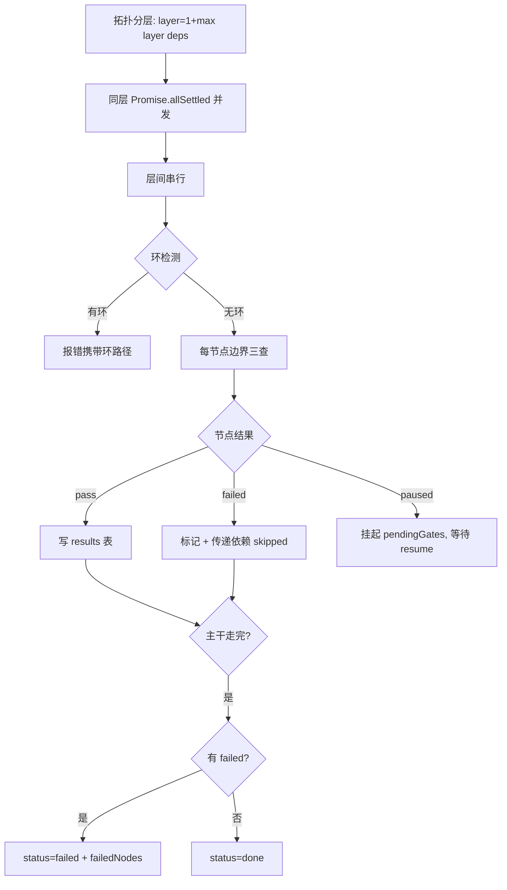
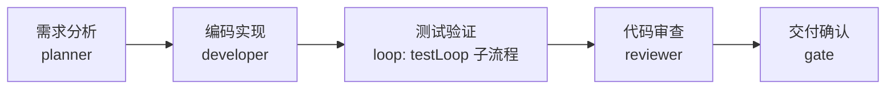

# 阶段三技术报告 · Graph 编排层与多角色协作

> 所属项目：SunshineX（通用 AI Agent 工程化骨架）
> 阶段周期：第 13–18 周（ROADMAP 阶段三）
> 交付状态：✅ 已交付（实施链 f905fa5 → 3f4188a → 247e5b2 → a0cdfa2；终态门禁 build 0 / 149-149-0 / selfcheck 0）
> 依据文档：`docs/superpowers/specs/2026-09-06-phase3-graph-orchestration-design.md`、`docs/ROADMAP.md` 阶段三

---

## 1. 概览

阶段三在 Loop 层之上交付 **Graph 编排层**——回答「谁先跑、谁并行、产出给谁」，不亲自执行任何模型/工具动作。GraphEngine 只做 DAG 调度（拓扑分层、并发、数据流、错误局部化、终止记账），执行体全部复用既有引擎。

设计立场：**调度与执行分离**。Graph 层**不新增第四条执行路径**（前三条是 Harness Reactor / Loop Engine / 工具链）。

### 1.1 交付物总览

| 能力域 | 核心模块 | 落点 |
|--------|---------|------|
| DAG 核心引擎 | `graph/engine.ts` | 拓扑分层、并发调度、数据流、错误局部化 |
| 四类节点 | `graph/nodes.ts` | loop / agent / gate / ci |
| 多角色子 Agent | `graph/agents.ts` | planner / developer / tester / reviewer |
| 工作流定义 | `graph/workflow.ts` | WorkflowDef + 结构校验 + 实例化 |
| 全链路模板 | `graph/templates.ts` | 五节点软件工程流水线 |
| CLI 入口 | `cli/commands/run-pipeline.ts` | `sunshinex pipeline` 命令 |
| 类型体系 | `types.ts` | GraphNodeKind / GraphNodeOutput / GraphRunResult / WorkflowDef |

### 1.2 三种运行模式

| 模式 | 说明 |
|------|------|
| 纯 Loop | 单任务自主迭代（阶段二） |
| 纯 Graph | DAG 多节点编排（阶段三） |
| Graph + Loop | 图节点内嵌 Loop 子流程（阶段三核心验收点） |

---

## 2. 核心架构

### 2.1 设计立场

1. **调度与执行分离**：GraphEngine 只做 DAG 调度，loop 节点内嵌 LoopEngine，agent 节点直接驱动 Reactor，工具执行仍走 SafetyChain。
2. **三级预算贯通**：Graph 总预算 → Loop 节点预算 → Reactor 预算，按剩余量逐级换算（复用 `toReactorBudget` 比例）；超支在 Graph 边界 **paused**。
3. **错误局部化**：节点 fail 只标记该节点，传递依赖自动 skipped，**无关分支照常执行**，不做全局回滚。
4. **人机分离**：人工审批节点 pause 等待（`paused` + `pendingGates`），提供 `resume` 续跑接口。

### 2.2 GraphEngine 主干

```ts
export type GraphNodeFn = (ctx, deps, inputs) => Promise<GraphNodeOutput>;

export interface GraphNode extends LoopNodeBase {
  deps: string[];               // 上游依赖节点 id
  run: GraphNodeFn;
}

export class GraphEngine {
  constructor(nodes: GraphNode[], deps: GraphDeps, termination: GraphTermination, hooks?);
  async run(goal: string, opts?): Promise<GraphRunResult>;
  async resume(approvals?, opts?): Promise<GraphRunResult>;
}
```

### 2.3 执行语义



四种流程模式（串行 / 并行 / 分支 / 汇合）由拓扑结构自然表达：
- **并行** = 同层多节点
- **汇合** = 下游多依赖（fan-in 聚合上游产出）
- **分支** = 上游多下游（fan-out）

---

## 3. 底层技术设计细节

### 3.1 类型体系

```ts
export type GraphNodeKind = 'loop' | 'agent' | 'gate' | 'ci';

export interface GraphNodeOutput {
  nodeId: string;
  status: 'pass' | 'failed' | 'skipped' | 'paused';
  reply?: string;
  tokens: number;                    // 节点真实消耗（loop/agent 自 Reactor/Loop 透传）
  criteria?: CriterionResult[];      // 内嵌 Loop 的验收产物
}

export interface GraphContext {
  state: Record<string, unknown>;    // goal 与跨节点共享变量（含 approvals）
  tokensUsed: number;                // Graph 总预算记账
  startedAt: number;
  results: Record<string, GraphNodeOutput>;  // nodeId → 输出（数据流表）
}

export interface GraphRunResult {
  status: 'done' | 'failed' | 'paused';
  iterations: number;
  tokensUsed: number;
  failedNodes: string[];
  pendingGates: string[];            // paused 时非空
  reply?: string;
}
```

### 3.2 拓扑分层与环检测

```text
layer(id) = 1 + max(layer(deps))
环检测：topo() DFS，错误信息携带环路径
并发：同层节点 Promise.allSettled
```

### 3.3 四类节点

| kind | 职责 | 实现 |
|------|------|------|
| loop | 内嵌 Loop 子流程 | `makeLoopNode`：按 config 组装三模板之一；输出映射 LoopRunResult（done→pass / failed→failed / paused→paused）；预算贯通 Graph remaining → Loop maxTokens |
| agent | 多角色单任务 | `makeRoleAgent(role)`：角色预设 → 单次 Reactor run；`toReactorBudget(remaining)` 换算 |
| gate | 人工审批 | `makeGateNode({ prompt })`：`state.approvals[id]===true` → pass；`===false` → failed；未审批 → paused |
| ci | CI/CD | `makeCiNode({ command, expect? })`：经 registry exec（走 SafetyChain）执行注入命令，exit 0 → pass |

### 3.4 多角色子 Agent

```ts
export type AgentRole = 'planner' | 'developer' | 'tester' | 'reviewer';
export const ROLE_PRESETS: Record<AgentRole, { label: string; framing: string }>;
```

| 角色 | 职责 |
|------|------|
| planner（规划师） | 需求拆解、方案设计、路径规划 |
| developer（开发者） | 代码生成、重构、Bug 修复 |
| tester（测试工程师） | 测试用例生成、执行、结果分析 |
| reviewer（审查员） | 代码规范、逻辑检查、安全扫描、审查报告 |

设计要点：角色预设只做**任务框定与档位建议**（写入任务文本与 router 建议信号），**不新增模型通道**——模型调用仍经 deps.model/router。

### 3.5 三级预算贯通

```text
Graph termination.maxTokens（总预算）
  └─ loop 节点   → Loop termination.maxTokens = remaining（Loop 内部自管 reserve 换算）
  └─ agent 节点  → Reactor budget = toReactorBudget(remaining)
```

超支 → **paused**（非 failed，不伪造完成）；`resume(approvals?, { budget })` 可携调整后预算续跑。

### 3.6 工作流定义（零依赖）

```ts
export interface WorkflowDef {
  name: string;
  nodes: Array<{ id; kind; deps; config }>;
  termination: GraphTermination;
}
export function validateWorkflow(def): Result<WorkflowDef>;       // 手写结构校验
export function instantiateWorkflow(def, deps): { name, engine };
```

- 手写结构校验（kind 合法性、deps 引用存在性、无环预检、必填 config），**不引 JSON Schema 库**——Schema 语义以 TS 类型 + 校验器等义落地
- 校验器对未知 config 字段不宽松放行：逐 kind 白名单校验，错误逐条列明

---

## 4. 核心功能设计

### 4.1 全链路软件工程流水线



- 依赖链：developer←planner、testLoop←developer、reviewer←testLoop、gate←reviewer（串行为主）
- **测试验证阶段为内嵌 Loop**——正是「节点嵌套 Loop」验收点
- 架构设计并入需求分析输出（单 planner 节点承担两段框定）

### 4.2 错误局部化

节点 fail → 标记该节点 → 传递依赖置 skipped（依赖链上任一 failed/skipped 即 skip）→ **无关节点照常** → run 收口 status=failed + failedNodes 清单。

### 4.3 幂等续跑（resume）

`results` 已有 pass 的节点跳过不再执行——`resume` 复用同一调度遍历，天然从断点继续。paused 的 loop 节点 resume 时**重跑该子流程**（Loop 无中态恢复，如实声明）。

---

## 5. 设计趋势

1. **从「单任务」到「多角色协作」**：规划师 / 开发者 / 测试工程师 / 审查员自动分工。
2. **从「顺序执行」到「DAG 并发调度」**：拓扑分层 + 同层并发，支持串行/并行/分支/汇合四模式。
3. **从「全局失败」到「错误局部化」**：节点失败仅回退当前节点，无关分支照常执行。
4. **从「一次性执行」到「可中断续跑」**：gate pause/resume + 预算 paused，人工审批与预算调整可插拔。
5. **从「平台绑定」到「命令注入」**：CI 节点以命令注入承载（gh CLI），平台 API 集成留阶段四 MCP 或用户配置。

---

## 6. 优秀设计亮点

1. **调度与执行分离**：Graph 层不新增执行路径，所有执行体复用 LoopEngine / Reactor / SafetyChain——延续主链「无旁路」哲学。
2. **三级预算贯通**：Graph→Loop→Reactor 按剩余量逐级换算，超支 paused 不伪造完成，语义与 Loop 同构。
3. **环检测携带环路径**：错误信息可诊断，而非笼统的「检测到环」。
4. **幂等续跑**：resume 复用同一调度遍历，天然从断点继续，无额外恢复逻辑。
5. **零依赖的 DAG 与校验**：拓扑分层、并发调度（Promise.allSettled）、结构校验全部手写，不引 JSON Schema 库。

---

## 7. 交付与验收

**交付物**：Graph 编排引擎、多角色协作、全链路流水线模板、pause/resume、WorkflowDef 校验、CLI `pipeline` 命令。

**验收结论**（C1–C5）：
- DAG 环检测报出环路径，同层并发有见证（时间戳重叠），四模式端到端各一
- 四角色预设框定进任务文本，scripted 端到端
- loop 节点内嵌测试闭环修正环收敛，三级预算贯通，Graph 超支 paused
- 错误局部化（fail→skipped 传播 + 无关分支完成）+ gate pause/resume 双路 + ci exit 语义
- 全链路模板 e2e + 零回归（129 例既有断言零改动）+ selfcheck graph 行

---

## 附：阶段三关键提交链

| 任务 | 主题 | 提交 |
|------|------|------|
| T1 | Graph 类型体系 + 引擎骨架 | f905fa5 |
| T2 | 四类节点 | 3f4188a |
| T3 | 多角色子 Agent + 工作流定义 | 247e5b2 |
| T4 | 全链路流水线模板 + selfcheck 收口 | a0cdfa2 |
