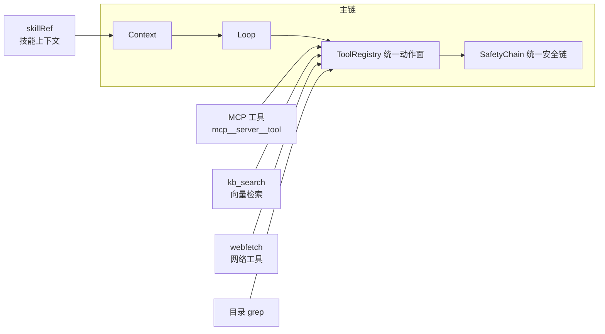
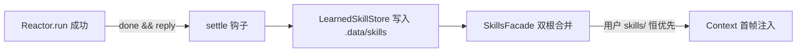
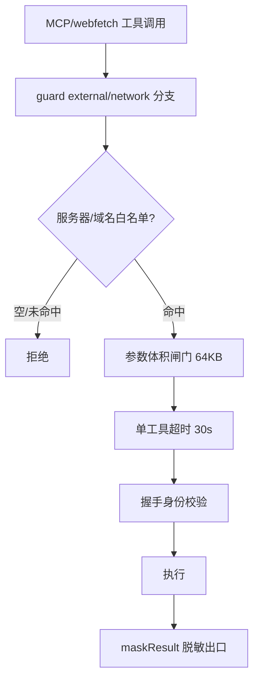

# 阶段四技术报告 · MCP 生态与全场景能力

> 所属项目：SunshineX（通用 AI Agent 工程化骨架）
> 阶段周期：第 19–22 周（ROADMAP 阶段四）
> 交付状态：✅ 已交付（P1 主线 + P1b HTTP/SSE 与技能沉淀闭环 + P4R 路由/账本/前缀稳定化）
> 终态基线：`npm run build` 零报错 · 全量测试 289/289 全绿 · `npm run selfcheck` 通过（含 learned / usage 行）
> 依据文档：`docs/superpowers/specs/2026-09-08-phase4-mcp-ecosystem-design.md`、`docs/superpowers/plans/2026-09-10-phase4-p1b-http-skill-settle.md`、`docs/superpowers/plans/2026-09-09-phase4-p1-sqlite-vec.md`、`docs/ROADMAP.md` 阶段四

---

## 1. 概览

阶段四是 SunshineX 的**生态开放层**：把第三方工具（MCP）、知识检索（向量库）、可复用任务模板（技能）接进既有主链，补齐 v1.0「能力对标」的最后一批运行时能力。

设计立场：**有机结合而非能力拼接**。MCP 工具、kb_search、目录 grep、webfetch 全部经 `ToolRegistry` 注册、走同一条 SafetyChain，**不新增任何旁路**——第三方工具与内置工具对 Loop/Graph 完全同构。

### 1.1 交付物总览

| 能力域 | 核心模块 | 落点 |
|--------|---------|------|
| MCP 客户端 | `harness/mcp/client.ts` | stdio/http/sse 传输工厂 + 握手身份校验 + external 登记制 |
| 内置工具扩展 | `harness/tools/` | 目录级 grep + webfetch + kb_search |
| 模型路由/缓存/流式 | `model/adapter.ts` + `harness/reactor.ts` | RouteHint 决策留痕 + 前缀稳定化 + completeStream 流式 |
| 向量知识库 | `harness/knowledge/` | chunk 分块 + store 后端注册表 + embed + KnowledgeBase |
| 技能系统 | `harness/skills.ts` + `skills/learned.ts` | skillRef 调度 + 记忆→技能沉淀闭环 |
| 成本账本 | `harness/ledger.ts` | per-run 成本账本（runs/<id> + 汇总） |
| 类型体系 | `types.ts` | ToolCategory 扩展 / RouteDecision / SkillRef / McpServerConfig |

### 1.2 阶段四内部子批次

| 批次 | 主题 | 关键提交 |
|------|------|---------|
| P1 主线 | stdio 注册链 + 安全闸门 + sqlite-vec 知识库 + grep/webfetch + 路由/流式/账本 | 083ac89 → … → 95481ce |
| P1b | MCP HTTP/SSE 传输 + 记忆→技能沉淀闭环 | c31a17e → 1539ba4（8 任务 8 commit） |
| P4R | 路由观测 + 成本账本 + 前缀稳定化 | 6cacf69 / f17c28b / eb99c36 |

---

## 2. 核心架构

### 2.1 生态开放层的接缝设计

阶段四坚持「**外部依赖可插拔**」：一切外部依赖（向量存储、embedding 提供方、MCP 传输与 SDK、模型后端）一律收敛在内部接口之后——缺省零依赖实现，替换后端不改主链。每个接缝配一致性测试套件，可插拔性由「第二个真实后端通过套件」证明，而非口头接口。



第三方工具与内置工具**同构**——同一注册表、同一安全链、同一脱敏出口。

---

## 3. 底层技术设计细节

### 3.1 MCP 客户端与工具接入

依赖 `@modelcontextprotocol/sdk`（1.30.0，阶段四唯一新增运行时依赖），按依赖政策登记入册。

```ts
export interface McpServerConfig {
  name: string;
  command?: string; args?: string[]; env?: Record<string, string>;
  transport?: 'stdio' | 'http' | 'sse';   // 缺省 = stdio（P1b 增量）
  url?: string;                            // http/sse 端点（P1b 增量）
}

export class McpHost {
  constructor(servers, registry, chain);
  registerTools(): Promise<number>;   // 逐 server：connect → tools/list → registry.register
  async close(): Promise<void>;
}
```

#### 传输工厂（三分支，P1b 交付）

```text
stdio → StdioClientTransport({ command, args })            # 现行为原样
http  → StreamableHTTPClientTransport({ url })             # streamable http
sse   → SSEClientTransport({ url })                        # server-sent events
```

#### 命名与类别

- 工具规范名 `mcp__<server>__<tool>`（业界惯例，天然隔离内置命名空间）
- `ToolCategory` 新增 `'external'` 与 `'network'`

#### 安全策略（guard 增补 external/network 分支）

| 维度 | 策略 |
|------|------|
| 服务器白名单 | SUNSHINE.md `mcpServers` 清单本身；白名单空 = 全禁 |
| 参数体积 | JSON 体积上限（默认 64KB） |
| 单工具超时 | 默认 30s |
| 网络白名单 | webfetch 域名白名单（`network.allowlist`），缺省空 = 禁用 |
| 脱敏 | 结果统一过 `maskResult`（链上既有唯一出口） |
| dontAsk | 外部工具不豁免以上闸门（免审批 ≠ 免策略） |

#### 握手身份校验

配置名 ≠ serverInfo.name 即拒（防止配置漂移注入）。连接失败 → `MCP_CONNECT_FAILED`（含 URL 不可达 fail-fast）。

#### 测试（零外部网络）

仓库内脚本 mock stdio JSON-RPC server 与 HTTP/SSE server（`node:http` 零依赖，port 0 临时端口），覆盖 handshake → tools/list → 注册 → 经链调用 → 脱敏/超时/越权断言。

### 3.2 内置工具集扩展

| 工具 | 变更 | 说明 |
|------|------|------|
| grep | 目录级升级：path 支持目录，glob 过滤，递归遍历 | 复用 safePath 判界；结果行数上限（默认 200 行）防爆炸 |
| webfetch | 新增（category `network`） | 域名白名单闸门；正文长度上限；mask 出口 |
| kb_search | 新增（category `read`） | 本地向量索引检索 |
| git/db 专项 | **不做** | exec 已覆盖；能力并入既有执行面 |

### 3.3 模型路由、缓存与流式

#### 可观测路由（P4R）

```ts
router.route(hint?: RouteHint): RouteDecision   // hint 携带复杂度/角色信号
RouteDecision { tier, reason }                  // 随 run 结果返回并落 ledger
```

决策留痕：`run opts.routeHint` 正式入参，`RunResult.route` 携带实际生效决策。

#### 成本账本（P4R）

- UsageHooks 聚合到 harness 层 per-run ledger（storage key `runs/<id>`）
- session 缓存增加 hit/miss 计数器
- selfcheck 输出汇总行（`usage` 行）

#### 前缀稳定化（P4R）

context 组装器固定 system 与工具 schema 段顺序（稳定段前置、工具清单按名序、档位提示移尾），提升 provider 端 KV 前缀缓存命中（DeepSeek/OpenAI 隐式缓存均受益）。

#### 流式（completeStream）

```ts
ModelAdapter.completeStream(req, onDelta): Promise<Completion>
```

- SSE 解析零依赖（body reader 按 `data:` 行切分、`\n\n` 分帧、跨 chunk 缓冲、`[DONE]` 终止）
- scripted/stub 适配器同步支持（scripted 逐字吐出）
- 三适配器同接口——即「外部依赖可插拔」在模型层的既有范例
- 理由：阶段五 TUI 硬依赖 token 流，接口改造提前到阶段四（路由/缓存同域施工）降低风险

### 3.4 本地向量知识库（可插拔后端）

```text
src/harness/knowledge/
  embed.ts      # EmbeddingProvider 接口 + OpenAI 兼容默认实现
  chunk.ts      # Markdown 感知分块
  store.ts      # VectorStore 接口 + 后端注册表 + LocalJsonVectorStore
  store.sqlite-vec.ts  # sqlite-vec KNN 后端（P1 交付）
  store.conformance.ts # 全后端必过的契约用例
  index.ts      # KnowledgeBase：indexDir/search/stats，按 KB_BACKEND 装配
```

#### 后端可插拔

`VectorStore` 是唯一存储接缝，后端经注册表按配置装配（`.env` 键 `KB_BACKEND`，缺省 `local-json`）。新增后端 = 一个实现文件 + 注册一行，主链零改动。

| 后端 | 说明 |
|------|------|
| local-json | 零依赖缺省与回归基线（归一化向量 + 暴力余弦） |
| sqlite-vec | node:sqlite + sqlite-vec 零编译路线，vec0 KNN（P1 交付） |
| chromadb | 仅留位，不引入 |

#### 一致性测试套件

`store.conformance.ts` 定义全后端必过的契约用例（写入/召回/TopK 语义/幂等/持久化/损坏恢复）。缺省后端与新后端共用同一断言集——**可插拔由「第二个真实后端全绿」证明**（sqlite-vec 双后端 conformance 全绿）。

#### Markdown 感知分块

- 标题节聚合、`MAX_CHUNK=1200` 硬切、`OVERLAP=100` 重叠
- 超长节句子完整、无边界硬切带重叠前缀、重叠归入下块头部消孤立尾块

#### 数据可控口径

索引仅覆盖用户显式指定目录；分块文本发送至所配置 embedding 端点（可指向本地实现实现全本地化）；`.env` 不入库。

#### 降级与 fail-fast

- 未配置 embedding 端点 → `kb_search` 返回明确提示（`kb_not_configured` 降级），不阻塞其他工具
- `KB_BACKEND` 指向未注册后端 → 装配期 fail-fast，不静默回退

### 3.5 技能模板调度与记忆→技能沉淀

#### 技能语义

技能 = **参数化上下文模板**。调度 = `skillRef` 注入首帧 context，Loop/Graph 执行语义零改动（Claude Code 式，非独立执行通道）。

```ts
export interface ResolvedSkill { manifest: SkillManifest; body: string; }
export function resolveSkill(skillsDir, id, params?): Result<ResolvedSkill>;
// 未注册 id / 缺参数 → fail（三态语义：未注册/缺参/命中）
```

- `SkillManifest` 增加 `params?: string[]`（正文 `{{param}}` 占位符清单）与 `kind: 'prompt'`
- 白名单形参替换：白名单内占位符替换，白名单外原样保留

#### 记忆→技能沉淀闭环（P1b 交付）



三件套：

| 组件 | 职责 | 细节 |
|------|------|------|
| `LearnedSkillStore` | 成功任务沉淀为学习技能模板 | `.data/skills/{id}/skill.md`；slug 确定性（截长 40）；撞名 `-2`；FIFO 50 对齐 CAP.skill |
| Reactor settle 钩子 | 成功路径一次性沉淀 | 仅 `done===true && reply` 触发一次；失败零触发；抛错吞掉记 episodic 不倒灌任务成败 |
| `SkillsFacade` 双根合并 | 用户技能 + 学习技能合并 | 用户 `skills/` 恒优先（学习产物同 id 被遮蔽，不抛） |

---

## 4. 核心功能设计

### 4.1 全场景基础能力

- **标准 MCP 工具可注册并调用**：stdio/http/sse 三传输 + 握手校验 + 安全闸门链
- **全场景内置工具**：目录 grep + webfetch + kb_search，覆盖检索/网络/知识三类缺口
- **可观测模型路由**：RouteHint 决策留痕 + per-run 成本账本 + 前缀稳定化
- **本地向量知识库**：可插拔双后端（local-json / sqlite-vec），conformance 契约硬化
- **技能模板体系**：skillRef 参数化调度 + 记忆→技能沉淀闭环

### 4.2 安全闸门全链路（external/network）



---

## 5. 设计趋势

1. **从「封闭」到「开放生态」**：MCP 协议兼容接入第三方工具，能力无限扩展。
2. **从「单后端」到「可插拔多后端」**：向量库 local-json / sqlite-vec 双后端 + conformance 契约证明可插拔性。
3. **从「黑盒」到「可观测」**：RouteDecision 留痕 + per-run 成本账本 + 缓存命中率计数。
4. **从「静态绑定」到「决策留痕」**：算力路由从静态绑定升级为 route(hint) 带 reason 的可观测决策。
5. **从「一次性输出」到「流式」**：completeStream 三适配器同接口，为阶段五 TUI 铺路。
6. **从「记忆存储」到「技能沉淀」**：成功任务自动沉淀为可复用技能模板（记忆→技能闭环）。

---

## 6. 优秀设计亮点

1. **单一执行面无旁路**：MCP/kb_search/webfetch/grep 全部经 ToolRegistry + SafetyChain，第三方工具与内置工具对 Loop/Graph 完全同构。
2. **可插拔由第二个后端证明**：conformance 契约套件是「可插拔」的硬证据——sqlite-vec 全绿证明接口真可替换，而非口头接口。
3. **握手身份校验**：配置名 ≠ serverInfo.name 即拒，防止配置漂移注入，是 MCP 接入的安全锚点。
4. **零依赖 mock 测试**：node:http 零依赖 mock stdio/http/sse server，port 0 临时端口，覆盖全链路而不依赖外部网络。
5. **记忆→技能沉淀闭环**：成功任务自动沉淀为技能模板，双根合并保证用户作品不被机器覆盖，FIFO 上限防膨胀。
6. **降级与 fail-fast 双态**：embedding 未配置明确降级不阻塞主链；KB_BACKEND 指向未注册后端装配期 fail-fast 不静默回退。

---

## 7. 交付与验收

**交付物**：MCP 兼容（stdio/http/sse）、全场景基础能力、技能系统（含沉淀闭环）、可插拔向量知识库、可观测路由与成本账本、流式接缝。

**验收结论**（量化）：
- MCP 全链路：mock server 完成 handshake → tools/list → 注册 → 经安全链 tools/call；白名单外 server 拒绝、超时返回 fail、结果脱敏、`mcp__` 命名无冲突
- 知识库：conformance 套件双后端全绿（local-json + sqlite-vec）
- 技能：示例技能经 skillRef 完成 scripted 任务；记忆→技能沉淀闭环三件套交付（selfcheck `learned` 行）
- 门禁：build 0 / 全量 289/289/0 / selfcheck 全绿（mcp/tools/kb/skill/learned/usage 行）

---

## 附：阶段四关键提交链

| 批次 | 主题 | 关键提交 |
|------|------|---------|
| P1 脚手架 | 类型与配置脚手架 | 083ac89 |
| P1 工具 | 目录 grep + webfetch | 09a1983 |
| P1 路由/流式 | 缓存命中率 + RouteHint 留痕 + completeStream | f27848e / 90221e0 / ba34f27 |
| P1 知识库 | chunk 分块 + VectorStore 接缝 + conformance + sqlite-vec | 4985d1d → 03b1444 |
| P1 技能 | resolveSkill 参数化 + skillRef 首帧注入 | 6458479 / 85ca7f9 |
| P1 MCP | SDK 注册链 + 闸门全链路 | c6ec58b / ad166e3 |
| P1b H 线 | HTTP/SSE 传输（H1–H4） | c31a17e / 803e01c / 70f1589 / 6b89416 |
| P1b S 线 | 技能沉淀闭环（S1–S3） | 5959265 / 835c615 / a5bee7e |
| P1b G 线 | 定案收口 + 终验门禁 | 1539ba4 |
| P4R | 路由观测 + 成本账本 + 前缀稳定化 | 6cacf69 / f17c28b / eb99c36 |
