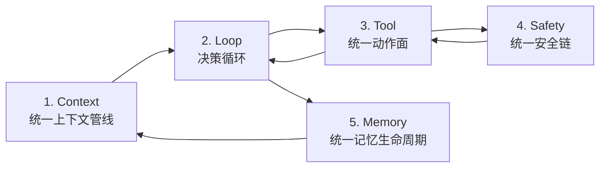
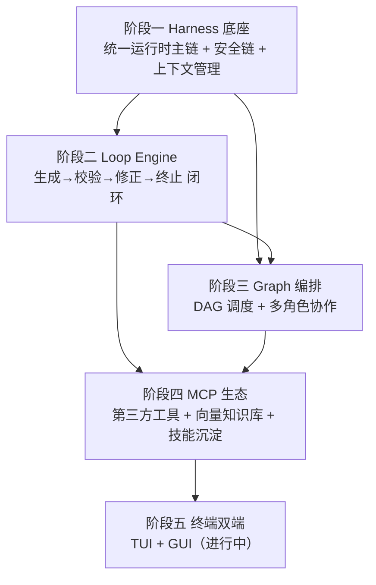

# SunshineX 技术架构报告（Tech Architecture）

> 本文件夹收录 SunshineX（通用 AI Agent 工程化骨架）阶段一至阶段四的**阶段技术报告**，供内部汇报使用。
> 每份报告包含：底层技术设计细节、核心架构图 / 流程图、设计趋势、优秀设计亮点、核心功能设计、交付与验收结论。
> 全部内容基于仓库内已交付的 spec / plan / 提交记录与真实代码结构整理，可与 `docs/superpowers/` 下的设计文档交叉核对。

## 项目定位（一句话）

SunshineX 采用 **Harness / Loop / Graph 三层嵌套范式**：云端大模型负责推理，本地负责编排、执行、安全与记忆。核心是**统一运行时主链**——五环节按数据流串联成单一闭环，而非多套实现逻辑拼接。

## 阶段报告导航

| 阶段 | 主题 | 报告文件 | 核心交付物 | 状态 |
|------|------|---------|-----------|------|
| 一 | Harness 底座核心 | [01-阶段一-Harness底座核心技术报告.md](./01-阶段一-Harness底座核心技术报告.md) | 统一运行时主链（1A–1E）、安全链、上下文压缩闭环 | ✅ 已交付 |
| 二 | Loop Engine 与专用模板 | [02-阶段二-LoopEngine核心技术报告.md](./02-阶段二-LoopEngine核心技术报告.md) | Loop 引擎、四类节点、三大模板、/goal 自我验证 | ✅ 已交付 |
| 三 | Graph 编排层 | [03-阶段三-Graph编排层核心技术报告.md](./03-阶段三-Graph编排层核心技术报告.md) | DAG 引擎、多角色协作、全链路流水线 | ✅ 已交付 |
| 四 | MCP 生态与全场景 | [04-阶段四-MCP生态与全场景核心技术报告.md](./04-阶段四-MCP生态与全场景核心技术报告.md) | MCP（stdio/http/sse）、可插拔向量库、技能沉淀闭环 | ✅ 已交付 |

## 三层范式演进总览

**分层依赖方向**：`graph → loop → harness → model / storage / plugins`。Graph 节点可嵌入 Loop 子流程，二者都运行在 Harness 底座之上。

## 各阶段技术主题速览

| 阶段 | 核心技术主题 | 设计亮点关键词 |
|------|------------|--------------|
| 一 | 统一运行时主链、三态权限引擎、symlink 路径归一、压缩预算闭环、三档算力路由 | 无旁路可证伪、单一代收点脱敏、真实场景驱动加固、零依赖生产级底座 |
| 二 | 节点序列 + Router 主干、/goal 自我验证、四重终止、预算贯通 | 复用而非重写、纯函数式节点、pause 不伪造完成、模板即配置 |
| 三 | 拓扑分层并发、四类节点、三级预算贯通、错误局部化、幂等续跑 | 调度与执行分离、环检测携带环路径、零依赖 DAG |
| 四 | MCP 三传输、可插拔向量后端、可观测路由、记忆→技能沉淀 | 单一执行面无旁路、可插拔由第二个后端证明、握手身份校验、降级与 fail-fast 双态 |

## 交叉引用

- 架构设计方案与分阶段规划：`../Arch-Plan.md`
- 开发路线图（6 阶段、28 周）：`../ROADMAP.md`
- 设计 spec 原文：`../superpowers/specs/`
- 实施计划与执行记录：`../superpowers/plans/`
- 真实场景验证报告：`../superpowers/reports/`
- 项目当前架构与设计亮点：仓库根目录 `README.md`
