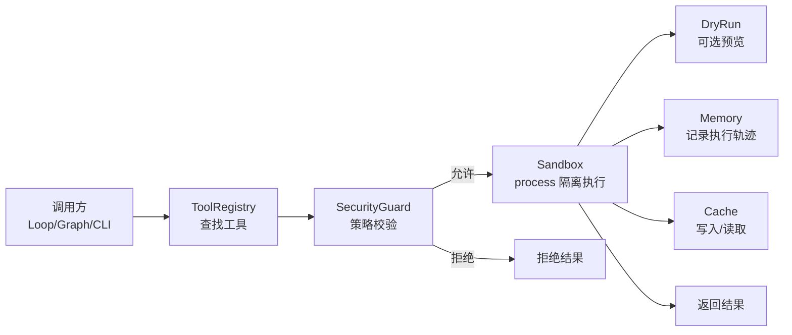
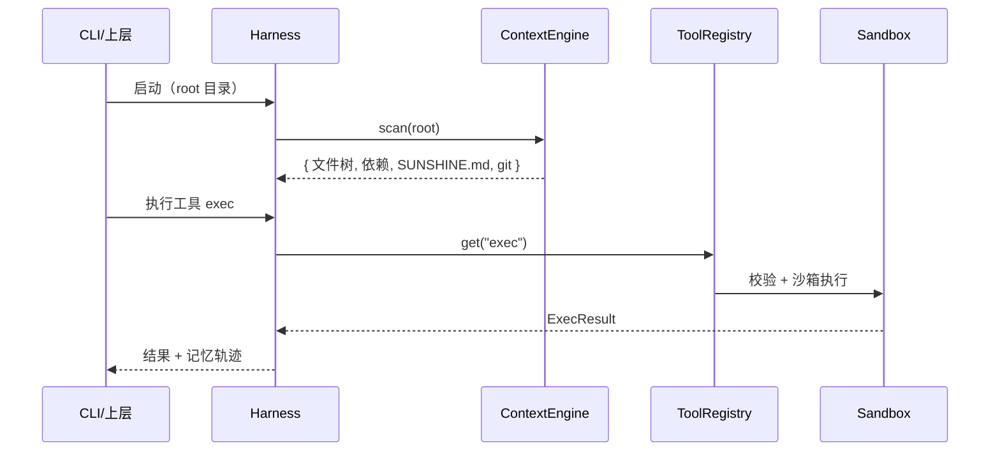

# 第一阶段设计：Harness 底座核心

> 日期：2026-09-03
> 状态：已评审通过（待实施）
> 关联：docs/ROADMAP.md 阶段一、README.md 第五章

## 1. 概述

### 1.1 背景

SunshineX 采用 Harness / Loop / Graph 三层嵌套范式，Harness 是底座，Loop 与 Graph 都运行其上。当前仓库已有骨架：`src/` 下占位实现了 skills 加载、三级记忆、工具注册表、Loop/Graph 引擎、模型适配、存储、插件加载，但 Harness 四大基础能力（项目感知、工具、安全、记忆）尚未形成可运行的闭环。

### 1.2 目标

落地生产级 Harness 底座，实现四大基础能力的**最小可运行闭环**，并以可插拔接口预留生产级实现（SQLite / Docker / MCP）的挂载点。

### 1.3 范围

**本阶段做：**

- 项目感知引擎：目录扫描、依赖解析、SUNSHINE.md 配置、Git 读取
- 统一工具框架：注册表 + 内置工具集（read/write/grep/exec/glob）
- 安全管控：命令策略（允许/拒绝）+ 沙箱执行 + dry-run 预览
- 记忆体系：三级记忆 + 三级 KV 缓存
- 可插拔接口：StorageAdapter / Sandbox / ModelAdapter
- 测试与自检：单元测试 + 门面集成测试 + selfcheck 扩展

**本阶段不做：**

- MCP 协议实现（仅预留挂载点）
- SQLite / Docker 真实实现（仅留接口）
- Loop / Graph 业务逻辑（保留占位）
- GUI 桌面端

### 1.4 约束

- 零新增 npm 依赖：仅使用 Node 内置模块（fs / path / child_process / node:test）
- TypeScript strict 模式，禁止无理由 any
- 所有 IO 集中在 adapter/store 内

## 2. 模块划分与目录结构

四大能力各落一个边界清晰的模块，外加一个 Harness 门面统一对外。

| 能力 | 模块 | 职责 |
|------|------|------|
| 项目感知 | `harness/context.ts` | 目录扫描、依赖解析、SUNSHINE.md、Git 读取 |
| 统一工具 | `harness/tools.ts` + `harness/tools/` | 工具注册表（带执行器）+ 内置工具集 |
| 安全管控 | `harness/security.ts` + `sandbox.ts` + `dryrun.ts` | 命令策略、沙箱执行、dry-run 预览 |
| 记忆 | `harness/memory.ts` + `cache.ts` | 三级记忆 + 三级 KV 缓存 |

阶段一完成后的目录：

```text
src/
  harness/
    index.ts      # Harness 门面，聚合四大能力（新增）
    context.ts    # 项目感知引擎（新增）
    tools.ts      # 工具注册表，扩展执行器签名（改造）
    tools/        # 内置工具集：read/write/grep/exec/glob（新增）
    security.ts   # 命令策略：允许/拒绝规则（新增）
    sandbox.ts    # 沙箱执行，process 隔离（新增）
    dryrun.ts     # dry-run 预览（新增）
    memory.ts     # 三级记忆（已有）
    cache.ts      # 三级 KV 缓存（新增）
    skills.ts     # 技能加载（已有，保留）
  storage/
    adapter.ts    # StorageAdapter 接口（新增）
    store.ts      # LocalStore 实现（已有，改造为适配器）
  model/adapter.ts  # 已有，保留
```

## 3. 接口与数据流

### 3.1 Harness 门面（统一入口）

```ts
interface Harness {
  context: ContextEngine;   // 项目感知
  tools: ToolRegistry;      // 统一工具
  security: SecurityGuard;  // 安全
  sandbox: Sandbox;         // 沙箱执行
  dryrun: DryRun;           // dry-run 预览
  memory: Memory;           // 三级记忆
  cache: Cache;             // 三级 KV 缓存
  skills: SkillsLoader;     // 技能（沿用）
}
```

Harness 是唯一聚合点：`new Harness(opts)` 后，上层（Loop/Graph）只依赖这个门面，不直接触达内部模块。

### 3.2 三个可插拔接口

```ts
interface StorageAdapter {
  read<T>(key: string, fallback: T): T;
  write<T>(key: string, value: T): void;
}

interface Sandbox {
  run(cmd: string, opts?: { cwd?: string; timeoutMs?: number }): Promise<ExecResult>;
}

interface ModelAdapter {          // 沿用已有
  readonly provider: string;
  complete(prompt: string): Promise<string>;
}
```

- `StorageAdapter`：默认 `FileStore`（改造已有 LocalStore），预留 `sqlite`。
- `Sandbox`：默认 `ProcessSandbox`（Node child_process + 超时 + 输出截断），预留 `docker`。
- `ModelAdapter`：已有，阶段一不扩展，仅通过路由接入。

### 3.3 工具执行链路



关键约定：**工具只声明、不直接执行**——`ToolRegistry` 里的工具是「元数据 + 执行器」，执行器统一经过 `SecurityGuard → Sandbox → DryRun` 这条链，保证安全与预览能力对所有工具生效。

### 3.4 数据流（单次感知 + 执行）



## 4. 错误处理

统一结果类型，避免异常穿透到上层：

```ts
type Result<T> =
  | { ok: true; value: T }
  | { ok: false; error: { code: string; message: string } };
```

| 场景 | 错误码 |
|------|--------|
| 工具未注册 | `TOOL_NOT_FOUND` |
| 命令被安全策略拦截 | `COMMAND_DENIED`（附拦截原因） |
| 沙箱执行超时 / 非零退出 | `EXEC_TIMEOUT` / `EXEC_FAILED`（附 stdout/stderr 截断） |
| 存储读写失败 | `IO_ERROR` |
| 依赖解析失败（非致命） | 降级为「依赖未知」，不阻断感知 |

约定：**感知类失败降级**（感知不全是致命的），**执行类失败返回结构化错误**（可追溯、可重试）。

## 5. 测试策略

| 层级 | 内容 | 工具 |
|------|------|------|
| 单元测试 | 每个模块核心逻辑：安全规则、缓存 TTL、记忆读写、解析器 | `node --test`（Node 内置，零依赖） |
| 集成测试 | 门面装配：`new Harness()` → 感知 → 工具执行 → 记忆轨迹 | 同上 |
| 自检 | `npm run selfcheck` 覆盖四大能力实例化 + 一次端到端工具调用 | 已有，扩展 |

## 6. 验收标准（进入阶段二的门槛）

1. `npm run build` 零报错（tsc strict）
2. `npm run test` 通过（新增，`node --test`）
3. `npm run selfcheck` 输出四大能力 + 一次真实沙箱执行结果
4. 危险命令（`rm -rf /` 等）被 `SecurityGuard` 拦截并返回结构化错误

## 7. 关键决策记录

| 决策 | 结论 |
|------|------|
| 推进方式 | 混合可插拔：核心零依赖，存储/沙箱/模型走 adapter 接口，预留 SQLite/Docker/MCP 挂载点 |
| 产出形态 | 先架构设计，再落地实施计划（本文件为设计，实施计划另出） |
| 安全默认实现 | process 子进程隔离（零依赖），Docker 仅留接口 |
| 存储默认实现 | 文件 JSON（零依赖），SQLite 仅留接口 |
