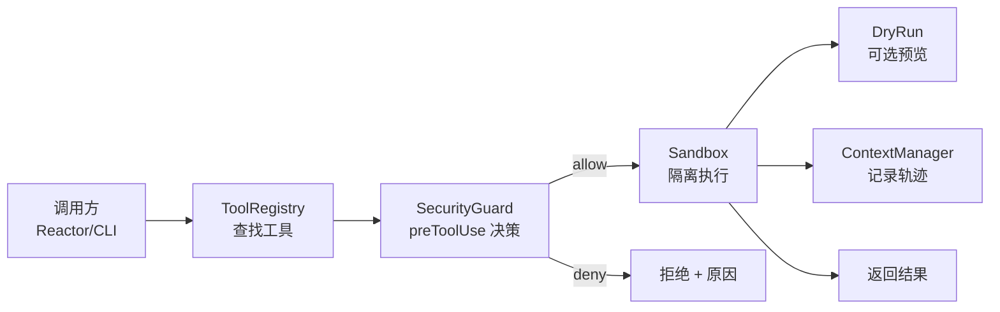
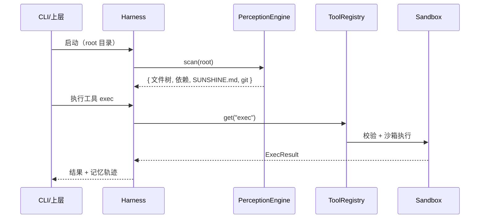
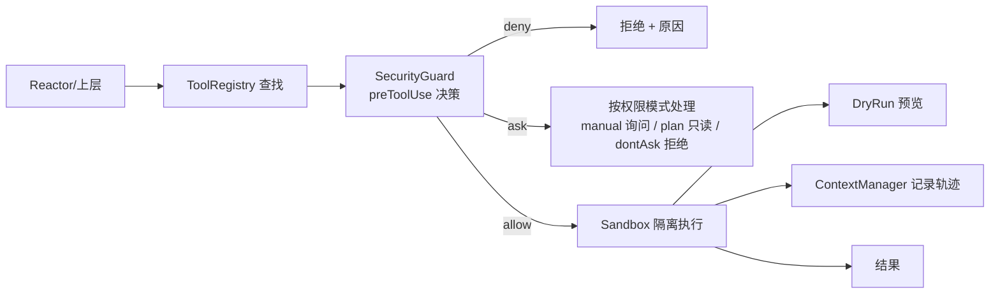
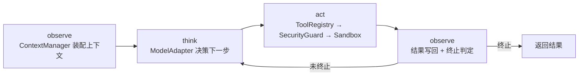

# 第一阶段设计：Harness 底座核心

> 日期：2026-09-03
> 状态：已评审通过（待实施）
> 关联：docs/ROADMAP.md 阶段一、README.md 第五章

## 1. 概述

### 1.1 背景

SunshineX 采用 Harness / Loop / Graph 三层嵌套范式，Harness 是底座，Loop 与 Graph 都运行其上。当前仓库已有骨架：`src/` 下占位实现了 skills 加载、三级记忆、工具注册表、Loop/Graph 引擎、模型适配、存储、插件加载，但 Harness 四大基础能力（项目感知、工具、安全、上下文与记忆）尚未形成可运行的闭环。

### 1.2 目标

落地生产级 Harness 底座，实现四大基础能力的**最小可运行闭环**，并以可插拔接口预留生产级实现（SQLite / Docker / MCP）的挂载点。

### 1.3 范围

**本阶段做：**

- 项目感知引擎：目录扫描、依赖解析、SUNSHINE.md 配置、Git 读取
- 统一工具框架：注册表 + 内置工具集（read/write/grep/exec/glob）
- 安全与权限：三态规则引擎（allow/ask/deny）+ PreToolUse 决策点 + 沙箱执行 + dry-run + 凭据 mask
- 上下文与记忆管理：分层指令加载 + 自动记忆（索引+主题文件）+ 上下文窗口管理
- 最小 Reactor：observe→think→act→observe 驱动循环（阶段一验收载体）
- 可插拔接口：StorageAdapter / Sandbox / ModelAdapter
- 测试与自检：单元测试 + 门面集成测试 + selfcheck 扩展

**本阶段不做：**

- MCP 协议实现（仅预留挂载点）
- SQLite / Docker 真实实现（仅留接口）
- Loop / Graph 业务逻辑（保留占位）
- GUI 桌面端

### 1.4 约束

- 零新增 npm 依赖：仅使用 Node 内置模块（fs / path / child_process / node:test）
- TypeScript strict 模式，禁止无理由 any
- 所有 IO 集中在 adapter/store 内

## 2. 模块划分与目录结构

四大能力（感知/工具/安全/上下文与记忆）各落一个边界清晰的模块，外加一个 Harness 门面统一对外、一个最小 Reactor 驱动循环。

| 能力 | 模块 | 职责 |
|------|------|------|
| 项目感知 | `harness/perception.ts` | 目录扫描、依赖解析、SUNSHINE.md、Git 读取 |
| 统一工具 | `harness/tools.ts` + `harness/tools/` | 工具注册表（带执行器）+ 内置工具集 |
| 安全与权限 | `harness/security/` | 三态规则引擎 + 沙箱 + dry-run + 凭据 mask |
| 上下文与记忆 | `harness/context/` | 分层指令 + 自动记忆 + 上下文窗口管理 |
| 驱动循环 | `harness/reactor.ts` | 最小 observe→think→act→observe 循环 |

阶段一完成后的目录：

```text
src/
  harness/
    index.ts        # Harness 门面，聚合四大能力（新增）
    perception.ts   # 项目感知引擎（新增）
    tools.ts        # 工具注册表，扩展执行器签名（改造）
    tools/          # 内置工具集：read/write/grep/exec/glob（新增）
    security/       # 安全与权限（新增）
      policy.ts     #   权限规则引擎（deny→ask→allow）
      rules.ts      #   规则解析（Tool(specifier) + 通配符）
      modes.ts      #   权限模式
      guard.ts      #   PreToolUse 决策点
      sandbox.ts    #   沙箱执行（process 隔离）
      dryrun.ts     #   dry-run 预览
      credentials.ts#   凭据 mask（预留）
    reactor.ts      # 最小驱动循环（新增）
    context/        # 上下文与记忆管理（新增）
      loader.ts     #   分层指令加载（SUNSHINE.md 多 scope + @import）
      rules.ts      #   path-scoped 规则
      auto-memory.ts#   自动记忆（索引 + 主题文件）
      window.ts     #   上下文窗口（token 预算 + compaction）
      session.ts    #   会话状态（持久化 + 恢复）
    skills.ts       # 技能加载（已有，保留）
  storage/
    adapter.ts    # StorageAdapter 接口（新增）
    store.ts      # LocalStore 实现（已有，改造为适配器）
  model/adapter.ts  # 已有，保留
```

## 3. 接口与数据流

### 3.1 Harness 门面（统一入口）

```ts
interface Harness {
  perception: PerceptionEngine;  // 项目感知
  tools: ToolRegistry;           // 统一工具
  security: SecurityGuard;       // 安全（PreToolUse 决策点）
  sandbox: Sandbox;              // 沙箱执行
  dryrun: DryRun;                // dry-run 预览
  context: ContextManager;       // 上下文与记忆管理
  skills: SkillsLoader;          // 技能（沿用）
  reactor: Reactor;              // 最小驱动循环
}
```

Harness 是唯一聚合点：`new Harness(opts)` 后，上层（Loop/Graph）只依赖这个门面，不直接触达内部模块。

### 3.2 三个可插拔接口

```ts
interface StorageAdapter {
  read<T>(key: string, fallback: T): T;
  write<T>(key: string, value: T): void;
}

interface Sandbox {
  run(cmd: string, opts?: { cwd?: string; timeoutMs?: number }): Promise<ExecResult>;
}

interface ModelAdapter {          // 沿用已有
  readonly provider: string;
  complete(prompt: string): Promise<string>;
}
```

- `StorageAdapter`：默认 `FileStore`（改造已有 LocalStore），预留 `sqlite`。
- `Sandbox`：默认 `ProcessSandbox`（Node child_process + 超时 + 输出截断），预留 `docker`。
- `ModelAdapter`：已有，阶段一不扩展，仅通过路由接入。

### 3.3 工具执行链路



关键约定：**工具只声明、不直接执行**——`ToolRegistry` 里的工具是「元数据 + 执行器」，执行器统一经过 `SecurityGuard.preToolUse → Sandbox → DryRun` 这条链，保证安全与预览能力对所有工具生效。完整链路（含 ask 分支与权限模式）见第 8 章。

### 3.4 数据流（单次感知 + 执行）



## 4. 错误处理

统一结果类型，避免异常穿透到上层：

```ts
type Result<T> =
  | { ok: true; value: T }
  | { ok: false; error: { code: string; message: string } };
```

| 场景 | 错误码 |
|------|--------|
| 工具未注册 | `TOOL_NOT_FOUND` |
| 命令被安全策略拦截 | `COMMAND_DENIED`（附拦截原因） |
| 沙箱执行超时 / 非零退出 | `EXEC_TIMEOUT` / `EXEC_FAILED`（附 stdout/stderr 截断） |
| 存储读写失败 | `IO_ERROR` |
| 依赖解析失败（非致命） | 降级为「依赖未知」，不阻断感知 |

约定：**感知类失败降级**（感知不全是致命的），**执行类失败返回结构化错误**（可追溯、可重试）。

## 5. 测试策略

| 层级 | 内容 | 工具 |
|------|------|------|
| 单元测试 | 每个模块核心逻辑：权限规则引擎、上下文窗口估算、自动记忆索引、指令解析器 | `node --test`（Node 内置，零依赖） |
| 集成测试 | 门面装配：`new Harness()` → 感知 → Reactor 循环 → 工具执行 → 上下文记录 | 同上 |
| 自检 | `npm run selfcheck` 覆盖四大能力实例化 + 一次端到端工具调用 | 已有，扩展 |

## 6. 验收标准（进入阶段二的门槛）

1. `npm run build` 零报错（tsc strict）
2. `npm run test` 通过（新增，`node --test`）
3. `npm run selfcheck` 输出四大能力 + 一次真实沙箱执行结果
4. 危险命令（`rm -rf /` 等）被 `SecurityGuard` 拦截并返回结构化错误
5. 上下文窗口：指令/自动记忆按序加载、`shouldCompact` 正确触发、`compact` 产出结构化摘要
6. 最小闭环：`reactor.run(task)` 端到端跑通（ScriptedAdapter 驱动一次完整 observe→think→act→observe）

## 7. 上下文与记忆管理（吸收 Claude Code 设计）

Harness 的核心不是「三级记忆存储」，而是**上下文与记忆管理**——决定什么内容进入上下文窗口、何时进入、如何压缩、如何跨会话恢复。本节吸收 Claude Code 的成熟设计，替代原先「三级记忆一带而过」的粗略规划。

### 7.1 Claude Code 调研结论

| 机制 | Claude Code 设计 | 关键点 |
|------|-----------------|--------|
| 分层持久指令 | `CLAUDE.md` 多 scope | managed → user → project → local，从广到具体；`@path` import 递归 4 层 |
| 按需规则 | `.claude/rules/` + `paths:` frontmatter | path-scoped，命中匹配文件才加载，省上下文 |
| 自动记忆 | Auto memory | Agent 自己写，四类 type：`user`/`feedback`/`project`/`reference` |
| 记忆索引 | `MEMORY.md` + topic files | 索引常驻（限 200 行/25KB），详情按需读；跳过可从代码推导的内容 |
| 窗口压缩 | 自动 `/compact` | 接近上限自动摘要；system prompt 不变，指令/记忆从磁盘重注入，最近 5 文件重读 |
| 会话恢复 | session + transcript | 本地持久化，resume / branch / 命名 |

### 7.2 SunshineX 吸收方案

将「记忆」能力升级为「上下文与记忆管理」模块组 `harness/context/`：

```text
harness/context/
  loader.ts      # 分层指令加载：SUNSHINE.md 多 scope + @import
  rules.ts       # path-scoped 规则（.sunshine/rules/ + paths frontmatter）
  auto-memory.ts # 自动记忆：MEMORY.md 索引 + topic files，四类 type
  window.ts      # 上下文窗口：token 预算 + compaction 摘要
  session.ts     # 会话状态：持久化 + 恢复 + 命名
```

五模块对应关系：

| SunshineX 机制 | 对标 Claude Code | 阶段一落地 |
|---------------|-----------------|-----------|
| ContextLoader | CLAUDE.md 分层 + @import | SUNSHINE.md 多 scope 解析 + import 展开 |
| RulesRegistry | .claude/rules/ + paths | 规则目录扫描 + glob 匹配按需加载 |
| AutoMemory | Auto memory + MEMORY.md | 索引 + topic 文件，四类 type，200 行/25KB 上限 |
| ContextWindow | 自动 compaction | token 估算 + 触发压缩 + 摘要重注入 |
| SessionStore | session 持久化 | 本地 transcript 读写 + 恢复 |

关键设计原则（吸收自 Claude Code）：

1. **指令是上下文，不是强约束**：SUNSHINE.md 引导行为；强制拦截走 SecurityGuard（对齐 Claude Code「CLAUDE.md 是 context，PreToolUse hook 才是 enforcement」）。
2. **索引 + 详情分离**：自动记忆用索引文件（常驻、限量）+ topic 文件（按需），避免记忆膨胀挤占上下文。
3. **按需加载**：path-scoped 规则与 topic 记忆都在命中时才加载，上下文预算是第一约束。
4. **压缩保底**：窗口接近上限自动 compaction，摘要 + 从磁盘重注入指令/记忆/最近文件，会话不因满窗口中断。

### 7.3 上下文窗口预算（阶段一最小实现）

```ts
interface ContextBudget {
  total: number;        // 总预算（token 估算）
  used: number;         // 已用
  reserve: number;      // 预留（供压缩与工具输出）
}

interface ContextWindow {
  estimate(items: ContextItem[]): number;   // token 估算（字符/4 近似）
  shouldCompact(budget: ContextBudget): boolean;
  compact(history: ContextItem[]): Promise<ContextSummary>; // 结构化摘要
  reinject(): ContextItem[];                // 重注入指令/记忆/最近文件
}
```

## 8. 安全与权限模型（吸收 Claude Code）

阶段一原设计只有「命令黑名单」，离生产级太薄。本节吸收 Claude Code 的权限系统与沙箱设计，落地为分层的安全管控。

### 8.1 Claude Code 调研结论

| 机制 | Claude Code 设计 | 关键点 |
|------|-----------------|--------|
| 工具分级 | 只读 / Bash / 文件修改 / 网络 | 只读默认放行，其余默认询问 |
| 规则引擎 | allow / ask / deny 三态 | 求值顺序 deny → ask → allow，首个匹配生效，specificity 不改变顺序 |
| 规则语法 | `Tool(specifier)` | 通配符、复合命令感知、wrapper 剥离、只读命令内置集 |
| 权限模式 | manual / plan / auto / acceptEdits / dontAsk | 控制「哪些询问、哪些自动」 |
| 强制边界 | PreToolUse hook | 工具调用前决策点，可 deny + 附原因 |
| Bash 沙箱 | OS 级强制 | 文件系统层 + 网络层双层隔离、凭据 mask、unsandboxed 回退 |

核心原则：**权限由运行时强制，不由模型决定**——`SUNSHINE.md` 是上下文（引导行为），`SecurityGuard`/`Policy` 才是强制（enforcement），与第 7 章「指令是上下文，不是强约束」一脉相承。

### 8.2 SunshineX 吸收方案

安全管控从两个文件升级为 `harness/security/` 模块组：

```text
harness/security/
  policy.ts       # 权限规则引擎（allow/ask/deny，deny→ask→allow 求值）
  rules.ts        # 规则解析：Tool(specifier) + 通配符 + 复合命令感知
  modes.ts        # 权限模式：manual / plan / dontAsk（阶段一）
  guard.ts        # PreToolUse 决策点（enforcement 层，对齐 hook 语义）
  sandbox.ts      # 沙箱执行：process 隔离（文件/网络双层，零依赖近似）
  dryrun.ts       # dry-run 预览
  credentials.ts  # 凭据保护：环境变量/文件 mask（预留）
```

```ts
type PermissionDecision = 'allow' | 'ask' | 'deny';

interface PolicyEngine {
  // 求值顺序：deny → ask → allow，首个匹配生效
  decide(toolName: string, specifier: string): PermissionDecision;
  add(decision: PermissionDecision, rule: string): void; // 如 deny "Bash(rm *)"
}

interface SecurityGuard {          // PreToolUse 决策点
  preToolUse(tool: string, input: unknown):
    { allowed: true } | { allowed: false; reason: string };
}
```

阶段一实现（零依赖，对齐 Claude Code 语义但用 process 隔离近似 OS 级强制）：

| Claude Code | SunshineX 阶段一 |
|------------|-----------------|
| allow/ask/deny 规则 | `PolicyEngine` 三态规则，deny→ask→allow 求值 |
| `Bash(rm *)` 语法 | `rules.ts` 通配符 + 复合命令拆分 + 常用 wrapper 剥离 |
| 只读命令内置集 | 内置只读白名单（ls/cat/pwd/grep/find/...）默认 allow |
| PreToolUse hook | `SecurityGuard.preToolUse` 决策点，deny 附原因 |
| 权限模式 | manual（默认）/ plan（只读）/ dontAsk（未批准即拒） |
| Bash 沙箱（Seatbelt/bubblewrap） | `sandbox.ts` process 隔离 + 路径/网络白名单（Docker 预留） |
| 凭据 mask | `credentials.ts` 环境变量 mask（预留接口） |

### 8.3 工具执行链路（含 PreToolUse 决策点）



## 9. 最小 Reactor（Harness 驱动层）

阶段一若只有被动底座，验收只能验证「组件可实例化」，验证不了「能干活」。因此加入一个最小 Reactor 驱动底座，形成端到端闭环。它**不是**阶段二的 Loop Engine，而是最薄的线性循环。

### 9.1 定位与边界

| 维度 | 阶段一 Reactor | 阶段二 Loop Engine |
|------|---------------|-------------------|
| 形态 | 线性单循环 | 四类节点（agent/check/gate/router） |
| 循环 | observe → think → act → observe | 节点调度 + 流转控制 |
| 决策 | 单步 action（ScriptedAdapter 脚本化） | 多步 + 校验 + 路由 |
| 终止 | maxSteps + 预算 | 四重终止（验收/迭代/超时/Token） |
| 模板 | 无 | 三大专用模板 |
| 可被 Graph 嵌入 | 否 | 是 |

### 9.2 四步循环



```ts
interface Reactor {
  run(task: Task, opts?: { maxSteps?: number }): Promise<RunResult>;
}

interface Task { goal: string; }

interface RunResult {
  steps: StepRecord[];      // 每步的 think/act/observe 轨迹
  done: boolean;            // 是否正常终止
  reply?: string;           // 终态输出
}
```

关键设计：

1. **think 经 ModelAdapter**：阶段一无真实 LLM，提供 `ScriptedAdapter`（脚本化决策：预置 action 序列逐步回放）用于验收与测试，真实模型接口不变，接入真实 LLM 时无需改 Reactor。
2. **act 复用安全链**：所有 action 统一走 `SecurityGuard.preToolUse → Sandbox`，保证最小闭环也受权限管控。
3. **observe 写回 context**：每步轨迹进入 ContextManager（会话记忆），为阶段二 Loop Engine 的「状态管理」打好基础。
4. **终止保底**：maxSteps（默认 8）+ 预算，防止死循环，不做阶段二的四重终止。

## 10. 关键决策记录

| 决策 | 结论 |
|------|------|
| 推进方式 | 混合可插拔：核心零依赖，存储/沙箱/模型走 adapter 接口，预留 SQLite/Docker/MCP 挂载点 |
| 产出形态 | 先架构设计，再落地实施计划（本文件为设计，实施计划另出） |
| 安全默认实现 | process 子进程隔离（零依赖），Docker 仅留接口 |
| 存储默认实现 | 文件 JSON（零依赖），SQLite 仅留接口 |
