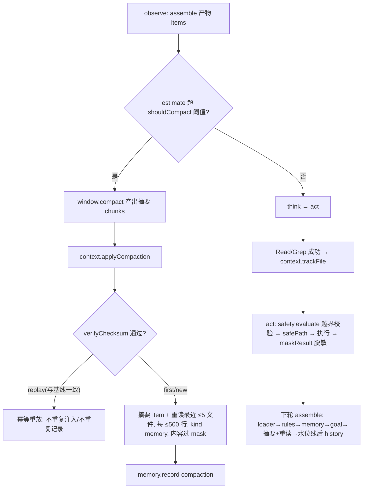

# 1B 补深度设计：压缩重注入、凭据脱敏、root 越界校验

> 日期：2026-09-04
> 状态：已实施交付（2026-09-05 端到端验收通过；实现提交链 7b81bc8→62c7f53→907d273→a3916ae→e879135→3fb250d）
> 关联：docs/superpowers/specs/2026-09-04-harness-unified-spine-design.md（统一主链总纲）、docs/superpowers/specs/2026-09-03-phase1-harness-design.md（8.4/9.3 压缩稳定性）、docs/superpowers/plans/2026-09-04-phase1-harness-spine-1a.md（1A 已交付）

## 1. 概述

### 1.1 背景与范围

统一主链 1A 已交付：`Context.assemble()` 唯一上下文入口、`SafetyChain` 统一安全链（guard→sandbox→dryrun）、`MemoryLifecycle` 唯一记忆。1B 是总纲第 7 节的「补深度」子阶段，三项交付：

1. `reinject()` 落地 + 压缩重注入；
2. credentials mask（凭据脱敏）；
3. root 越界校验。

对应总纲验收 **A3 强化**（安全唯一链的深度补齐）。

### 1.2 范围决策（已定，本 spec 的约束输入）

| 决策点 | 结论 |
|---|---|
| reinject 形态 | 完整形态：摘要回流 + 重读最近 ≤5 个文件 |
| mask 覆盖面 | 安全链边界统一脱敏 + read/grep 内容脱敏（密钥不进上下文/记忆） |
| 越界校验面 | 仅文件工具（read/write/grep）；exec 由沙箱 cwd 承担，不做命令串扫描 |
| 架构组织 | 链内统一扩展：`SafetyChain.evaluate` 加越界校验并返回 `safePath`，`maskResult` 作为统一脱敏出口；`ContextWindow` 保持纯计算产出摘要，`ContextManager` 协调重读与注入 |

### 1.3 已知边界（有意不做，YAGNI）

- exec 命令串不做路径扫描：`cd /`、`cat ../x` 类逃逸不由 1B 防守（启发式易被绕过、制造假安全感），硬隔离属 1D 多后端；
- symlink 不解析（`path.resolve` 不跟随符号链接），realpath 级防护留待 1D；
- 敏感文件 deny 规则（如拦截读 `.env`）不在 1B 交付内，mask 是通用机制，deny 规则可作为 policy 配置随时叠加；
- mask 模式集为零依赖内置正则，不引第三方库；模式可扩展但 1B 不做外部配置化。

## 2. SafetyChain 扩展（链内统一）

### 2.1 越界校验（boundary）

链序不变：guard → sandbox(边界) → dryrun → mask → execute。

- `SafetyChain` 构造新增 `root` 注入；`SecurityGuard` 保持无状态，不持有 root；
- `evaluate(tool, input)` 对文件工具（canonical 名 `Read`/`Write`/`Grep`）执行：
  - 绝对路径解析：`abs = path.resolve(root, String(input.path ?? ''))`；
  - 越界判据：`abs !== root && !abs.startsWith(root + path.sep)` → deny（reason 指明越界绝对路径）；
  - allow 时返回 `safePath: abs`，供工具直接执行，**删除 builtin 内各自的二次 resolve**（消除双轨解析）；
- `Glob`：以 root 为 walk 根天然不出界，仅需 root 透传，无路径校验点、无 `safePath`；
- `Exec`（Bash）：不做命令串路径扫描（见 1.3）。

### 2.2 GuardDecision 演进

```ts
export type GuardDecision =
  | { allowed: true; safePath?: string }
  | { allowed: false; reason: string };
```

deny 仍走既有 `COMMAND_DENIED` 流程，reason 说明越界；不新增错误码。

### 2.3 凭据脱敏（mask）

- `SafetyChain` 新增 `maskResult(tool, result: ExecResult): ExecResult`：所有工具结果跨链的**唯一脱敏出口**；
  - read/grep：stdout 内容过模式集；
  - exec（Bash）：stdout 与 stderr 过同一模式集；
  - dryrun 预览串过同一模式集（命令内可能内嵌密钥，如 `curl -H "Authorization: Bearer sk-x"`）；
  - 命中片段替换为 `***`（不保留任何前缀/后缀熵）；
- 内置模式集（零依赖正则，内置默认、代码内可扩展）：
  - `sk-[A-Za-z0-9]{20,}`（OpenAI/DeepSeek 风格 key）；
  - `Bearer\s+[A-Za-z0-9._\-]{8,}`；
  - `AKIA[0-9A-Z]{16}`（AWS）；
  - `-----BEGIN [A-Z ]*PRIVATE KEY-----` 至 `-----END [A-Z ]*PRIVATE KEY-----` 的块；
  - JSON/键值形态：`"(api[_-]?key|secret|token|password)"\s*:\s*"[^"]+"` 与 `(api[_-]?key|secret|token|password)\s*[=:]\s*\S+`；
- 脱敏在结果跨链出口一处生效：observation → history 与 `memory.record` 的内容天然洁净，上下文与记忆无需第二套过滤（单一代收点）；
- 模式集权威定义唯一：`maskText`（chain.ts 内置并由安全链导出），所有「内容直入上下文」的通道必须复用同一模式集，包括不经 execute 出口的旁路（如 ContextManager 重读）；
- 旁路边界（1B 验收 B3 实证后补强）：重读条目若不过模式集，最近文件中的密钥将以明文进入上下文，违反单一代收点目标；该缺口已修复并有回归用例（重读条目内容过凭据脱敏）覆盖。

## 3. 压缩重注入（Context 管线）

### 3.1 确定性门禁（checksum 语义收紧）

现状 `verifyChecksum` 语义为「首次调用注册基线并返回 false，内容相同再次调用返回 true」，且 Reactor 忽略返回值——压缩产物实际未闭环。1B 收紧为：

- 首次调用：注册基线，**视为通过**（不抛错、不返回 false）；
- 后续调用：与基线一致 → **幂等重放**：`applyCompaction` 识别为同一压缩事件的重复触发，不重复注入摘要/重读条目、不重复记入记忆；
- 与基线不同 → **新一轮压缩**：更新基线并正常进入注入流程（长会话多次压缩合法）；
- 摘要可重现性校验（内容漂移检测）由幂等重放与 chunk id 可重现性测试覆盖；compact 算法本身不改（分块确定性、摘要可重现的设计约束见 2026-09-03 spec 8.4，1B 只收紧校验消费）。

> 注：原评审稿为「不一致即抛错中止本轮」。该语义与 B1 多轮压缩闭环矛盾（长会话第二次压缩的 chunks 必然与首次不同，按字面将中止整个 run），已裁决修正为上述「不同=新一轮、相同=幂等重放」语义。

### 3.2 摘要回流

- 压缩发生时，`ContextWindow.compact()` 产出摘要；`ContextManager` 新增 `applyCompaction(chunks)`：
  1. 以 `verifyChecksum` 做确定性门禁（见 3.1）；
  2. 生成**一条压缩摘要 item**（kind: `history`，content 为 kept chunks 的摘要文本 + checksum 标记），存入内部 `compacted` 状态（新压缩覆盖旧摘要）；
  3. 记入记忆：`memory.record('compaction', '摘要 checksum=<hash>，重读 <N> 个文件')`；
- `assemble(goal, history, relPath)` 的 items 顺序定为：`loader → rules → memory → goal → compacted摘要（若有）→ history`（摘要作为 history 的前缀）；
- Reactor 持有压缩水位线 `compactedUpTo`（压缩发生时的 steps 长度）：此后 `toHistory` 只生成水位线之后的 steps，压缩点之前的原文不再进入 history；
- 职责切分：`ContextWindow` 纯计算（估算/压缩/摘要文本/checksum），`ContextManager` 管摘要内容、重读与注入，Reactor 只管水位线与触发。

### 3.3 最近文件重读

- `ContextManager` 新增 `trackFile(relPath: string)`：记录最近读取文件，去重、LRU 上限 5；
- 上报点：Reactor act 阶段执行成功后，若 `action.tool` 为 `Read` 或 `Grep` 且 input.path 存在，调用 `context.trackFile(input.path)`（记录相对 root 的路径）；
- `applyCompaction` 触发重读：对最近 ≤5 个文件逐个重读内容，**每文件截断前 500 行**，产出 `kind: 'memory'` 条目（`[重读] <relPath>: ...`），内容过统一凭据脱敏模式集（见 2.3，重读属不经 execute 出口的旁路通道）；重读条目与摘要 item **作为一个整体注入块**，固定位于 goal 之后、history 之前（kind 仅作语义标注，块位置不因 kind 改变）；
- 重读失败（文件已删除/不可读）跳过该文件，不视为错误。

### 3.4 数据流



## 4. 改动面

| 文件 | 改动 |
|---|---|
| `src/harness/security/chain.ts` | 构造注入 root；evaluate 越界校验 + safePath；新增 maskResult；preview 输出过 mask；maskText 导出供重读通道复用 |
| `src/harness/security/guard.ts` | GuardDecision 扩展 `safePath?: string` |
| `src/harness/tools.ts` | execute 注入 safePath（路径单轨）；结果出口统一 maskResult 脱敏 |
| `src/harness/tools/builtin.ts` | read/write/grep 消费 safePath（删除自 resolve）；结果经 maskResult 脱敏 |
| `src/harness/context/window.ts` | verifyChecksum 三态语义（first 注册基线 / replay 幂等重放 / new 新一轮）；新增 checksum() 观测与摘要产出（summarize/reinject） |
| `src/harness/context/index.ts` | applyCompaction / trackFile / compacted 并入 assemble |
| `src/harness/reactor.ts` | 压缩接 applyCompaction；act 后 trackFile；水位线后 history |
| `src/types.ts` | 不动（GuardDecision 定义在 guard.ts；无新增共享类型） |

约束：零新增 npm 依赖；`node --test`；tsc strict；提交前 `npm run build` + `npm run selfcheck`。

## 5. 测试计划

- `chain.test`：越界 deny（`../x`、绝对路径越出 root）；越界 allow 返回 safePath；Glob 不做路径校验；maskResult 各模式命中与无匹配原样；
- `builtin` 集成：read 经 safePath 执行成功；read `.env` 类内容输出已脱敏；
- `window.test`：verifyChecksum 三态（first 注册 / replay 重放 / new 新一轮）；checksum() 基线观测；摘要产出含 checksum 标记；
- `context.test`：trackFile 去重与 LRU 上限 5；applyCompaction 后 assemble 并入摘要 + 重读条目；重读失败跳过；重复 applyCompaction（相同 chunks）幂等：不重复注入、记忆不重复记录；重读条目内容过凭据脱敏（密钥不进上下文）
- `reactor.test`：压缩水位线（压缩点前 steps 不进 history、摘要作为 history 前缀出现）；Read 成功后 trackFile 被调用。

## 6. 验收标准（可证伪）

| 编号 | 判据 | 反例（出现即不合格） |
|---|---|---|
| B1 | 压缩后摘要必然进入后续轮 prompt，且压缩点前原文不再出现 | compact 产物被丢弃，下一轮仍注入全量 history |
| B2 | 压缩后最近读取文件被重读注入（每文件 ≤500 行，≤5 个） | 压缩后模型丢失文件内容且无重读 |
| B3 | 工具结果（read/grep/exec/dryrun）与重读条目内容跨链必脱敏 | 密钥明文出现在上下文或记忆中 |
| B4 | 文件路径 resolve 后越出 root 即 deny | `../x` 读到 root 外文件 |
| B5 | checksum 三态门禁：与基线一致→幂等重放（不重复注入/记录）；不一致→新一轮压缩正常注入 | 相同压缩事件重复注入/重复记入记忆；漂移被误判为错误中止 |
