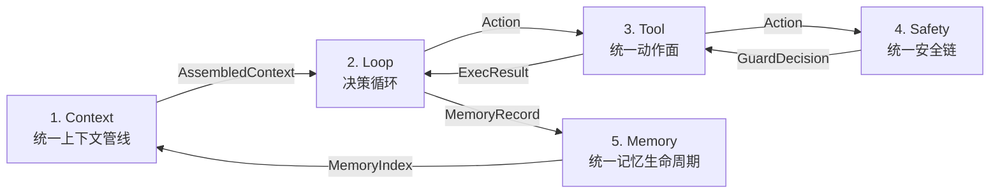
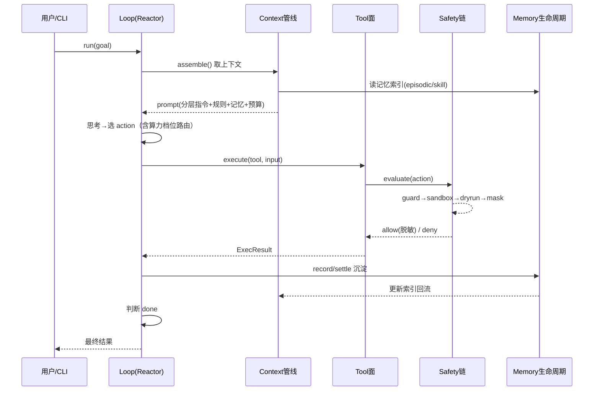
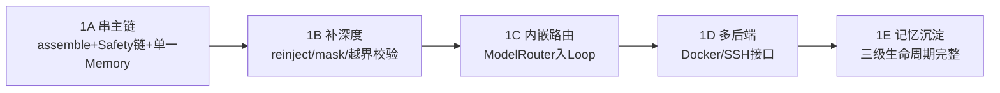

# 第二阶段设计：统一运行时主链（Harness 有机结合）

> 日期：2026-09-04
> 状态：已实施交付（子阶段 1A-1E 全部实施并端到端验收：1A f141544→0c46132、1B 7b81bc8→3fb250d、1C 93fe719→9384497、1D d0f0306→525b340、1E a54236e→bcfcd1f；真实场景验证 docs/superpowers/reports/2026-09-05-phase1-real-scenario-report.md，其发现项由安全收尾与 Phase 2 压缩预算闭环修复收口）
> 关联：docs/superpowers/specs/2026-09-03-phase1-harness-design.md、docs/ROADMAP.md

## 1. 概述与设计哲学

### 1.1 背景与动机

Phase 1 已交付 Harness 底座核心：构建零报错、40 个测试全绿、selfcheck 通过。但盘点发现，当前实现存在「模块齐全却未成链」的共性问题：

- 上下文 loader / rules / auto-memory 均已实现，但 Reactor 运行时从不调用，它们不进上下文窗口。
- `exec` 走 ProcessSandbox，`write` / `read` / `grep` / `glob` 却直接操作 fs，绕过沙箱。
- `harness/memory.ts`（内存 Map）与 `context/auto-memory.ts`（持久索引）两套记忆并存且互不关联。
- `ModelRouter` 独立闲置，未接入 Harness。

这些不是「缺功能」，而是「缺统一抽象」。若按能力域逐项补差，会把 Claude Code、Codex、Hermes 的优秀能力各自补一块，退化成能力拼接。

### 1.2 设计哲学：有机结合 vs 能力拼接

分水岭只有一条：**有没有统一抽象、有没有单一数据流、有没有旁路**。

本设计的核心主张：不复制、不拼接三大明星产品，而是识别它们共享的「能力本质」，映射到同一条运行时主链上，形成「单一数据流 + 无旁路」的有机结合体。

四条原则：

1. **统一抽象**：每个环节只承担一个职责，通过统一接口协同，不提供多套实现逻辑。
2. **单一数据流**：上一环节的输出即下一环节的输入，最后回流闭环，无旁路。
3. **能力本质映射**：明星产品的表面能力拆解为能力本质，归入其本属环节，而非各占一环。
4. **无旁路可证伪**：每条验收以「反例即不合格」表述，而非「补差是否完成」。

## 2. 能力本质映射

三大明星产品的表面能力拆解为能力本质后，归入主链对应环节：

| 明星产品 | 表面能力 | 拆解后的能力本质 | 归入主链环节 |
| --- | --- | --- | --- |
| Claude Code | CLAUDE.md 分层 / 路径规则 / 自动记忆 | 「该注入什么上下文」的统一来源 | Context 的 source |
| Codex | 三档算力 / 多执行后端 | 「用什么算力、在哪执行」的决策与动作面 | Loop 决策 + Tool 后端 |
| Hermes | 模型无关 / 持久记忆 / 自我验证 | 「如何沉淀、如何演进」的记忆生命周期 | Memory 环节 |
| 三者共通 | 权限 / 沙箱 / 脱敏 | 「所有动作不可旁路」的边界 | Safety 链 |

关键约束：任何一个产品的能力都**不整体搬入**某一环节，而是拆到能力本质后归位；三个产品共享的横切关注点（安全）收敛为同一条链，不各做一份。

## 3. 统一运行时主链

### 3.1 主链总览

五个环节按数据流串联，非并列模块。上一环节的输出是下一环节的输入，Memory 的产出回流 Context 形成闭环。

### 3.2 环节间传递的数据结构

| 边界 | 数据结构 | 说明 |
| --- | --- | --- |
| Context → Loop | `AssembledContext` | 分层指令 + 路径规则 + 记忆索引 + 预算水位 |
| Loop → Tool | `Action` | 工具名 + 输入 + 算力档位 |
| Tool → Safety | `Action` | 待守门的动作 |
| Safety → Tool | `GuardDecision` | allow（含脱敏后执行）/ deny（含 reason） |
| Tool → Loop | `ExecResult` | 动作执行结果 |
| Loop → Memory | `MemoryRecord` | 类型 + 内容 + 来源 |
| Memory → Context | `MemoryIndex` | 记忆索引摘要，供注入 |

## 4. 主链环节详述

### 4.1 Context —— 统一上下文管线

| 维度 | 定义 |
| --- | --- |
| 做什么 | 决定「模型此刻能看到什么」；唯一入口负责 收集→分层→预算→注入→压缩→重注入 |
| 怎么用 | 单一 `assemble()` 方法，Reactor 每轮只调用它获取 prompt 上下文 |
| 依赖什么 | Memory 回流（记忆索引注入）；项目结构感知（初始化 source，非动作性读取） |
| 能力本质 | Claude Code 的分层指令 + 路径规则 + 自动记忆 → 统一为「上下文来源 source」 |
| 无旁路约束 | 任何进 prompt 的内容必经此管线（反例：Reactor 直接拼 goal/steps 即不合格） |

**收敛动作**：现 `context/` 五个模块（loader / rules / auto-memory / window / session）不再各自为政；`ContextManager` 从空壳聚合变为装配编排器，`assemble()` 串起全部 source。

### 4.2 Loop —— 决策循环

| 维度 | 定义 |
| --- | --- |
| 做什么 | 观察→思考→选择动作；复杂度感知→算力档位路由作为循环内决策 |
| 怎么用 | `Reactor.run(goal)` 驱动，每轮 produce 一个 `Action` |
| 依赖什么 | Context 输出（AssembledContext，含 prompt）、Tool（动作面）、Memory（结果沉淀） |
| 能力本质 | Codex 的算力路由 → 循环内决策，而非游离模块 |
| 无旁路约束 | 无游离路由模块（反例：存在独立调用的 ModelRouter 即不合格） |

**收敛动作**：`ModelRouter` 收敛进 Reactor 内部，`reactor.ts` 保持纯驱动职责。

### 4.3 Tool —— 统一动作面

| 维度 | 定义 |
| --- | --- |
| 做什么 | 所有「做事」的统一接口（只读动作 read/grep/glob/list、执行、记忆读写） |
| 怎么用 | 单一 `ToolExecutor` 协议（name + input + exec），多执行后端是它的后端实现 |
| 依赖什么 | Safety 守门（执行前必经） |
| 能力本质 | Codex 多执行后端（process / Docker / SSH）作为 Tool 后端 |
| 无旁路约束 | 感知/执行/记忆读写全走此面（反例：write 绕过沙箱直写 fs 即不合格） |

**收敛动作**：`builtinTools` 统一入口；read / write / grep / glob 与 exec 走同一条 Safety 链，消除「exec 进沙箱、write 直接 fs」的双轨。

### 4.4 Safety —— 统一安全链

| 维度 | 定义 |
| --- | --- |
| 做什么 | 动作不可旁路的守门链 guard→sandbox→dryrun→mask→execute |
| 怎么用 | 每个 Tool 执行前经 `SafetyChain.evaluate`，返回 allow（脱敏）/ deny（reason） |
| 依赖什么 | 无（横切关注点） |
| 能力本质 | 三者共通权限 / 沙箱 / 脱敏 → 收敛为一条链 |
| 无旁路约束 | 无 fs 直写绕行（反例：任一工具绕过 sandbox 即不合格） |

**收敛动作**：`security/` 各模块串成一条链；补齐 credentials mask；root 越界校验纳入 guard/sandbox，杜绝 `..` 逃逸。

### 4.5 Memory —— 统一记忆生命周期

| 维度 | 定义 |
| --- | --- |
| 做什么 | working→episodic→skill 同一份数据的沉淀演化，并回流 Context |
| 怎么用 | `record / settle / promote` 三级流转，`index` 注入 Context |
| 依赖什么 | Tool（记忆读写也走工具） |
| 能力本质 | Hermes 持久记忆 + 自我验证 → 一条生命周期 |
| 无旁路约束 | 只此一套生命周期（反例：`memory.ts` 与 `auto-memory.ts` 两套并存即不合格） |

**收敛动作**：删掉内存 Map 版 `memory.ts`，统一到持久化的 `MemoryLifecycle`，消除「两套记忆并存」。

## 5. 数据流与生命周期

端到端一次请求的完整时序：

单向闭环，无旁路：上下文只能从 Context 进、动作只能从 Tool 出、执行必经 Safety、记忆只走 Memory。

## 6. 无旁路验收标准

每条以「反例即不合格」表述，可证伪：

| 编号 | 验收项 | 判据 | 反例即不合格 |
| --- | --- | --- | --- |
| A1 | 上下文唯一入口 | 所有 prompt 内容经 `Context.assemble()` | Reactor 直接拼 goal/steps |
| A2 | 动作唯一入口 | 所有执行经 `Tool.execute` | 存在非 Tool 的 fs 直写 |
| A3 | 安全唯一链 | 所有动作经 `SafetyChain` | 任一工具绕过 sandbox/guard |
| A4 | 记忆唯一生命周期 | 所有记忆读写经 `MemoryLifecycle` | 存在第二套 Map |
| A5 | 路由内嵌 | 算力档位在 Loop 内决策 | 存在游离 ModelRouter |

## 7. 分阶段实施路线

以下 A-E 均为 ROADMAP 阶段一「Harness 底座核心」内部的子阶段（记作 1A-1E），不是 ROADMAP 的独立全局阶段。先串主链，再补深度：

| 子阶段 | 交付 | 对应验收 |
| --- | --- | --- |
| 1A 串主链 | `Context.assemble()` 串起 loader/rules/memory；`SafetyChain` 统一；删除内存 Map 版 `memory.ts` | A1 A2 A3 A4 |
| 1B 补深度 | `reinject()` 落地 + 压缩重注入；credentials mask；root 越界校验 | A3 强化 |
| 1C 内嵌路由 | ModelRouter 收敛进 Loop 决策 | A5 |
| 1D 多后端 | Tool 后端接口抽象（process 现行，Docker/SSH 预留） | A2 扩展 |
| 1E 记忆沉淀 | working→episodic→skill 三级流转完整 | A4 完整 |

本 spec 是总纲：子阶段 1A-1E 不在同一个 plan 内一次实现，后续按子阶段拆分 plan，每个子阶段走独立的 spec→plan→实现循环。

**与 ROADMAP 6 阶段的映射**：1A-1E 全部归属阶段一「Harness 底座核心」；其中 1E 的技能沉淀机制（skill 级）是阶段四「技能系统」生态化的前置，两者为先后关系而非重复。

## 8. 边界与约束

- **依赖政策**：安全隔离与凭据处理允许引入成熟开源库，其余保持零新增 npm 依赖；测试沿用 `node --test`、`tsc strict`。
- **不做的事**：子阶段 1D 只做 Tool 后端接口抽象，不实现真实 Docker/SSH 后端；1E 的完整记忆沉淀留到对应阶段 spec 展开。
- **与 Phase 1 spec 的关系**：本 spec 是 Phase 1 之上的演进总纲，不推翻已交付内容；Phase 1 各模块作为「环节原料」被重组进主链。
- **与后续 spec 的关系**：每个子阶段可拆出独立 spec，本 spec 只定义统一主链与无旁路验收，不写环节内部实现细节。
