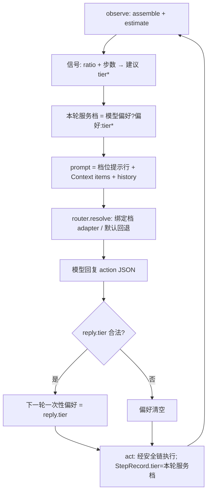

# 1C 内嵌路由设计：算力档位收敛进 Loop 决策

> 日期：2026-09-05
> 状态：评审稿（随实施回写定稿）
> 关联：docs/superpowers/specs/2026-09-04-harness-unified-spine-design.md（统一主链总纲，本阶段对应验收 A5）、docs/superpowers/specs/2026-09-04-harness-spine-1b-depth-design.md（1B 补深度，本阶段档位信号消费其 estimate 产物）
> 执行方式：subagent-driven 逐任务实施（沿用 1A/1B 流程）

## 0. 背景与动机

总纲指出的现状反例：`ModelRouter` 独立闲置，未接入 Harness——「三档算力」能力以游离模块形态存在，任何调用方都可绕过主链直接 `resolve`，违背统一主链「单一数据流、无旁路」的骨架约束。总纲收敛动作已裁决：**ModelRouter 收敛进 Reactor 内部，reactor.ts 保持纯驱动职责**（验收 A5 反例：存在独立调用的 ModelRouter 即不合格）。

Codex 对标能力是「用什么算力」的**循环内决策**：档位选择消费循环自身已产出的信号（上下文体量、步数水位），并允许模型经动作协议自报档位参与决策——路由是决策链的一环，而非调用前的独立网关。

## 1. 范围决策

| 事项 | 决策 | 理由 |
|---|---|---|
| ModelRouter 去向 | 内嵌为 Reactor 内部协作件，Harness 外不再存在独立调用路径 | A5 无旁路 |
| 档位决策权 | 模型显式声明（协议字段，下一轮一次性偏好）优先；无声明时由循环复杂度信号确定 | 有机结合：模型参与决策，循环用确定性信号兜底 |
| 未绑定档位 | `resolve` 回退默认 adapter（ReactorDeps.model），不再抛错 | 零回归：仅默认绑定时与 1B 行为等价 |
| 复杂度信号 | 复用循环内已有 `estimate` 产物（used/budget 占比）+ 步数水位 | 不新增观测通道，消费 1B 稳定性改造既有产物 |
| 多后端接入 | 不做，仍以 `ModelAdapter` 接口挂载 | 执行后端抽象属 1D |
| 真实多模型配置 | 不做，档位→adapter 绑定由装配方注入 | 零新增依赖 |

## 2. 设计

### 2.1 档位决策语义

每轮 think 前，先确定**本轮服务档位**（effectiveTier），优先级从高到低：

1. **模型一次性偏好**：上一轮回复中的合法 `tier` 字段（`'small' | 'medium' | 'large'`）——消费后即清空，仅影响下一轮；非法值忽略并清空。
2. **复杂度信号建议**（循环内确定性规则，每轮 observe 用已有 estimate 产物计算）：
   - `ratio = est.used / budget.total`
   - `ratio >= 0.6` → `large`（上下文重载，升档）
   - `step <= 2 且 ratio < 0.2` → `small`（开局轻载，快速试探）
   - 其余 → `medium`
3. **默认档**：以上皆未命中 → `medium`。

实际 adapter 由 `router.resolve(effectiveTier)` 决定：该档已绑定 → 对应 adapter；未绑定 → 回退默认 adapter；两者皆无 → 抛错（装配错误，快速失败）。每步实际服务档位记入 `StepRecord.tier`。

语义说明：模型在回复里声明的 `tier` 表示「下一轮决策需要什么算力」（前向语义）——本轮调用已发生，回溯改档无意义；前向一次性消费避免陈旧偏好永久驻留。

### 2.2 ModelRouter 内嵌化

- 新增 `bindDefault(adapter)`；`resolve(tier)` 语义改为「该档已绑定 → 返回；未绑定但有默认 → 返回默认；两者皆无 → 抛错」。既有 throw 语义用例按新语义同步调整。
- 新增 `boundTiers(): ModelTier[]` 快照（测试与诊断用；prompt 不暴露绑定细节，只暴露本轮服务档位）。
- 消费约束：生产代码中 ModelRouter 的唯一消费方是 Reactor。装配方经 `ReactorDeps.router` 注入预绑定路由；不注入时 Reactor 以 `model` 自动装配（等价于仅默认档，行为与 1B 一致）。

### 2.3 协议扩展（向后兼容）

- `Action` 新增可选 `tier?: ModelTier`；`StepRecord` 新增可选 `tier?: ModelTier`。
- 不带 tier 的历史回复格式完全兼容，parse 容错不变——**现有全部用例零改动必须保持全绿（实施红线）**。

### 2.4 prompt 可观测性

`buildPrompt` 在上下文条目之前注入一行档位提示（仅存在于模型请求串，不产生 ContextItem、不参与 estimate/压缩/checksum——它是循环元信息而非任务上下文，不得扰动 1B checksum 基线）：

```text
当前服务档位：<effectiveTier>；如需调整下一轮算力，在回复 JSON 中加 "tier": "small|medium|large"
```

### 2.5 与 1B 压缩稳定性的关系

档位决策只读 `estimate` 结果，不改变其语义；压缩水位线、checksum 三态门禁零改动。ratio 分母使用本轮 run 的 `budget.total`（与 `shouldCompact` 同源），不引入第二套预算口径。

## 3. 数据流



## 4. 改动面

| 文件 | 改动 |
|---|---|
| `src/types.ts` | 登记 `ModelTier`（自 adapter.ts 迁入；adapter.ts 兼容重导出） |
| `src/model/adapter.ts` | ModelRouter：`bindDefault` / `boundTiers` / resolve 回退语义；ModelTier 改自 types 导入 |
| `src/harness/reactor.ts` | ReactorDeps 增可选 `router`；信号建议 + 一次性偏好装配；complete 经 resolve；Action/StepRecord 增 tier；parse 容错；prompt 档位行 |
| `src/model/adapter.test.ts` | 回退语义用例；原 throw 用例同步调整 |
| `src/harness/reactor.test.ts` | 新增 5 组用例（见第 5 节） |

约束：零新增 npm 依赖；`node --test`；tsc strict；显式 `git add` 提交。

## 5. 测试计划

- `adapter.test`：bindDefault 后 resolve 未绑定档 → 默认 adapter；无默认无绑定 → 抛错；boundTiers 快照。
- `reactor.test`：
  1. **显式档位路由**：router 绑 small/large 两个 capture adapter；首轮回复带 `"tier":"large"`，第二轮断言 large adapter 被调用（偏好生效且一次性——第三轮无偏好回落）。
  2. **信号路由**：budget 极小 + 大观测使 ratio≥0.6 → large 绑定 adapter 被调用（无模型偏好路径）。
  3. **回退等价**：仅注入 model（无 router）→ 各档位均落到 model，现有用例零改动全绿。
  4. **非法档位**：reply `"tier":"huge"` 被忽略，回落信号档，不中断循环。
  5. **可观测**：StepRecord.tier 记录每步实际服务档位。
- 结构复核（A5）：`grep -rn "ModelRouter" src`——生产调用点仅 `reactor.ts` 与定义处 `adapter.ts`，其余为测试装配。

## 6. 验收标准

| 编号 | 判据 | 反例 |
|---|---|---|
| C1 档位循环内决策 | 档位由循环内信号 + 模型协议字段决定，StepRecord.tier 随步演进 | 档位在循环外由调用方一次性指定后全程固定 |
| C2 模型参与决策 | 合法 reply.tier 作为下一轮一次性偏好生效；非法值忽略不中断 | tier 字段被丢弃或导致解析失败 |
| C3 回退安全 | 未绑定档位回退默认 adapter；仅默认绑定时与 1B 行为等价（现有用例零改动全绿） | resolve 对未绑定档抛错中断循环 |
| C4 无游离路由 | 生产代码 ModelRouter 仅 Reactor 消费（grep 复核） | Harness 外存在独立调用路径 |
| C5 可观测 | 每步 StepRecord.tier 可查；prompt 含本轮服务档位提示行 | 档位决策黑箱不可见 |

## 7. 不做的事与边界

- 不实现真实多模型配置/绑定 DSL（装配注入即可）。
- 不做执行后端抽象（1D：Tool 后端 process/Docker/SSH 接口）。
- 不做算力成本计量与计费。
- 不改 1B 压缩稳定性语义（checksum/水位线零改动）。
- graph 层多角色子 Agent 的档位策略不在本阶段（Loop 内决策已覆盖主链）。
