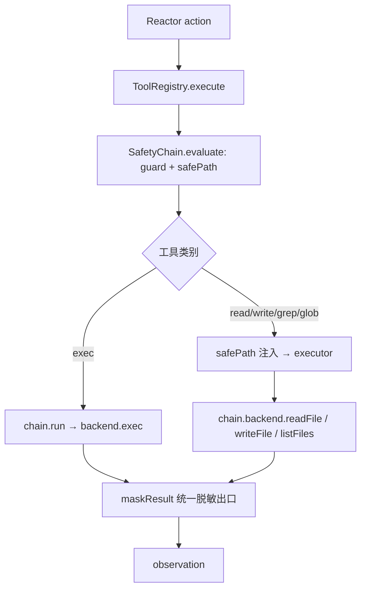

# 1D 多后端设计：Tool 执行面统一与后端可替换

> 日期：2026-09-05
> 状态：已实施交付（2026-09-05 端到端验收通过；提交链 d0f0306 → 525b340）
> 关联：docs/superpowers/specs/2026-09-04-harness-unified-spine-design.md（统一主链总纲，本阶段对应验收 A2 扩展）
> 执行方式：subagent-driven 逐任务实施（沿用 1B/1C 流程）

## 0. 背景与动机

总纲点名的现状反例：`exec` 走 ProcessSandbox，`write`/`read`/`grep`/`glob` 却直接操作 fs——「exec 进沙箱、文件直写 fs」的双轨。总纲收敛动作已裁决：`builtinTools` 统一入口，文件工具与 exec 走同一条执行链；Codex 的「多执行后端（process / Docker / SSH）」本质是**后端实现**细节，而非工具协议的分裂。

1D 的目标不是再造一层网关，而是把「在哪执行」（本机进程 / 容器 / 远程）收敛为**单一后端接口**：命令执行与文件 IO 同属一个后端的工作面——Docker 后端里的 readFile 就是容器内文件，这正是后端抽象必须覆盖文件 IO 的原因。只抽象 exec、文件继续直连 fs，双轨依旧，不算完成 1D。

## 1. 范围决策

| 事项 | 决策 | 理由 |
|---|---|---|
| 后端接口形态 | 单一 `ToolBackend`：`exec` + `readFile` + `writeFile` + `listFiles` + `name` | 「在哪执行」的完整语义含文件系统；拆两套接口即双轨复活 |
| 接口落点 | `src/types.ts` 登记（跨 harness/index、tools、security 三域共享） | CLAUDE.md 共享类型登记纪律 |
| process 后端 | 现有 `ProcessSandbox` 扩展实现 `ToolBackend`（类名不变） | 12 处装配点零改动；「安全沙箱 + process 后端」同一实现面 |
| 旧 `Sandbox` 接口 | 删除（唯一实现与唯一消费者均迁移到 ToolBackend） | 无残渣；避免新旧接口并存 |
| 文件工具切换 | builtin 的 read/write/grep/glob 改经 `safety.backend`，fs 依赖整体迁出 | 消除双轨；builtin.ts 归零 fs 引用 |
| Docker/SSH 预留 | 只以接口 + 可注入承载，**不写空壳类** | 空壳 throw 类是死代码；接口即预留 |
| 感知/存储侧 fs | 不动（loader/rules/storage/perception 等） | 属读侧基础设施，总纲边界明确 1D 只做 Tool 后端抽象 |

## 2. 设计

### 2.1 ToolBackend 接口（types.ts 登记）

```ts
/** Tool 执行后端：命令与文件 IO 的统一执行面（process 现行，Docker/SSH 预留接口位） */
export interface ToolBackend {
  /** 后端标识，如 process / docker / ssh */
  readonly name: string;
  exec(cmd: string, opts?: { cwd?: string; timeoutMs?: number }): Promise<Result<ExecResult>>;
  readFile(absPath: string): string;
  /** 写入含父目录自动创建（维持现行 write 语义） */
  writeFile(absPath: string, content: string): void;
  listFiles(root: string, pattern: string): string[];
}
```

- `readFile`/`writeFile` 同步、失败直接 throw（由 `ToolRegistry.execute` 的既有 catch 收敛为 `EXEC_FAILED`）——与现行文件工具行为逐字节一致，零回归。
- `listFiles(root, pattern)` 沿用现行 glob 语义（`**/` 跨目录段、`*`/`?` 不跨斜杠；跳过 `node_modules`/`.git`/`dist`），glob→正则逻辑自 builtin 迁入后端实现。

### 2.2 ProcessSandbox 扩展为 process 后端

- `implements ToolBackend`：`name = 'process'`；exec 保持现实现（execFile + 超时语义不变）；新增文件三方法（fs 逻辑自 builtin 迁入，`writeFile` 含 `mkdirSync` 父目录创建）。
- 类名不变：12 处 `new ProcessSandbox()` 装配点零改动；注释标明 1D 定位（process 执行后端，Docker/SSH 后端同接口预留）。
- 旧 `Sandbox` 接口删除。

### 2.3 SafetyChain 切换执行面

- 构造第二参类型 `Sandbox` → `ToolBackend`（ProcessSandbox 兼容传入，全部既有装配零改动）。
- `run(cmd, opts)` 委托 `this.backend.exec(cmd, opts)`——exec 全链单一执行路径。
- 暴露 `readonly backend: ToolBackend`，供 builtin 文件工具消费（链管安全判定，后端管执行，职责分离不越权）。

### 2.4 builtin 文件工具切换

- `builtinTools(safety, root)` 签名不变（10 个调用点零改动）。
- read → `safety.backend.readFile(safePath)`；write → `writeFile(safePath, content)`；grep → `readFile` 后行过滤（语义不变）；glob → `listFiles(root, pattern)`。
- builtin.ts 的 `fs`/`path` import 与 `findFiles`/`globToRegex` 删除——**生产工具面零直连 fs**。

### 2.5 Docker/SSH 预留策略

接口位即预留：`name` 区分后端标识，装配点（Harness/测试）以 `ToolBackend` 类型注入即可替换。不实现真实后端，不写空壳类；spec/类型注释标注预留位置。1D 验收不含真实容器/远程执行。

## 3. 数据流



## 4. 改动面

| 文件 | 改动 |
|---|---|
| `src/types.ts` | 登记 `ToolBackend` 接口（import `Result`） |
| `src/harness/security/sandbox.ts` | 删 `Sandbox` 接口；ProcessSandbox implements ToolBackend；文件三方法 + glob 逻辑迁入 |
| `src/harness/security/chain.ts` | 构造第二参改 `ToolBackend`；`run` 委托 `backend.exec`；暴露 `readonly backend` |
| `src/harness/tools/builtin.ts` | 文件工具改经 `safety.backend`；删 fs/path 依赖与 glob 私有函数 |
| `src/harness/security/sandbox.test.ts` | 追加后端文件方法用例 |
| `src/harness/tools/tools.test.ts` | 追加「文件工具经后端执行」探针用例 |

约束：零新增 npm 依赖；`node --test`；tsc strict；显式 `git add` 提交。既有用例断言零改动（ProcessSandbox 类型兼容 ToolBackend，全部装配点无需变更）。

## 5. 测试计划

- `sandbox.test`：`name === 'process'`；readFile/writeFile 往返（含父目录自动创建）；listFiles glob 语义（`**/*.txt` 命中、跳过 node_modules）。
- `tools.test`：探针后端（记录调用的 ToolBackend stub，文件方法委托真实实现）→ `execute('write')` 断言 `backend.writeFile` 被调用且结果经 maskResult——证明文件工具无旁路。
- `chain.test`：既有用例零改动全绿（构造兼容即回归证明）。
- 结构复核（A2 扩展）：`grep -n 'fs\.' src/harness/tools/` 仅 sandbox.ts（后端实现）命中。

## 6. 验收标准

| 编号 | 判据 | 反例 |
|---|---|---|
| D1 执行面统一 | 全部工具 IO（exec/文件）经 `ToolBackend`；工具声明面（builtin）零直连 fs | write 绕过后端直写 fs |
| D2 后端可替换 | 接口注入即换（探针 stub 用例实证）；process 后端行为与 1C 逐字节等价 | 后端与安全链/工具耦合，无法注入替换 |
| D3 预留不残渣 | Docker/SSH 仅接口预留，无空壳类、无死代码 | 存在 throw 'not implemented' 空类 |
| A2 扩展 | 所有执行经 `Tool.execute` 且 IO 经统一后端 | 存在非 Tool 的 fs 直写（工具面） |

## 7. 不做的事与边界

- 不实现真实 Docker/SSH 后端（总纲边界）。
- 不动感知/存储侧 fs（loader/rules/perception/storage）——总纲 207 行明确 1D 只做 Tool 后端抽象。
- 不引入后端注册表/工厂（当前单后端，YAGNI；注入即换已够）。
- 不改 mask/越界/水位线等 1B 语义。
