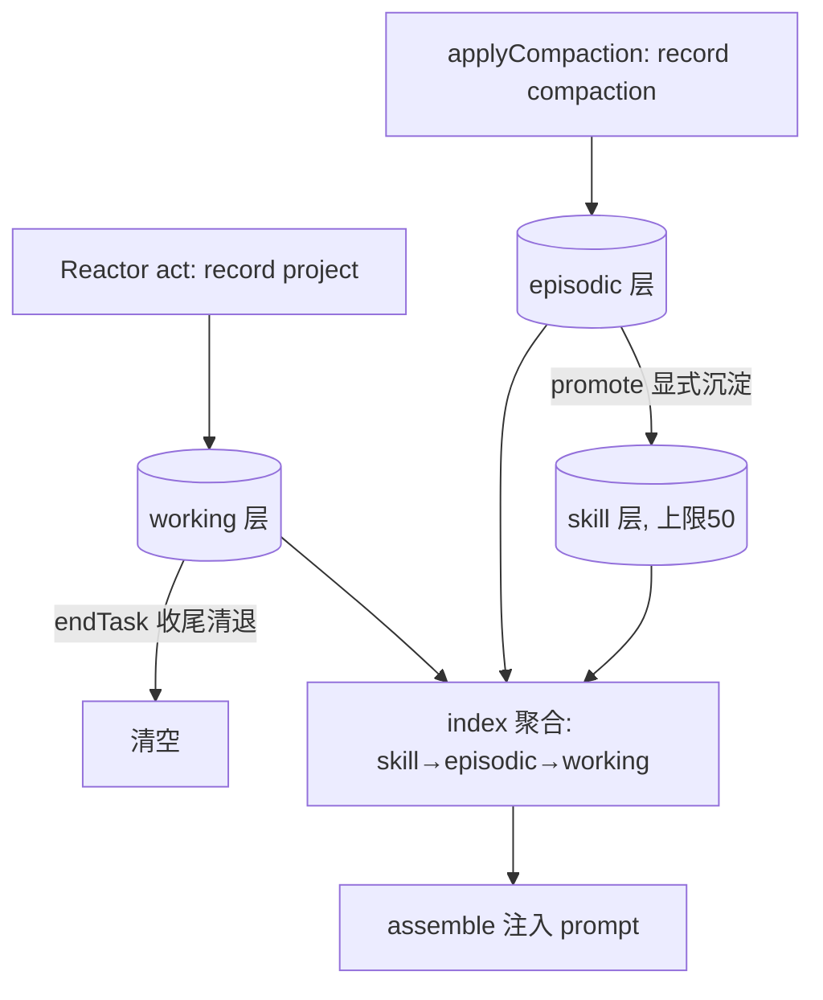

# 1E 记忆沉淀设计：working→episodic→skill 三级生命周期

> 日期：2026-09-05
> 状态：已实施交付（2026-09-05 端到端验收通过；提交链 a54236e → bcfcd1f）
> 关联：docs/superpowers/specs/2026-09-04-harness-unified-spine-design.md（统一主链总纲，本阶段对应验收 A4 完整）
> 执行方式：subagent-driven 逐任务实施（沿用 1B/1C/1D 流程）

## 0. 背景与动机

总纲 §4.5 对 Memory 的裁决：**working→episodic→skill 同一份数据的沉淀演化，并回流 Context**；无旁路约束为「只此一套生命周期」（反例：两套记忆并存即不合格，已在 1A 消除）。当前 `MemoryLifecycle` 仅是单桶索引（`memory.index` 一个键、200 行 FIFO、全量注入），三级流转未落地——`record('project', ...)` 的运行步骤与 `record('compaction', ...)` 的压缩事件混在同一数组，无沉淀通道、无易失语义，索引随任务无限线性膨胀。

对标能力：Claude Code 的自动记忆（该沉淀什么跨会话留存）+ Hermes 的持久记忆与自我验证（如何沉淀、如何演进）。1E 的目标不是再造记忆系统，而是给同一份数据建立**分层生命周期**：易失的运行记录、持久的事件记忆、可复用的沉淀知识，并以显式沉淀通道贯通，回流 Context 注入顺序体现价值梯度。

## 1. 范围决策

| 事项 | 决策 | 理由 |
|---|---|---|
| 分层形态 | 三个存储键 `memory.working` / `memory.episodic` / `memory.skill`，单一 `MemoryLifecycle` 模块 | 「同一份数据的沉淀演化」——分层是生命周期阶段，不是第二套系统 |
| record 路由 | 按主题路由：`project`→working；`compaction` 及其余→episodic；**skill 层仅经 `promote` 写入** | 现有 4 个调用点零改动；skill 是沉淀产物，不可被常规写入污染 |
| index 语义 | `index()` 改为聚合视图：skill → episodic → working | 注入顺序体现价值梯度：稳定知识优先；现有断言（含 `compaction:` 行）兼容 |
| 沉淀通道 | `promote(match: string): boolean`——按子串匹配第一条 episodic 条目，原样移入 skill 层 | 显式、确定性、可测试；自动沉淀策略（语义聚类/触发器）留阶段四 |
| working 易失 | `endTask()` 清退 working 层，由 Reactor run 收尾调用；episodic/skill 跨任务持久 | working=当前工作记忆，任务结束清退防膨胀；关键事实已由 episodic 承载 |
| 存量迁移 | 构造时一次性迁移：legacy `memory.index` 非空且三层全空 → 按前缀路由迁入并删除 legacy 键 | 部署一致性（CLAUDE.md §10）：`.data/` 存量不丢失 |
| 容量治理 | working 200 / episodic 200 / skill 50（各层独立 FIFO） | skill 应小而精；沿用现有 200 上限语义 |
| 自动沉淀/AI 筛选 | 不做。promote 为显式 API，智能触发留阶段四技能系统生态化 | 总纲 207 行：1E 完整记忆沉淀即三级流转本身 |

## 2. 设计

### 2.1 MemoryLifecycle 升级

```ts
export type MemoryTier = 'working' | 'episodic' | 'skill';

export class MemoryLifecycle {
  constructor(private store: StorageAdapter) {}

  /** 主题路由：project→working；compaction 及其余主题→episodic。条目格式 `${type}: ${text}` 不变 */
  record(type: string, text: string): void;

  /** 聚合视图：skill → episodic → working 依次拼接（注入顺序 = 价值梯度） */
  index(): string[];

  /** episodic → skill 沉淀：按子串匹配第一条命中条目，原样移入 skill 层（FIFO 上限 50）；命中失败返回 false */
  promote(match: string): boolean;

  /** 任务收尾：清退 working 层；episodic/skill 持久保留 */
  endTask(): void;

  /** 各层条目数（观测与测试断言） */
  counts(): { working: number; episodic: number; skill: number };
}
```

- 条目格式与语义完全沿用现状（`'${type}: ${text}'` 字符串、各层独立 200/200/50 上限 FIFO），仅存储位置从单键变为分层键——现有断言（`index()` 含 `compaction:` 行、幂等不重复）零改动兼容。
- 迁移：构造时检测 legacy `memory.index`，按条目前缀路由（`project:`→working、其余→episodic），写入分层键后删除 legacy 键；三层已有数据时不重复迁移。

### 2.2 Reactor 收尾挂点

`run()` 循环退出后（done 或 maxSteps 耗尽均算任务收尾）调用 `memory.endTask()`——一行接线，working 层生命周期由此闭合。ContextManager 不感知收尾时机（它是装配编排器，不是生命周期所有者）；Reactor 拥有 run 生命周期，由它收尾语义自洽。

### 2.3 回流注入

`ContextManager.assemble` 已消费 `memory.index()`——聚合视图自动生效，**context/index.ts 零改动**。压缩重读条目（kind memory）与分层记忆互不干扰（1B 语义）。

### 2.4 A4 无旁路

`memory.*` 存储键的唯一读写方是 `MemoryLifecycle`；ContextManager 与 Reactor 只经 `context.memory` 门面消费。收尾以 grep 复核全仓无第二处直碰记忆键。

## 3. 数据流



## 4. 改动面

| 文件 | 改动 |
|---|---|
| `src/harness/context/memory-lifecycle.ts` | 三层分键存储、record 路由、index 聚合、promote/endTask/counts、容量治理、legacy 迁移 |
| `src/harness/reactor.ts` | run 收尾调用 `endTask()`（一行） |
| `src/harness/context/memory-lifecycle.test.ts` | 新增：路由/聚合/沉淀/清退/容量/迁移 6 组用例 |
| `src/harness/reactor.test.ts` | 追加：run 结束后 working 清零、episodic 保留 |

约束：零新增 npm 依赖；`node --test`；tsc strict；显式 `git add` 提交。既有用例断言零改动（compaction.test / assemble.test / reactor.test 既有用例全部兼容，零回归红线同前）。

## 5. 测试计划

- `memory-lifecycle.test`（新）：
  1. record 路由：project→working、compaction→episodic（counts 断言）
  2. index 聚合顺序：skill → episodic → working
  3. promote：命中提升（counts 此消彼长、index 中升至最前）；未命中返回 false
  4. skill 容量 50 FIFO；working/episodic 200 FIFO
  5. endTask：working 清零，episodic/skill 保留
  6. legacy 迁移：预置 `memory.index`（含 project/compaction 前缀条目）→ 构造后分层正确、legacy 键删除
- `reactor.test`：run 结束（done 与 maxSteps 耗尽两形态）后 `counts().working === 0`、episodic 保留
- 回归：compaction.test / assemble.test / 既有全部用例零改动全绿

## 6. 验收标准

| 编号 | 判据 | 反例 |
|---|---|---|
| E1 三级分层 | record 按主题路由分层；skill 仅经 promote 写入 | 全部记忆落单桶、skill 被常规写入污染 |
| E2 沉淀回流 | promote 将 episodic 提升为 skill，聚合注入中 skill 优先 | skill 无法产生或无法回流 prompt |
| E3 working 易失 | 任务收尾清退 working，episodic/skill 跨任务保留 | working 无限膨胀或随任务误删持久层 |
| E4 迁移兼容 | legacy 索引自动分层迁移；既有用例零改动全绿 | 存量数据丢失或断言破坏 |
| A4 完整 | 记忆唯一生命周期：`memory.*` 键仅 MemoryLifecycle 读写（grep 复核） | 第二套记忆并存 |

## 7. 不做的事与边界

- 不做自动沉淀触发器/语义聚类（promote 为显式 API；智能沉淀策略属阶段四技能系统）。
- 不做记忆条目结构化（ts/来源元数据字段）——沿用字符串条目，保持断言兼容。
- 不动 1B 压缩重读、1C 档位、1D 后端语义；ContextManager 装配逻辑零改动。
- 不引入跨项目/全局记忆存储（仍限当前 root 的 store）。
