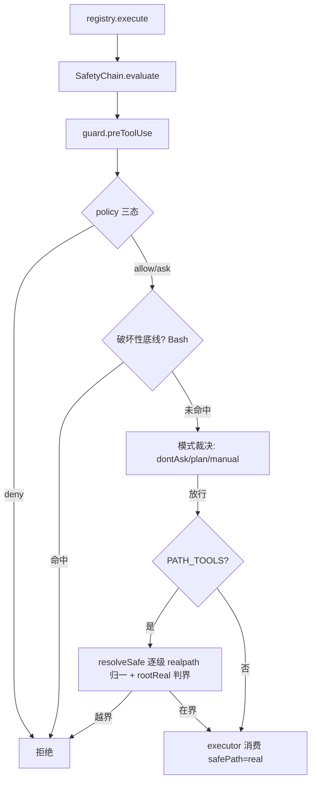

# 安全收尾补丁设计：符号链接路径归一与破坏性命令底线

> 日期：2026-09-05
> 状态：已实施交付（2026-09-05 端到端验收通过；提交链 18f584b → 8ae093b → 2d7f10b）
> 关联：docs/superpowers/reports/2026-09-05-phase1-real-scenario-report.md（真实场景验证报告 421f5e0，本补丁对应其 P0-1 与 P1-2）；统一主链总纲验收 A3（安全唯一链）
> 范围裁决：仅覆盖验证报告「立即」级两项；压缩预算闭环（P1-1）、沉淀触点（P1-3）、注入围栏（P2-2）等后续另行立 spec
> 实现方案：方案 A（用户已批准）——chain 层路径归一 + guard 层破坏性底线，拒绝方案 B（边界下沉后端，违背 1D「链管安全、后端管执行」分工）与方案 C（PolicyEngine 默认 deny 规则表达，glob 对旗标组合表达力不足）

## 0. 背景与动机

真实场景验证报告实测两项安全缺口：

- **P0-1 软链接逃逸**：`SafetyChain.evaluate` 以 `path.resolve + startsWith` 判界，不解析符号链接。实测 root 内 `link.txt → root 外 secret.txt`，read 直接返回外部内容（TOPSECRET-CONTENT 泄漏）——路径类防线被一个 `symlinkSync` 完全击穿。
- **P1-2 破坏性命令无防护**：dontAsk 自主模式下 `rm -rf victim` 直接执行（victim 已删），PolicyEngine 无破坏性命令黑名单；prompt 注入或模型误操作可无阻力触发不可逆破坏。

目标：以最小改动面（3 个安全文件 + 测试）闭合两项。约束：零新增依赖、tsc strict、既有 90 用例断言零改动全绿。

## 1. 范围决策

| 事项 | 决策 | 理由 |
|---|---|---|
| 路径归一层位 | `SafetyChain.evaluate`（PATH_TOOLS 分支内） | 单点收口 read/write/grep 全部路径工具；后端保持执行纯度（1D 确立分工） |
| 归一算法 | 存在段 `realpathSync` + 新建段字面拼接（逐级上溯找存在祖先） | write 常新建文件，目标不存在时不能直接 realpath；新建段是 resolve 产物（无 `..` 残留），字面拼接无穿越面 |
| 判界基准 | 构造时对 `root` 自身 realpath 归一一次（`rootReal`） | root 本身可能位于链接路径上（如 macOS `/tmp → /private/tmp`），以解析后基准判界才自洽 |
| 破坏性检查层位 | `SecurityGuard.preToolUse` 的 Bash 分支：policy deny 之后、模式裁决与 allow 之前 | 「底线」语义：任何权限模式、任何显式 allow 规则都越不过 |
| 黑名单载体 | `modes.ts` 导出破坏性命令清单与下载执行管道模式（数据），guard 持匹配逻辑 | 与 `READONLY_WHITELIST` 同位存放；guard 零结构新增 |
| rm 非递归 | 放行 | 清理临时产物是高频正常操作；递归删除才是不可逆面 |
| 工具名前提 | 到达 guard 的工具名已归一为规范名（Bash/Read/Write/Grep/Glob） | 代码证据：tools.ts:6-12 `CANONICAL_TOOL_NAMES` 映射，registry.execute 于安全链之前统一归一（tools.ts:47 `evaluate(canonical, input)`）；实测反证：manual 模式 `exec echo` 放行（命中 Bash 只读分支）、`write` 拒绝（命中兜底分支） |
| 拒绝码细分（P3-1） | 不动 | 备案项，牵连既有断言 |

## 2. 设计

### 2.1 W1 路径归一（chain.ts）

```text
构造：rootReal = fs.realpathSync(root)          // 一次性归一

evaluate 的 PATH_TOOLS 分支：
  abs    = path.resolve(root, String(raw ?? ''))
  anchor = abs
  while (!fs.existsSync(anchor)) anchor = path.dirname(anchor)   // 逐级上溯，必止于已存在的 root
  real   = fs.realpathSync(anchor) + abs.slice(anchor.length)     // 存在段取真实路径，新建段字面拼接
  若 real !== rootReal 且 !real.startsWith(rootReal + path.sep) → 拒绝
      reason: `COMMAND_DENIED: 路径越出项目 root（真实路径）：${real}`   // 归一后真实路径，可诊断
  放行：safePath = real
```

- 逐级上溯必然终止：root 存在，任何路径的祖先链必经 root。
- `safePath` 语义兼容：存在文件场景 realpath 与 resolve 等价（除非穿越链接——正是要拦的）；executor 拿到的始终是真实路径。
- 失败兜底：`realpathSync` 对已存在 anchor 不应失败；若遇权限类异常按拒绝处理（reason 携带异常信息），不放行。

### 2.2 W2 破坏性命令底线（guard.ts + modes.ts）

`modes.ts` 新增导出：

- `DESTRUCTIVE_COMMANDS = ['dd', 'fdisk', 'shutdown', 'reboot', 'poweroff', 'halt']`（首 token basename 精确匹配）
- `DESTRUCTIVE_PIPE = /\b(?:curl|wget)\b[^|]*\|\s*(?:sudo\s+)?(?:ba|z|da|k)?sh\b/`（下载执行管道）

`guard.ts` 新增私有判定（在 preToolUse 中 policy deny 之后、`decision === 'allow'` 返回之前插入）：

```text
isDestructive(cmd):
  base = 首 token 取 basename（防 /bin/rm、/usr/bin 绕过）
  1) base === 'rm' 且参数含递归旗标：-r / -R / 组合（-rf、-fr 等）或 --recursive
  2) base 以 'mkfs' 开头
  3) base ∈ DESTRUCTIVE_COMMANDS
  4) DESTRUCTIVE_PIPE.test(cmd)
命中 → { allowed: false, reason: `COMMAND_DENIED: 破坏性命令被安全底线拦截：${cmd 截断}` }
```

- 插入位置保证底线优先于 allow：`policy.add('allow', ...)` 不能豁免破坏性命令——P1-2「底线」的本义。
- 旗标解析仅针对 rm；其余命令按首 token 整体判断，避免误伤（如 `find -R` 类工具参数）。

### 2.3 裁决流（改后）



## 3. 改动面

| 文件 | 改动 |
|---|---|
| `src/harness/security/chain.ts` | `rootReal` 构造归一；`resolveSafe` 私有方法；evaluate 判界替换（原 `abs.startsWith` 逻辑退役） |
| `src/harness/security/guard.ts` | `isDestructive` 判定 + 底线拒绝分支 |
| `src/harness/security/modes.ts` | `DESTRUCTIVE_COMMANDS`、`DESTRUCTIVE_PIPE` 导出 |
| `src/harness/security/chain.test.ts` | symlink 逃逸/反向放行/新建段/rootReal 用例 |
| `src/harness/security/guard.test.ts` | 底线拒绝与放行用例、allow 规则不豁免用例 |

约束：零新增 npm 依赖；`node --test`；显式 `git add` 提交；每任务 `npm run build` + 全量测试零回归。

## 4. 测试计划

- symlink 逃逸转绿：root 内链接 → root 外文件，read/grep 拒绝且 reason 含真实路径；write 经链接路径拒绝。
- 反向放行：root 外目录链接指向 root 内文件（或 root 自身为链接）→ 归一后在界内，放行。
- 新建段回归：write `a/b/c.txt`（a/b 不存在）→ 创建成功、落盘位置正确（逐级上溯算法无回归）。
- 破坏性底线：`rm -rf x`、`rm -fr x`、`rm --recursive x`、`/bin/rm -rf x`、`mkfs.ext4`、`dd`、`shutdown`、`curl ... | sh` 在 manual/plan/dontAsk 三模式全拒。
- 正常放行：`rm file.txt`（非递归）、`echo hi`、`cat f`、`grep -r` 类只读不受误伤（grep 属 PATH_TOOLS 走路径链，Bash 白名单含 grep 不受底线影响）。
- 底线优先级：`policy.add('allow', 'Bash *')` 后 `rm -rf` 仍拒。
- 零回归：既有 90 用例全绿（含 R1/R7 形态的 manual 拒绝路径——其 reason 文案不变）。

## 5. 验收标准

| 编号 | 判据 | 反例 |
|---|---|---|
| S1 symlink 闭环 | root 内符号链接触达 root 外目标的读/写/检索全部拒绝，reason 含归一真实路径 | 读穿返回外部内容 |
| S2 新建安全 | 不存在路径的 write 正常逐级创建；真实落盘位置与预期一致 | 新建场景被误拒或落错位置 |
| S3 底线硬性 | 破坏性命令三模式全拒，显式 allow 规则不豁免 | allow 规则放行 rm -rf |
| S4 不误伤 | rm 非递归、只读白名单、管道非下载执行（如 `cat f | grep x`）放行 | 正常清理/只读操作被拦 |
| S5 零回归 | 90 用例断言零改动全绿、tsc strict 零报错 | 既有断言需修改 |

## 6. 不做的事与边界

- 不做拒绝码细分（P3-1 备案，本补丁沿用 `COMMAND_DENIED` 前缀 + 明确 reason）。
- 不做对抗编码混淆（`\rm`、`$(echo rm)`、base64 管道等可绕过黑名单）——见威胁模型声明。
- 不动 PolicyEngine 三态引擎、用户规则表、mask/dryrun 语义。
- 不做 exec 通道文件系统约束（P2-1，Docker 后端路线，1D 接口已预留）。

## 7. 威胁模型声明

黑名单按「常见不可逆操作」设防，定位是拦截**无意的破坏**——模型误操作、prompt 注入诱导的常规破坏命令（验证报告 R3i 已实测注入可达工具层）。**有意的绕过**（shell 技巧编码混淆）不在本补丁防御范围，由执行环境隔离兜底（Docker/SSH 后端 fs 约束），与报告 P2-1 处置路线一致。本补丁交付后，spec/README 应同步标注该威胁模型边界（随本补丁在文档区补一段说明，不单独立文档）。

## 8. 实施记录（2026-09-05 回写）

已实施交付。提交链：18f584b（T1 W1 路径归一）→ 8ae093b（T2 W2 破坏性底线）→ 2d7f10b（修复波 resolveSafe 异常兜底）；执行与评审细节见 plan 执行记录（docs/superpowers/plans/2026-09-05-security-hardening.md）。

### 验收结论

S1–S5 全部通过：全量 101/101/0 零回归（T1 后 95/95/0、T2 后 100/100/0）；E2E 经 ToolRegistry 全链路探针四项全 true（symlinkBlocked / rmrfBlocked / victimSurvives / normalWriteOk）。

### §7 威胁模型边界落地声明

本补丁后防线形态：路径类越界（含符号链接与链接父目录）由链上逐级 realpath 归一判界兜底，判界 IO 异常一律 fail-closed（拒绝并携带异常信息）；破坏性命令由 guard 底线兜底，任何权限模式与显式 allow 规则均不豁免。§7 其余边界保持不变：编码混淆、间接调用、分号执行等有意绕过不在黑名单防御范围，由执行环境隔离（Docker/SSH 后端，1D 接口已预留）兜底。延后项清单见 plan 执行记录，终审已逐条裁定可延后。

