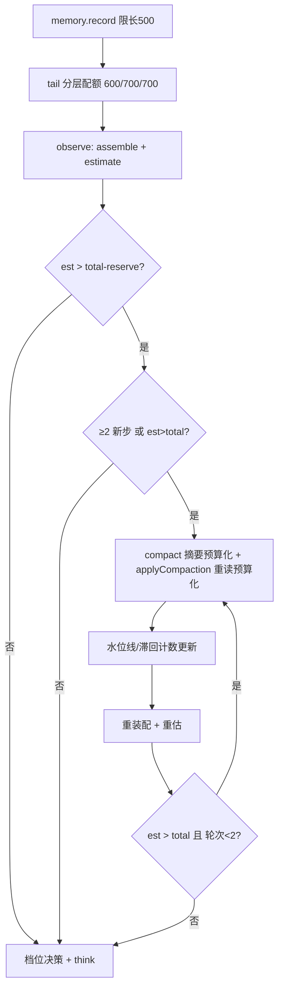

# P1-1 压缩预算闭环设计：估算解耦、收敛环与记忆水位治理

> 日期：2026-09-05
> 状态：已实施交付（提交链见 plan 执行记录）
> 关联：docs/superpowers/reports/2026-09-05-phase1-real-scenario-report.md（验证报告 421f5e0，本设计对应其 P1-1，并吸收 P2-4 的估算校准部分）；总纲 §8.4 上下文窗口压缩稳定性（1B 落地）；1E 记忆分层（value 排序 skill→episodic→working）
> 实现方案：方案 A（用户已批准）——Reactor 收敛环 + 记忆尾部/分层上限；拒绝方案 B（ContextManager 内聚收敛 + 行数快照水位线：预算语义跨层传递、水位线与 promote/endTask 层级重排耦合脆弱）与方案 C（独立 convergence.ts：仅一个调用方，多一模块一接口面，YAGNI）

## 0. 背景与动机

真实场景双轮探针实测压缩链路预算失控：

- scripted 轮（budget 800）：prompt 曲线 337 → 25938 字符，8 轮触发 6 次压缩，注入块自身越滚越大；
- 真实模型轮（budget 900）：423 → 4393 → 8363 → 16547（首次压缩）→ 20658，3 次压缩后仍失控，且触发滞后约 2 轮（轮 2 已 4.4K 字符未触发）。

四个病灶相互耦合，缺一则闭环不成立：

| 编号 | 病灶 | 根因（代码定位） |
|---|---|---|
| F-a | 记忆通道不过水位线：摘要与旧记忆是**叠加**而非**替换** | `assemble` 每轮注入 `memory.index()` 全量；压缩摘要化了旧记忆，下一轮又全量回来（context/index.ts:71-72） |
| F-b | 压缩后注入不复核预算 | `applyCompaction` 设置 `this.compacted` 后从不重估（context/index.ts:62）；摘要 + 重读（5 文件 × 500 行）注入块自身可超限 |
| F-c | 摘要/重读无预算约束 | 每 chunk 摘要截 2000 字符（window.ts:101）且块数无上限；重读仅限行数不限总量 |
| F-d | 估算系统性失准 | estimate = chars × kind权重 / 4：history 权重 0.5 打折 + CJK 按 /4 折算，CJK/历史类真实占用被低估 2–8 倍 |
| F-e | 连轮压缩震荡 | 同批条目可连轮重复压缩（R2：8 轮 6 次），每次压缩再记一条 episodic，记忆增长反哺估算 |

目标：压缩后注入块受预算约束、记忆通道纳入水位治理、估算反映真实占用、压缩频次受滞回约束——多文件全文汇总场景下 prompt 估算全程 ≤ total。

## 1. 范围决策

| 事项 | 决策 | 理由 |
|---|---|---|
| 收敛环层位 | Reactor observe 块内（至多 2 轮） | Reactor 是历史水位线（compactedUpTo）与压缩步计数的唯一所有者，语义自洽；零新模块 |
| 估算口径 | 解耦：estimate = CJK×1 + 其余÷4（真实 token 近似） | 根治触发滞后；权重退役为压缩丢弃优先级，语义各归其位 |
| 记忆治理 | record 入口限长 + assemble 分层配额注入（skill 600 / episodic 700 / working 700） | 层内按时间取尾、层间按价值保配额——整体 tail 会优先丢 skill 保 working，方向反了 |
| 摘要预算 | `compact(items, { summaryTokenBudget })`，超限按丢弃序丢块再截断 | 注入块自身不超限是闭环成立的前提 |
| 重读预算 | `applyCompaction(chunks, { rereadTokenBudget })`，超限按 LRU 最旧先丢整文件 | 重读是注入块体积大头，与摘要各占 reserve/2 |
| 滞回 | 距上次压缩 ≥2 个新 step 才允许再触发 | 消除同批条目连轮压缩；收敛环负责轮内二次收敛，二者互补 |
| 档位信号 | ratio 用收敛后的 est | 压缩后仍 ≥0.6 说明任务真实重负载，large 判定更准 |
| 测试数字 | 1C 档位与相关预算数字按新口径**重校**（白名单：仅数字适配行） | 口径变了数字必然变；断言语义零改动红线不变 |

## 2. 设计

### 2.1 估算解耦（window.ts）

```ts
/** 真实 token 近似：CJK（含全角/中文标点）×1 + 其余 ÷4；单次全局正则计数 */
export function estimateTokens(content: string): number {
  const cjk = (content.match(/[\u4e00-\u9fff\u3000-\u303f\uff00-\uffef]/g) ?? []).length;
  return cjk + Math.ceil((content.length - cjk) / 4);
}

estimate(items): { used: number; items } // used = Σ estimateTokens(it.content)；无权重
```

- ASCII 纯文本下与旧口径数值一致（ceil(len/4)）；history/memory 等不再打折，CJK 类上调至真实量级。
- `KIND_WEIGHT` 从 estimate 退役，迁移为 compact 丢弃优先级（§2.3）。
- 既有预算数字语义随之重标定：`total/reserve` 从此近似真实 token。

### 2.2 收敛环与滞回（reactor.ts observe 块）

```ts
let items = this.deps.context.assemble(task.goal, this.toHistory(steps, compactedUpTo));
let est = this.deps.context.window.estimate(items);
let lastCompactStep = -2; // 滞回：初始可压（step − (−2) ≥ 2 恒成立）
const overThreshold = () => this.deps.context.window.shouldCompact({ total: budget.total, used: est.used, reserve: budget.reserve });

// 滞回门（跨步节流，环外判定一次）：≥2 新步开闸防连轮压缩；est > total 硬越限应急旁路——保证全程 est ≤ total（C1）
const gateOpen = step - lastCompactStep >= 2 || est.used > budget.total;

if (gateOpen && overThreshold()) {
  // 收敛环（环内不受滞回限制）：压缩 → 重注入 → 重装配重估；续环条件为硬越限（est > total）越阈即止——防对摘要的重复再压缩，至多 2 轮有界
  for (let rounds = 0; rounds < 2 && est.used > budget.total; rounds++) {
    const chunks = await this.deps.context.window.compact(items, { summaryTokenBudget: Math.floor(budget.reserve / 2) });
    await this.deps.context.applyCompaction(chunks, { rereadTokenBudget: Math.floor(budget.reserve / 2) });
    compactedUpTo = steps.length;
    lastCompactStep = step;
    items = this.deps.context.assemble(task.goal, this.toHistory(steps, compactedUpTo));
    est = this.deps.context.window.estimate(items);
  }
}
```

- **滞回与应急线**：`step - lastCompactStep >= 2` 开闸防同批条目连轮压缩；`est > total` 硬越限旁路滞回直接压缩——「全程 est ≤ total」（C1）不被滞回破坏。
- **收敛保证**：每轮压缩输入包含上一轮注入块（新摘要判 `new`，吸收旧摘要）；摘要 ≤ summaryTokenBudget、重读 ≤ rereadTokenBudget ⇒ 注入块合计 ≤ reserve，压缩后 est ≈ 装配骨架 + 注入块 ≤ total；触发轮的 prompt 以收敛后 items 组装——压缩当轮即生效（F-b 修复的可观察结果，见 §4.7 白名单）。至多 2 轮有界；装配骨架自身超阈（loader/rules 巨大）属配置异常，本设计 fail-bounded（环有界退出，见 §6）。
- **档位信号**：`ratio = est.used / budget.total` 用收敛后的 est。
- checksum 三态门禁语义不变：确定性丢弃/截断 ⇒ 同输入同 hash，幂等重放保持。

### 2.3 摘要预算化（window.ts compact）

```ts
async compact(items: ContextItem[], opts?: { force?: boolean; summaryTokenBudget?: number }): Promise<ContextChunk[]>
```

- 生成 chunks（chunkByMarkdown → mergeChunks → priority>0）后，若 `Σ estimateTokens(c.summary) > summaryTokenBudget`：
  1. **丢弃序**：`priority` 升序 → kind 权重升序（history 0.5 → result 0.6 → tool 0.7 → memory 0.8 → system 1.0 → instruction 1.2）→ 位置最旧先丢；**白名单 kind = system / instruction 不可丢**。
  2. 丢尽可丢块仍超限 → 逐块确定性截断 summary（按预算比例均匀截断，长度确定性计算——保 checksum 确定性）。
- 未传 `summaryTokenBudget` 时保持现行为（既有调用/测试兼容）。
- 每 chunk 的 2000 字符单块截断保留；总量由 budget 约束。

### 2.4 重读预算化（context/index.ts applyCompaction）

```ts
async applyCompaction(chunks: ContextChunk[], opts?: { rereadTokenBudget?: number }): Promise<void>
```

- 预算作用域：`rereadTokenBudget` **仅管辖重读条目**（摘要部分由 `summaryTokenBudget` 管辖，各占 reserve/2——见 §2.2）。重读条目装配后，若 `Σ estimateTokens(重读条目) > rereadTokenBudget`：按 LRU 最旧先丢**整文件**重读条目，直至预算内。
- 单文件仍截 `REREAD_MAX_LINES = 500` 行；`maskText` 脱敏（B3）保持；压缩事件记忆条目格式不变。
- 未传参数保持现行为（兼容既有测试）。

### 2.5 记忆治理（memory-lifecycle.ts + context/index.ts）

**精确常数表**（本 spec 的唯一取值来源）：

| 常数 | 值 | 含义 |
|---|---|---|
| `MEMORY_RECORD_MAX_CHARS` | 500 | record 入口单条限长（slice(0, 500)，超出截断） |
| `MEMORY_INJECT_BUDGET` | `{ skill: 600, episodic: 700, working: 700 }` | 分层配额注入（合计 2000 字符） |
| `HYSTERESIS_STEPS` | 2 | 距上次压缩的最小新步数 |
| `MAX_COMPACT_ROUNDS` | 2 | 收敛环内至多压缩轮数 |
| 摘要 / 重读预算 | 各 `reserve / 2` | Reactor 传入；注入块合计 ≤ reserve |
| `REREAD_MAX_LINES` | 500（不变） | 单文件重读行数上限 |

- `MemoryLifecycle.record(type, text)`：`text.slice(0, 500)`——所有主题统一闸口（working 的 step 记录是体积大头；episodic 的 compaction 记录天然短）。
- `MemoryLifecycle.tail(maxChars: { skill; episodic; working }): string[]`：各层内按时间取尾部（最新优先）、层间按配额拼接（skill→episodic→working）；`index()` 保持全量语义不变（测试断言与跨任务语义兼容）。
- `ContextManager.assemble`：`this.memory.index()` 替换为 `this.memory.tail(MEMORY_INJECT_BUDGET)`——旧记忆由压缩摘要代表，新记忆按配额注入，叠加通道关闭。

### 2.6 数据流



## 3. 改动面

| 文件 | 改动 |
|---|---|
| `src/harness/context/window.ts` | estimate 新口径（export estimateTokens）；KIND_WEIGHT 退役为丢弃优先级；compact 加 summaryTokenBudget |
| `src/harness/reactor.ts` | observe 收敛环 + 滞回计数 + 预算参数传递；档位用收敛后 est |
| `src/harness/context/index.ts` | applyCompaction 重读预算化；assemble 分层配额注入；MEMORY_INJECT_BUDGET 常量 |
| `src/harness/context/memory-lifecycle.ts` | record 限长 500；tail 分层配额方法 |
| `src/harness/context/window.test.ts` | 估算新口径精确断言；摘要预算化（丢弃序/确定性） |
| `src/harness/context/compaction.test.ts` | 重读预算化用例 |
| `src/harness/context/memory-lifecycle.test.ts` | record 限长；tail 分层配额 |
| `src/harness/context/assemble.test.ts` | assemble 注入切换为分层配额 tail（旧记忆由摘要代表） |
| `src/harness/reactor.test.ts` | 收敛环（注入后仍超 → 二轮收敛）；滞回；水位线语义保持 |
| 1C/1B 既有断言 | **数字重校白名单**：档位 ratio 与预算数字按新口径适配（仅数字行），断言语义零改动 |

约束：零新增 npm 依赖；`node --test`；tsc strict；显式 `git add` 提交；每任务 `npm run build` + 全量测试。

## 4. 测试计划

1. **估算**：纯 ASCII 2000 字符 → 500；纯 CJK 2000 字符 → 2000；混合文本精确断言；estimate 无权重（history 与 system 同长同值）。
2. **摘要预算化**：多 chunk 超限 → 低优先/旧块被丢、system/instruction 白名单保；两次调用同输入同 hash（确定性）；未传 budget 行为不变。
3. **重读预算**：5 个大文件超 rereadTokenBudget → 最旧文件整条被丢、最新保留；单文件 500 行截断保持；mask 不回归。
4. **记忆治理**：record 超 500 截断；tail 配额（working 超配额取尾、skill 至配额全保、层间顺序 skill→episodic→working）；index() 仍全量。
5. **收敛环**：scripted 大观测多步场景，注入后仍超阈 → 第二轮压缩 → est ≤ 阈值；压缩轮内有界（≤2）。
6. **滞回**：压缩后下一新步不立即再压（step − lastCompactStep < 2 被 skip），第 2 新步起恢复触发资格。
7. **档位与压缩闭环重校**：1C 档位用例按新口径重校数字；压缩闭环用例 budget 数字行重校、prompts[1] 断言按 F-b 新语义翻转（均登记白名单）。
8. **E2E 探针（验收）**：scripted R2 型场景（多文件全文汇总、budget 900/150）全轮次 prompt est ≤ total；对照旧失控曲线（20658 字符级）。

## 5. 验收标准

| 编号 | 判据 | 反例 |
|---|---|---|
| C1 收敛性 | R2 型场景（budget 900/150）全轮次 est ≤ total；prompt 字符长度有界（total 量级） | 20K 级失控曲线复现 |
| C2 语义保持 | R2b 场景任务结论正确（total=135）；checksum 三态/幂等不回归 | 压缩后任务失败或摘要重复注入 |
| C3 价值保持 | 存在 skill 记忆时注入含 skill 行（配额内不因 tail 丢失）；compaction 记录格式不变 | skill 被尾部裁剪丢弃 |
| C4 滞回 | 任意两次压缩事件间隔 ≥2 新步 | 同批条目连轮压缩 |
| C5 零回归 | 既有用例除「重校白名单」外断言零改动（白名单 = 数字行 + 压缩闭环用例 prompts[1] 断言随 F-b 修复翻转）；build/selfcheck 绿 | 断言语义被修改 |

## 6. 不做的事与边界

- **观测 2000 字符截断的分页读**（P2-4）——另立 spec；本设计只治上下文预算，不动观测通道。
- **真实 tokenizer**——零依赖约束；CJK×1 + 其余÷4 为近似口径，误差在文档化范围内（CJK 低估 ≤20%，符号混排波动）。
- **重读语义摘要化**——重读仍全文注入，仅做预算裁剪；语义压缩属摘要质量议题（阶段二其他项）。
- **摘要质量升级**（结构化状态摘要）——不在本设计范围。
- **CLI/配置面暴露预算参数**——run opts 已有 budget 入口，不加新配置面。

## 8. 实施记录（2026-09-05）

- **C1 收敛性 ✓**：E2E 探针（`scripts/probe-context-budget.js`，budget 900/150）`estAtThinkPerRound=[6, 641, 302, 809]`，max 809 ≤ 900；装配轨迹 `[6, 641, 1275, 302, 809]` 完整呈现「超阈 → 压缩当轮收敛 → 滞回门控」。
- **C2 语义保持 ✓**：R2b 真实模型冒烟通过（scripts/probe-r2b-smoke.js，.env DeepSeek 端点，budget {135,45}）：8 轮自主收敛，done=true 且答复口令 7391 正确；compact 调用 12 次、checksum 判 replay 去重后仅 1 次入账，每轮 prompt 摘要块恒 ≤1（幂等不重复注入）；est 全程有界（max 395，fail-bounded 包络内）。冒烟不进流水线门禁。
- **C3 价值保持 ✓**：tail 分层配额用例通过（skill 层按配额保留、层间 skill→episodic→working 梯度）；compaction 记录格式不变。
- **C4 滞回 ✓**：收敛环用例 records===1（次新步被滞回门控）；硬越限旁路用例（2c35e2b 强化终态）records===3——step2 一轮即止记 1，step3 硬越限旁路压缩且续环存活集变化记 2；无旁路则恒为 1，差值即旁路语义证明。
- **C5 零回归 ✓**：113/113/0 + tsc strict 零报错 + selfcheck OK；白名单改写点（budget 数字行 / prompts[1] 翻转 / 注释估算值）已登记于 plan 执行记录，白名单外断言语义零改动。
- 提交链：`533a2b4` → `f74b1dc` → `a45d27d` → `582c181` → `176cb14` → `0a07192` → `4335111` → `e2b8864`（回写）→ `2c35e2b`（T5 强化回补）→ 本提交（C2 真实模型冒烟与执行记录登记）。
