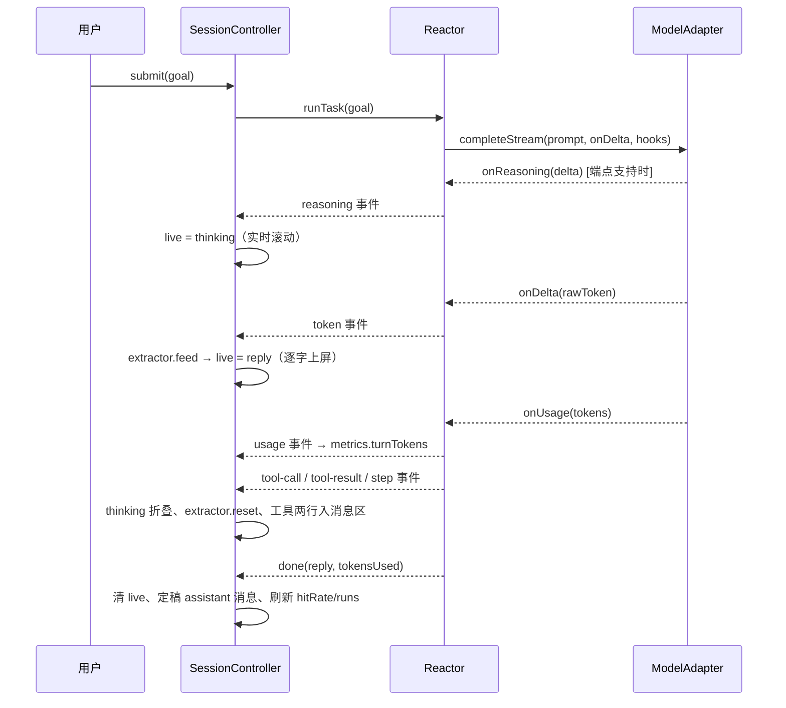

# 阶段五 5A+ · TUI 产品化精装（对标 Claude Code）设计

> 日期：2026-09-10
> 状态：设计已获用户确认（含一次视觉修订：去掉角色标签、助手裸文本、用户消息整行底色）；本 spec 待用户评审后转入 writing-plans
> 关联：docs/superpowers/specs/2026-09-10-phase5a-tui-design.md（5A 基础版）、docs/ROADMAP.md 阶段五、TUI-MANUAL.md

## 1. 背景与目标

5A 已交付可用的交互式 TUI：事件管道贯通（`token` 已在发射）、审批终端化、plan 模式与待办同步。但呈现面对标 Claude Code 仍显简陋——无启动横幅、答复整段落屏、思考与执行过程不可见、输入行无边框、无 token / 缓存命中率观测。

本阶段在**不改动 reactor 协议语义与工具链**的前提下，把 TUI 提升到产品级交互面。逐条对应诉求：

| # | 诉求 | 交付形态 |
| --- | --- | --- |
| 1 | 启动有自己图标 | ASCII 太阳图徽横幅（版本 / 模型 / 命令提示） |
| 2 | 流式显示 | 增量提取 JSON 协议中 `reply` 字段，逐字上屏，协议不泄漏 |
| 3 | 思考内容 | SSE `reasoning_content`/`reasoning` 通道 → 灰色斜体实时滚动 → 折叠为 `✻ Thought for Ns` |
| 4 | 执行步骤英文标识 | `⏺ VERB target` + `⎿ ✓/✗ summary`；计划执行 `▶ Step n/m — item` |
| 5 | 显示输入框 | 常驻圆角边框输入框（含占位提示、队列/审批态提示） |
| 6 | 美化度 | 去角色标签；助手裸文本；用户消息整行底色；消息间空行；失败行红色 |
| 7 | token 数量 | 状态栏 `↑ N tokens`（本轮 submit 周期累计，源自 provider usage） |
| 8 | 命中率等 | 状态栏 `runs N · ctx 命中率 P%`；运行态 spinner 常驻 |

## 2. 现状与差距

| 面 | 现状（已核实） | 差距 |
| --- | --- | --- |
| 事件面 | `SessionEventType` 含 `token`；reactor `callModel` 经 `completeStream(prompt, (t) => emit('token', t), hooks)` 已逐块发射原始增量 | TUI 侧丢
弃 `token`（`onEvent` 只处理 tool-result/error/done），仅 done 整段落屏 |
| 思考通道 | adapter SSE 仅解析 `delta.content` | 无 reasoning 通道，思考内容拿不到 |
| 用量 | 各 adapter 经 `UsageHooks.onUsage` 上报；reactor 内部累计 `tokensUsed` 并随 `done` 载荷下发 | 无实时用量事件，状态栏无法显示本轮 token |
| 命中率 | `harness.context.session.hitRate()` 可直取（selfcheck 已用） | 未进入 TUI 状态 |
| 账本 | `harness.ledger.summary()` → `{ runs, tokens }` | 仅 `/status` 用，未进入状态栏 |
| 渲染层 | `src/tui/components/App.tsx` 单文件 99 行；`ROLE_TAG` 中英标签（`[你]/[助手]/[工具]/[系统]`） | 需拆分组件并重定消息渲染规则 |
| 图标 | 无任何 banner 素材 | 需从零设计 |

## 3. 目标界面

### 3.1 样稿

```text
   ＼ ｜ ／
  ―― ☀ ――   SunshineX TUI v0.1.0 · model glm-5.3-flash
   ／ ｜ ＼  /help 查看命令 · /plan 先规划后执行

░ 帮我建一个 README 并写上简介（整行底色带，无前缀）░

✻ Pondering… (8s · ↑1.2k tokens)
  ✻ 思考流：灰色斜体实时滚动（实时区最多末尾 6 行）
⏺ READ SUNSHINE.md
  ⎿ ✓ 42 lines
⏺ WRITE README.md
  ⎿ ✗ permission denied

已创建 README.md，包含项目简介与快速开始。

▶ Step 1/2 — 创建 a.txt

╭─ ❯ ──────────────────────────────╮
│ 帮我写个部署脚本_                 │
╰──────────────────────────────────╯
 ↑1.2k tokens · runs 5 · ctx 命中率 83% · ✻ Pondering
```

### 3.2 消息渲染规则（本阶段唯一权威口径）

| role / kind | 渲染 | 颜色 |
| --- | --- | --- |
| `user` | 整行底色带（无前缀字符） | 中性灰底 |
| `assistant` | 裸文本原文（无标签、无容器、无着色） | 默认前景 |
| `tool` + `kind: 'call'` | `⏺ VERB target` | 暗灰 |
| `tool` + `kind: 'result'` | 两空格缩进 `⎿ ✓/✗ summary` | 成功绿 / 失败红 |
| `thinking` | 折叠行 `✻ Thought for Ns`（实时为斜体滚动区） | 暗灰斜体 |
| `step` | `▶ Step n/m — <条目>` | 暗青 |
| `system` | `! <正文>`（撤掉 `[系统]` 字样） | 暗黄 |

消息之间空一行；流式答复草稿位于消息区末尾（`live` 区），`done` 收束后转正为 `assistant` 消息。

## 4. 架构与组件

### 4.1 事件面扩展（三处，均为加法）

**`src/types.ts`**（共享类型登记，CLAUDE.md §5）：

```ts
export type SessionEventType =
  | 'token' | 'reasoning' | 'usage' | 'tool-call' | 'tool-result' | 'step'
  | 'route' | 'approval-request' | 'approval-resolved'
  | 'done' | 'error';
```

`SessionEvent` 结构不变（`{ type, text?, payload?, ts }`）。新事件载荷约定：

- `reasoning`：`text` = 思考增量原文；
- `usage`：`payload = { tokens: number, turnTotal: number }`，`tokens` 为本次模型调用的用量、`turnTotal` 为本 run 累计。

**`src/model/adapter.ts`**：

```ts
export interface UsageHooks {
  onUsage?: (tokens: number) => void;
  /** 思考增量（SSE reasoning_content / reasoning）；端点不回传则永不触发 */
  onReasoning?: (delta: string) => void;
}
```

OpenAI 兼容 adapter 的 SSE 解析改为：

```ts
const delta = ev.choices?.[0]?.delta as
  | { content?: string; reasoning_content?: string; reasoning?: string }
  | undefined;
const reason = delta?.reasoning_content ?? delta?.reasoning;
if (reason) hooks?.onReasoning?.(reason);
```

`StubAdapter` / `ScriptedAdapter` 不改（未声明 `onReasoning` 即零副作用）。

**`src/harness/reactor.ts`**：`callModel` 装配点（现 `{ onUsage: (t) => { tokensUsed += t; } }`）扩为：

```ts
{
  onUsage: (t) => { tokensUsed += t; this.emit('usage', undefined, { tokens: t, turnTotal: tokensUsed }); },
  onReasoning: (t) => this.emit('reasoning', t),
}
```

协议语义、工具链、路由零改动。

### 4.2 增量提取器（新增 `src/tui/stream-extractor.ts`）

模型输出是 JSON 协议，答复内嵌在 `reply` 字段。提取器把原始 `token` 增量还原为可上屏的答复文本，**协议骨架一律不上屏**。

```ts
/** 增量协议提取器：消费原始 token 流，透出 reply 字段的可显示文本 */
export class ReplyStreamExtractor {
  constructor(private readonly onReplyDelta: (text: string) => void) {}
  /** 消费一块原始增量 */
  feed(delta: string): void;
  /** 每回合复位（tool-call / tool-result / done / error 时由 controller 调用） */
  reset(): void;
  get mode(): 'seek' | 'ignore' | 'in-reply' | 'plain' | 'settled';
}
```

状态机（单位：Unicode 字符）：

- `seek`：跳过空白；**首个非空白字符不是 `{`** → 判定协议违规，转 `plain`；
- `seek` 内维护**尾部 16 字符滚动窗口**做跨 chunk 键匹配：先命中原样文本 `"tool"` → 转 `ignore`（工具回合无 reply）；先命中 `"reply"` → 消费随后的 `:` 与 `"` → 转 `in-reply`；
- `in-reply`：逐字符透出，处理转义 `\n \t \" \\ \/ \uXXXX`（跨 chunk 的不完整转义暂存待续）；遇未转义 `"` → 转 `settled`（其后 JSON 收尾字符吞掉）；
- `ignore`：吞掉直到 `reset()`；
- `plain`：原文透传（含空白），直至 `reset()`。

提取器是纯状态机，零 IO、零依赖，可完全单测；`controller` 拿到的答复文本仅用于**流式显示**，终稿一律以 `done` 事件载荷为准（见 §5），因此提取误差不影响消息终态。

### 4.3 会话归约（改 `src/tui/session.ts`）

**类型扩展**（`TuiState` / `ChatItem` / `ChatRole` 均在 session.ts，属 TUI 局部类型）：

```ts
export type ChatRole = 'user' | 'assistant' | 'tool' | 'system' | 'thinking' | 'step';

export interface ChatItem {
  role: ChatRole;
  text: string;
  ts: number;
  /** tool 行细分：call（⏺ 调用行） / result（⎿ 结果行） */
  kind?: 'call' | 'result';
  /** tool 结果行是否成功 */
  ok?: boolean;
}

export interface StatusMetrics {
  turnStartedAt: number;  // 本轮 submit 起始（spinner 计时基准）
  turnTokens: number;     // 本轮累计 tokens（usage 事件累加）
  runs: number;           // 账本 runs
  hitRate: number;        // 0..1
}

export interface LiveBlock {
  kind: 'reply' | 'thinking';
  text: string;
  startedAt: number;
}

export interface TuiState {
  messages: ChatItem[];
  approval?: ApprovalRequest;
  todos: TodoItem[];
  status: SessionStatus;
  metrics: StatusMetrics;
  live?: LiveBlock;
}
```

**`onEvent` 重写**（现仅 3 个分支 → 全事件归约）：

| 事件 | 归约动作 |
| --- | --- |
| `token` | `extractor.feed(text)`；提取出的增量追加到 `live = { kind: 'reply' }`（无 live 则创建） |
| `reasoning` | 折叠尚存的 thinking 实时区（转 `thinking` 摘要行）后，追加/创建 `live = { kind: 'thinking' }` |
| `usage` | `metrics.turnTokens = payload.turnTotal` |
| `tool-call` | 折叠 thinking；`extractor.reset()`；清 `live`；push `{ role: 'tool', kind: 'call', text: toolCallLine(tool, input) }` |
| `tool-result` | push `{ role: 'tool', kind: 'result', text, ok: payload.ok }` |
| `step` | push `{ role: 'step', text }`（plan 逐项执行时由 `confirmPlan` 直接 push，见下） |
| `done` | 折叠 thinking；清 `live`；push `{ role: 'assistant', text }`（终稿，权威来源）；刷新 metrics（`hitRate`、`runs`） |
| `error` | 折叠 thinking；清 `live`；push `{ role: 'system', text: '! 错误：…' }`（渲染层补前缀） |
| `route` / `approval-*` | 忽略（不刷屏；审批由 `approval` 字段驱动模态） |

**thinking 折叠**：`collapseThinking()` 把 `live.kind === 'thinking'` 转为一条 `{ role: 'thinking', text: 'Thought for Ns' }`（N 由 `Date.now() - startedAt` 取秒），实时区清空。

**metrics 刷新点**：构造函数初始化（`runs: ledger.summary().runs`, `hitRate: 0`）；`submit()` 起始重置 `turnStartedAt = Date.now()`、`turnTokens = 0`；`done` / `error` 时刷 `hitRate = harness.context.session.hitRate()` 与 `runs = harness.ledger.summary().runs`。

**plan 步骤行**：`confirmPlan(true)` 循环内、每个条目执行前 push `{ role: 'step', text: \`Step ${i + 1}/${items.length} — ${items[i]}\` }`。

### 4.4 渲染组件（新增，`src/tui/components/`）

单文件单职责，App 只做装配：

| 文件 | 职责 | 关键接口 |
| --- | --- | --- |
| `Banner.tsx` | 启动横幅 | `Banner({ info }: { info: BannerInfo })` |
| `MessageList.tsx` | 消息区（含 live 区与空态提示） | `MessageList({ messages, live, columns })` |
| `ToolRow.tsx` | 工具调用/结果两行 | `ToolRow({ item })` |
| `InputBox.tsx` | 边框输入框 | `InputBox({ buffer, status, onSubmit })` |
| `StatusBar.tsx` | 状态栏 | `StatusBar({ metrics, status, startedAt, tokens })` |
| `Spinner.tsx` | 帧动画与动词 | `Spinner({ startedAt, tokens, active })` |
| `App.tsx`（改） | 装配 + 键盘分发 | `App({ controller, banner? })` |

**布局**：`<Box flexDirection="column">` 依次为 Banner → MessageList → InputBox → StatusBar。`columns` 取自 `useStdout().stdout.columns ?? 80`（ink3 顶层导出已确认）。

**ink3 兼容约束（已核实）**：`Text` 支持 `backgroundColor`（`Text.d.ts` 已声明）；`Box` 在 ink3.2 **未**暴露 `backgroundColor` → 用户消息色带用 `<Text backgroundColor="gray">` + 补空格至 `columns` 实现。

**Spinner**：帧序 `['✻','✽','✶','✳','✢']`（160ms/帧），动词轮换 `['Pondering','Brewing','Weaving','Distilling']`（每 2s 换一个）；elapsed 由 `startedAt` 计算（跨重渲染稳定，不用组件内累计）；`active = status === 'running'`。定时器用 `useEffect` + `setInterval`（App 已在用 `useEffect`，ink3 + React 18 可用）。

**InputBox 提示态**：`awaiting-approval` → `等待审批：y 放行 / a 本会话放行 / n 拒绝`；`awaiting-plan` → `计划待确认：y 执行 / n 放弃`；`running` → `运行中…（输入将排队）`；空闲且空缓冲 → `输入任务，Enter 发送 · /help 查看命令`。

### 4.5 纯函数工具（新增，可单测）

| 文件 | 接口 | 规则 |
| --- | --- | --- |
| `src/tui/tool-verbs.ts` | `toolCallLine(tool: string, input: unknown): string` | 动词映射：`exec→EXEC`（target=命令首段）、`read→READ`（path）、`write→WRITE`（path）、`grep→GREP`（pattern）、`glob→GLOB`（pattern）、`webfetch→FETCH`（url）、`kb_search→SEARCH`（query）、`mcp__*→MCP`、其余大写原名；target 缺失时回退 `JSON.stringify(input)` 截 60 字符 |
| `src/tui/text-band.ts` | `displayWidth(s: string): number`、`bandLines(text: string, columns: number): string[]` | CJK 记宽 2；按 `columns - 2` 折行后逐行左右各补 1 空格并补齐到 `columns`，供底色带渲染 |
| `src/tui/banner-info.ts` | `interface BannerInfo { version; model; root }`、`defaultBannerInfo(): BannerInfo` | version 读 `package.json`（失败回退 `'0.1.0'`）；model 读 `OPENAI_MODEL`（缺失显示 `未配置`）；root 取 `process.cwd()` |

## 5. 数据流



**权威性划分**：`reply` 提取仅服务流式观感；消息终态一律取 `done` 载荷 → 提取器任何偏差只影响过程显示，不影响内容正确性。

## 6. 错误处理与降级

| 场景 | 行为 |
| --- | --- |
| 模型输出非 JSON（协议违规） | `seek` 首个非空白字符非 `{` → `plain` 原文透传，用户仍能看到内容 |
| 提取失败 / 未命中 `reply` | 实时区保持 spinner，`done` 时以全文定稿（观感降级，内容不丢） |
| 端点不回传 reasoning | 无 `reasoning` 事件 → 思考区整体不出现，其余功能不受影响 |
| `columns` 不可得（非 TTY） | 回退 80；测试替身固定 100 |
| 行尾空格被终端/ink 裁剪导致色带不齐 | 降级为「文本两侧各 1 空格 + 底色」的短色带（仍满足背景标识诉求，不阻塞验收） |
| usage 事件缺失（provider 不回报） | `turnTokens` 保持 0，状态栏照常显示 `↑ 0 tokens`（不伪造估算值） |

## 7. 测试与验收

沿用既定测试策略（先驱动状态、终态断言首帧；ink3 增量刷帧不可依赖），全部离线、零网络：

| 测试文件 | 覆盖 |
| --- | --- |
| `src/tui/stream-extractor.test.ts` | reply 增量提取；转义（`\n \" \\ \uXXXX`）；键分裂跨 chunk；`"tool"` 先现则忽略；裸文本回退；reset 复位 |
| `src/tui/tool-verbs.test.ts` | 各工具动词映射与 target 提取；缺省回退截断 |
| `src/tui/text-band.test.ts` | CJK 宽度；折行；补齐至 columns |
| `src/tui/session.stream.test.ts` | token → live.reply 累积；reasoning → thinking → 折叠；usage → turnTokens；tool-call/result 两行形态；done 清 live 且以 done 全文定稿；plan 步骤行 |
| `src/tui/components/App.visual.test.tsx` | 横幅内容；用户消息色带；助手裸文本（无 `[助手]`）；工具两行；状态栏 tokens/runs/命中率 |
| 既有 5A 用例（328） | 全量保持绿（键盘回归、审批、plan、runtime 接缝） |

**验收标准**：

1. `npm run build`（tsc strict）零报错；`npm test` 全绿（328 + 新增用例）；
2. `npm run selfcheck` 保持通过，`tui` 行扩展为含合成 `token`/`reasoning`/`usage` 事件流的冒烟（断言提取出的答复文本正确、无异常）；
3. 真实终端手工验收：启动见横幅；答复增量逐字出现且不出现 JSON 协议；端点支持时见思考流与折叠行；工具步骤为英文两行；输入框带边框；状态栏显示本轮 tokens / runs / 命中率。

## 8. 边界与不做（YAGNI）

- 不升级 ink（锁 v3 CJS 线，不引新依赖）；不迁移 `useSyncExternalStore`；
- 不做主题/配色配置项、鼠标交互、Markdown/diff 渲染、语法高亮；
- 不做滚动视口与历史裁剪（长会话由终端自身 scrollback 承担）；
- 不改 reactor 协议字段（不加 `thought` 协议键；思考仅走 SSE 通道）；
- 不改 CLI（`selfcheck`/`run`/`pipeline`）行为与输出。
- 不动审批模态的既有边框样式（仅沿用）。

## 9. 风险与开放问题

| 风险 | 影响 | 缓解 |
| --- | --- | --- |
| `reply` 与 `tool` 键同 chunk 出现时判定顺序 | 误判为忽略 → 流式缺失 | 以「首个命中键」为准并在测试中固化；且终稿取 `done`，无内容风险 |
| 端点 reasoning 字段名不一（`reasoning_content` vs `reasoning`） | 思考区不显示 | 双键兼容；缺失时静默降级 |
| ink3 `Text` 背景色在部分 Windows 终端渲染差异 | 色带观感不一致 | §6 降级方案；验收以「有背景标识」为准 |
| 长思考流撑爆视口 | 观感差 | 实时区最多末尾 6 行，折叠行保留时长 |
