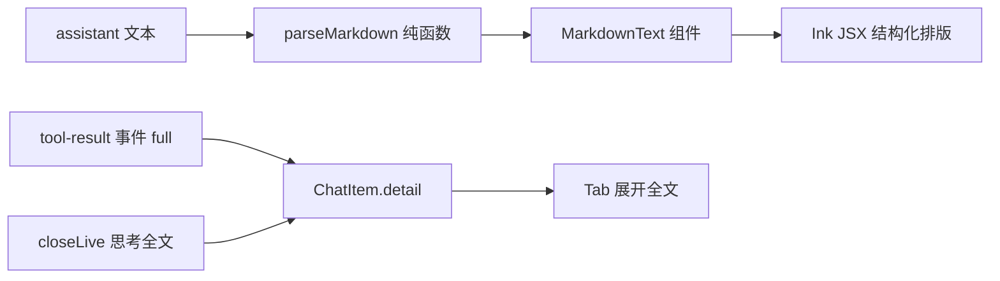

# 阶段五 5B · TUI 正文 Markdown 渲染与交互增强（对标 Codex / Claude Code）设计

> 日期：2026-09-10
> 状态：设计待用户评审后转入 writing-plans
> 关联：`docs/superpowers/specs/2026-09-10-phase5a-tui-polish-design.md`（5A 精装）、`docs/superpowers/plans/2026-09-10-phase5a-tui-polish.md`、`docs/ROADMAP.md` 阶段五、`TUI-MANUAL.md`

## 1. 背景与目标

5A 已交付产品级交互骨架：启动横幅、答复流式上屏、思考折叠、英文工具步骤、边框输入框、状态栏（本轮 tokens / runs / 命中率）。但正文仍以**裸文本**上屏——模型输出的 Markdown 符号（`#`、`**`、`` ` ``、`- `、` ``` `、`|` 等）全部原样可见，表格因 CJK 宽度错位，代码块与正文糊在一起。这正是「简陋感」的最大来源。

本阶段在**不改动 reactor 协议语义与既有事件流骨架**的前提下，补齐七项优化（用户已全选）：

| # | 优化项 | 对标 | 交付形态 |
| --- | --- | --- | --- |
| 1 | 正文 Markdown 渲染 | Claude Code | 标题/列表/代码块/表格/行内代码/引用/分割线结构化排版 |
| 2 | 工具调用行增强 | Codex | 工具名高亮 + 参数摘要 + 结果行可展开全文 |
| 3 | 思考可展开/折叠 | Claude Code | 折叠行 `✻ Thought for Ns`，Tab 切换展开全文 |
| 4 | 多行输入 | Claude Code | Shift+Enter 换行，Enter 提交 |
| 5 | 历史命令 ↑↓ + 斜杠补全 | 两者皆有 | 输入框历史导航 + `/` 命令 Tab 循环补全 |
| 6 | 状态栏增强 | Claude Code | 模型名 + 本轮耗时 |
| 7 | 代码块语法高亮 + diff 红绿 | Codex | diff 块 +/- 红绿；通用语言轻量高亮（可选后置） |

## 2. 现状与差距（已核实）

| 面 | 现状（已核实） | 差距 |
| --- | --- | --- |
| 正文渲染 | `MessageList.tsx` 助手行 `return <Text>{item.text}</Text>`，live 区同 | Markdown 符号原样可见，无结构排版 |
| 表格对齐 | 无 | 表格列未按 CJK 宽度（记 2）对齐 |
| 行内样式 | `Text` 已支持 bold/italic/strikethrough/inverse/backgroundColor/wrap（ink3 `Text.d.ts` 已核实） | 未应用 |
| 代码块 | 无围栏识别 | ` ``` ` 原样显示，无底色/语言标签 |
| 工具结果全文 | reactor `this.emit('tool-result', observation.slice(0, 200), { ok: r.ok })`（reactor.ts:133） | 结果被截断，展开无法取全文 |
| 思考全文 | `session.ts` `closeLive()` 折叠为 `Thought for Ns` 后**丢弃全文** | 展开无源 |
| 输入 | `App.tsx` 单一 `useInput`：`key.return` 提交、`key.backspace/delete` 删字符、`key.ctrl/meta` 过滤 | 无多行、无历史、无补全 |
| 状态栏 | `StatusBar` 显示 tokens/runs/命中率/待办/状态词 | 无模型名、无本轮耗时 |
| 键盘能力 | `useInput` 的 `key` 含 `shift`/`tab`/`upArrow`/`downArrow`（ink3 stdin 原始序列已透传，测试替身用 `write('\u001b[A')` 等） | 未用 ↑↓/Tab/Shift |

## 3. 目标界面（样稿）

```text
   ＼ ｜ ／
  ―― ☀ ――   SunshineX TUI v0.1.0 · model glm-5.3-flash
   ／ ｜ ＼  /help 查看命令 · /plan 先规划后执行

░ 部署到生产环境需要几步？ ░

### 部署步骤                ← 标题（加粗 + 分级色）
1. 构建镜像               ← 有序列表（连续编号 + 缩进）
2. 推送仓库
   - 打 tag               ← 嵌套列表
   - 推送 origin

```bash                   ← 代码块（底色带 + 语言标签）
docker build -t app .
```
| 环境 | 副本 | 说明 |          ← 表格（按 CJK 宽度对齐）
| --- | --- | --- |
| 测试 | 2    | 内部 |
| 生产 | 3    | 公网 |

> 注意事项                ← 引用（缩进 + 竖线）

✻ Thought for 8s  [Tab 展开]  ← 思考折叠行
⏺ [WRITE] deploy.sh         ← 工具调用行（工具名高亮）
  ⎿ ✓ 42 bytes  [Tab 展开]   ← 工具结果行（可展开全文）

╭─ ❯ 部署脚本改成多阶段构建_ ▊ ─╮   ← 多行输入（Shift+Enter 换行）
╰──────────────────────────────╯
 ↑1.2k tokens · 8.3s · model glm-5.3-flash · runs 5 · ctx 命中率 83% · 空闲
```

## 4. 架构设计

### 4.1 正文 Markdown 渲染（核心）

新增两级解析：**块级**（行级状态机）+ **行内**（字符扫描），全部纯函数、零依赖、可单测，与既有 `text-band`/`format` 体系一致。

**新增 `src/tui/markdown.ts`**：

```ts
export type MdInline =
  | { kind: 'text'; text: string }
  | { kind: 'bold'; children: MdInline[] }
  | { kind: 'italic'; children: MdInline[] }
  | { kind: 'code'; text: string }
  | { kind: 'strike'; children: MdInline[] };

export type MdBlock =
  | { type: 'heading'; level: 1 | 2 | 3 | 4 | 5 | 6; inlines: MdInline[] }
  | { type: 'paragraph'; inlines: MdInline[] }
  | { type: 'fence'; lang: string; code: string }
  | { type: 'list'; ordered: boolean; items: MdInline[][] }   // 每项一行；嵌套 list 降级为正文缩进
  | { type: 'quote'; inlines: MdInline[] }
  | { type: 'table'; headers: MdInline[][]; rows: MdInline[][][] }
  | { type: 'hr' };

/** 解析 Markdown 文本为块序列（纯函数，零依赖） */
export function parseMarkdown(text: string): MdBlock[];
/** 表格按显示宽度对齐（复用 text-band 的 displayWidth），返回补齐后的行文本数组 */
export function alignTable(headers: MdInline[][], rows: MdInline[][][], columns: number): string[][];
```

**解析规则**（块级）：

- ` ```lang ` 围栏起 → 收集到闭合围栏为 `fence`；**未闭合**时把已收集行降级为普通 `paragraph`（流式容错的关键）。
- `#{1,6} ` 开头 → `heading`（级别 = `#` 数，6 以上归 6）。
- `- ` / `* ` 开头 → `list ordered:false`；`\d+[.、] ` 开头 → `list ordered:true`（编号在渲染层重排为连续 1..N）。
- `> ` 开头 → `quote`（连续多行合并）。
- `|` 开头的相邻行且第二行为分隔行（`|---|`）→ `table`；否则按段落。
- `---` / `***` 独立行 → `hr`。
- 其余 → `paragraph`（连续普通行合并）。

**行内规则**（仅作用于 heading / paragraph / quote / list 项 / 表格单元格）：按 `**粗**`、`*斜*`、`` `代码` ``、`~~删~~` 优先级扫描；**未闭合的行内标记按字面原样输出**（不吞字）。

**新增 `src/tui/components/MarkdownText.tsx`**：IR → Ink JSX。

| 块 | 渲染 | 样式 |
| --- | --- | --- |
| heading | 文本 + 行内样式 | level 1/2 加粗 + 黄色；3/4 加粗；5/6 加粗 + 暗灰 |
| paragraph | 行内样式 | 默认前景 |
| fence | 逐行 `Text backgroundColor` 色带（`cyan` 底/暗底）+ 首行语言标签 | 代码行等宽感（暗灰前景） |
| list | 无序 `• ` + 缩进 2；有序 `n. ` 连续重排 + 缩进对齐 | 默认 |
| quote | 每行前缀 `│ ` + 缩进 | 暗青 |
| table | `alignTable` 补齐后逐行输出；表头与数据行之间加分隔线 | 表头加粗 |
| hr | 整行 `─` 铺满 columns | 暗灰 |

**行内样式映射**：`bold` → `bold`；`italic` → `italic`；`code` → `backgroundColor`（反色底）；`strike` → `strikethrough`。

**接入点**：`MessageList.tsx` 的 `assistant` 行与 `LiveArea` 的 `reply` 草稿改用 `MarkdownText`。

**流式容错**：`live` 草稿流式阶段同样走 `parseMarkdown`，未闭合围栏/表格已按 §4.1 降级为段落，故逐字上屏不会闪烁错乱；`done` 定稿后完整重渲一次（权威来源仍是 `done` 载荷，与 5A 口径一致）。

**选型取舍**：自研轻量解析器，**不引** `marked`/`markdown-it`/`ink-markdown`。理由：ink3（React 18）无成熟配套渲染器，社区库对 ink3 兼容存疑，引库后 renderer 仍须自写；assistant 输出实际命中上述子集，自研可控、可单测、零新增依赖（契合 CLAUDE.md 依赖纪律）。

### 4.2 工具调用行增强

- `ToolRow.tsx` 调用行：`⏺ [` + 工具名（高亮色）+ `] ` + 目标摘要（复用 `toolCallLine` 的 target，保留既有动词映射）。
- 结果行：`⎿ ✓/✗ 摘要`，末尾追加 `[Tab 展开]` 提示（当存在全文时）。
- **全文来源**（reactor 纯加法，向后兼容）：`tool-result` 事件 payload 由 `{ ok }` 扩为 `{ ok, full }`，`full` = 完整 `observation`（`text` 仍为 200 字符截断摘要）。reactor.ts 第 133 行改为：

```ts
this.emit('tool-result', observation.slice(0, 200), { ok: r.ok, full: observation });
```

- `session.ts`：`ChatItem` 增 `detail?: string`（工具结果全文 / 思考全文的通用可展开载荷）；`tool-result` 归约时 `detail: payload.full`。

### 4.3 思考可展开/折叠

- `ChatItem` 增 `detail?: string`：`thinking` 消息折叠时把全文存入 `detail`，行文本仍为 `Thought for Ns`。
- `session.ts` 的 `closeLive()` 改为：`pushMsg('thinking', 'Thought for Ns', { detail: live.text })`——**不再丢弃思考全文**。
- 展开交互：App 维护 `expandAll: boolean`，idle/error 态按 **`Tab`** 切换。开时 `thinking` 行渲染全文（灰色斜体），`tool` 结果行渲染 `detail` 全文（可折行）；关时恢复折叠。Tab 不参与斜杠补全（补全仅 `/` 前缀触发，见 §4.4，两功能互斥无冲突）。

### 4.4 输入增强

`App.tsx` 单一 `useInput` 扩展（纯前端状态，不触 controller）：

- **多行**：`key.shift && key.return` → `setBuffer(b => b + '\n')`，不提交；`key.return` 仍提交（提交前 `trim`）。
- **历史**：App 维护 `history: string[]` + `histIdx: number`。提交成功时 push（去重、去空、上限 100）；`key.upArrow`（buffer 为空或光标在首行）→ 上一条，`key.downArrow` → 下一条（越界回空）。仅 idle/error 态生效，运行态不响应（输入排队）。
- **斜杠补全**：命令清单 `['/help','/new','/compact','/status','/plan']` 提为纯函数 `slashCandidates(buffer)` 导出可测；buffer 以 `/` 开头时按 `Tab` 循环补全至完整命令 + 空格，非 `/` 开头时 Tab 留给 §4.3 展开切换。
- 现有 `approvalKeyToDecision`/`inputPlaceholder` 纯函数不动；键盘分发仍收敛于 App 单一 `useInput`。

### 4.5 状态栏增强

`StatusBar.tsx` 增两项（props 增 `model?: string`）：

- `model`：取自 `buildBannerInfo().model`（App 已有 `info.model`，透传即可）。
- 本轮耗时：`elapsed = Date.now() - metrics.turnStartedAt`（`turnStartedAt>0` 时显示 `X.Xs`，否则不显示）；running 态随帧刷新，idle 态显示最后一轮耗时。

### 4.6 代码块语法高亮 + diff 红绿

- **diff 优先**：`fence.lang === 'diff'`（或 `patch`）时，行首 `+` 绿 / `-` 红 / `@@` 青 / ` ` 上下文暗灰。
- **通用轻量高亮（后置可选）**：对 `ts/js/python/bash/sql` 等做关键字/字符串/注释/数字的正则着色；标记为 P2，仅在前六项验收通过后按剩余投入决定，不阻塞 5B 主验收。

## 5. 数据流



## 6. 错误处理与降级

| 场景 | 行为 |
| --- | --- |
| 未闭合代码围栏 / 表格（流式中途） | 降级为普通段落，逐字上屏不闪烁 |
| 未闭合行内标记（`**x`） | 按字面输出，不吞字 |
| 表格超宽 / 单元格过长 | `alignTable` 按可用列宽截断单元格（保留首尾可读） |
| 超宽表格列（列数 × 最小宽 > columns） | 降级为逐行文本（不再强制对齐） |
| 代码块无语言标签 | 按普通代码块渲染（无色带外文字，不标语言） |
| `tool-result` 无 `full`（旧 reactor / 脚本） | 折叠行无 `[Tab 展开]` 提示，仅显示摘要 |
| 端点不回传 reasoning | 思考区不出现，展开功能无对象，静默降级 |
| `turnStartedAt=0`（未运行） | 状态栏不显示耗时 |

## 7. 测试与验收

沿用「先经控制器驱动至终态再渲染，断言首帧全量映射；ink3 增量刷帧不可依赖」策略，全离线零网络。

| 测试文件 | 覆盖 |
| --- | --- |
| `src/tui/markdown.test.ts` | 标题/列表/围栏/引用/表格/hr 解析；行内加粗/斜体/代码/删除线；未闭合降级；嵌套列表降级；超宽表格降级 |
| `src/tui/markdown-table.test.ts`（或并入上者） | `alignTable` CJK 对齐、截断、降级 |
| `src/tui/components/MarkdownText.visual.test.tsx` | 标题加粗、列表编号、代码块底色、表格对齐、行内代码反色 |
| `src/tui/session.detail.test.ts` | tool-result `full` → `ChatItem.detail`；thinking 折叠保留 `detail` 全文 |
| `src/harness/reactor.events.test.ts`（追加） | `tool-result` payload 含 `full` 完整 observation，`text` 仍 200 截断 |
| `src/tui/components/App.input.test.tsx` | Shift+Enter 换行；↑↓ 历史导航；`/`+Tab 补全；Tab 展开开关 |
| 既有 5A 用例 | 全量保持通过（assistant 裸文本断言升级为「结构化排版仍含原文」，意图不变） |

**验收标准**：

1. `npm run build`（tsc strict）零报错；`npm test` 全绿；
2. `npm run selfcheck` 保持通过（`tui` 行保持流式冒烟口径）；
3. 真实终端手工验收：Markdown 正文结构化排版（标题/列表/代码块/表格/行内代码）；表格 CJK 对齐；工具行高亮 + 结果 Tab 展开；思考 Tab 展开；Shift+Enter 多行、↑↓ 历史、`/`+Tab 补全；状态栏显示模型名 + 耗时；diff 块 +/- 红绿。

## 8. 边界与不做（YAGNI）

- 不升级 ink、不引新依赖（Markdown 自研解析器）；
- 不做完整 tokenizer 级语法高亮（仅 diff 红绿 + 可选轻量正则着色）；
- 不做鼠标交互、主题/配色配置项；
- 不做滚动视口与历史消息裁剪（长会话由终端 scrollback 承担，沿用 5A 边界）；
- 不改 reactor 输出协议字段语义（`tool-result` 仅加 `full` 载荷，`text` 语义不变）；
- 不改 CLI（`selfcheck`/`run`/`pipeline`）行为；
- 不改嵌套表格/跨行单元格（超宽降级为文本）。

## 9. 风险与开放问题

| 风险 | 影响 | 缓解 |
| --- | --- | --- |
| Markdown 解析覆盖不全（模型输出超预期语法） | 部分符号仍原样 | 未识别行按段落字面输出，无内容丢失；解析器按需增量扩展 |
| 流式逐字解析致未闭合块闪烁 | 观感差 | 未闭合围栏/表格降级段落；终稿 done 权威重渲 |
| CJK 表格对齐受终端宽度限制 | 列被截断 | `alignTable` 截断 + 超宽降级文本；验收以「可读对齐」为准 |
| Tab 键复用（补全 vs 展开）冲突 | 按键歧义 | 以 `/` 前缀分流：`/` 开头 → 补全，否则 → 展开；测试固化 |
| ↑↓ 历史与多行光标冲突 | 光标行内导航误触历史 | 仅 buffer 空或光标在首行时响应历史；多行态光标内不触发 |
| ink3 `backgroundColor` 部分终端渲染差异 | 代码块/行内代码观感不一致 | 与 5A 色带同降级口径；验收以「有底色标识」为准 |
