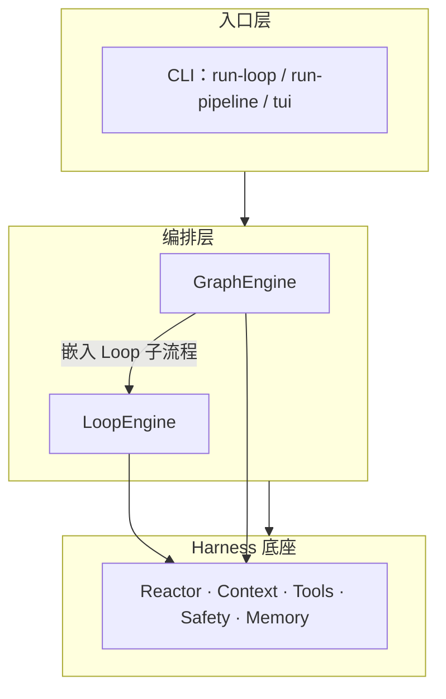
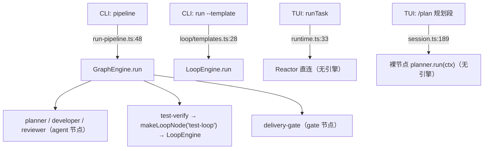

# 长任务护栏下沉与 TUI 主链接线（设计）

- 日期：2026-09-11
- 状态：待评审
- 前置修复：`18190c8 fix(tui): TUI 装配真实模型 + 堵住系统提示词回显泄露`
- 关联：`docs/Arch-Plan.md:68`（四重终止口径）、`2026-09-06-phase2-loop-engine-design.md`、`2026-09-06-phase3-graph-orchestration-design.md`、`2026-09-10-phase5b-tui-markdown-design.md`

## 1. 问题

产品目标是**长任务**（当前口径：单次提交最长 **4h** 兜底）。但 TUI 的一次实测任务在数步之后**静默停止**，且经代码核查，「4h 兜底」在 TUI 这条路径上**不可能兑现**。

### 1.1 现象

任务执行到某个工具行后停住，状态栏回到「空闲」，既无终答也无任何提示——用户无法判断是完成、失败还是还在跑。

### 1.2 根因（三条，逐层递进）

**R1 · 入口绕过编排层。**

```ts
// src/tui/runtime.ts:33
runTask: (goal, o) => harness.reactor.run({ goal }, { maxSteps: o?.maxSteps ?? 12 }),
```

TUI 直连 Harness 底座的 `Reactor`，不经过 Loop/Graph。而「四重终止（验收 / 迭代 / 超时 / Token）」是**编排层职责**——`loop/engine.ts` 在节点边界检查、`graph/engine.ts` 同理；`Reactor` 自身只有 `maxSteps`。

于是 TUI 这条路上四重退化为「一重」，且该值还是**手写的 `12`**（`Reactor` 自身缺省为 `200`，见 `src/harness/reactor.ts:38`）。同类魔数还有 `src/tui/session.ts:181` 的 `planner maxSteps: 6`。

**R2 · 护栏粒度错位。**

Loop/Graph 的边界检查发生在 `node.run()` **之前**，而一个 agent 节点 = **一次 Reactor run**（内部最多 200 步）。单节点内部跑多久，编排层的 `timeoutMs` 都拦不住。

同时 Loop 向 Reactor 只透传 token 换算，**没有透传 deadline**：

```ts
// src/loop/nodes.ts:108-110
const budget = toReactorBudget(ctx.termination.maxTokens - ctx.tokensUsed);
const reactor = new Reactor(deps);
const r = await reactor.run({ goal }, { maxSteps: opts?.maxSteps, budget });
```

即：**超时护栏守在节点边界，而长任务的时间恰恰消耗在节点内部的 agent 循环里。**

**R3 · 终止静默。**

`src/tui/session.ts` 的 `runTaskFlow` 丢弃 `runTask` 的返回值；而 `Reactor` 在 `maxSteps` 耗尽时走的是与正常完成**同一个** `done` 出口但 `reply=undefined`，TUI 只在有文本时才上屏 → 未完成终止对用户完全不可见。

### 1.3 附带发现：装饰性 termination

```ts
// src/tui/session.ts:186-189
const ctx: GraphContext = {
  state: { goal }, tokensUsed: 0, startedAt: Date.now(), results: {},
  termination: { maxNodes: 10, maxTokens: 200_000, timeoutMs: 600_000 },
};
const out = await planner.run(ctx, deps, {});
```

`/plan` 的规划段手工构造 `GraphContext` 后**裸调节点**，没有任何引擎读取该 `termination`——三个数字**声明了但从不生效**。这比 R1 更隐蔽：R1 的 `12` 至少在生效（值荒谬），这三个是彻底的空转。

## 2. 已定决策

| # | 决策点 | 结论 |
| --- | --- | --- |
| D1 | 完成判定 | 以模型自报 `done` 为准，**不引入校验环节**（TUI 链路无 check 节点） |
| D2 | 中断粒度 | **步边界收敛**，不抢占进行中的模型/工具调用 |
| D3 | 4h 口径 | **单次提交**计时（记在 run 上，`deadlineAt = startedAt + timeoutMs`） |
| D4 | 护栏分层 | **内建进 Reactor**（每步边界判定），编排层注入剩余限额；不新增编排层 |
| D5 | 入口接线 | **一条主链 + 任务形态驱动**：入口提交 → LoopEngine（内嵌 Reactor）；**不暴露引擎开关**，保留 `/plan` 作人类确认点 |

D5 的取舍说明：引擎是实现细节，把 `/goal`、`/graph` 做成用户可见命令等于把内部结构固化成产品接口，与「单一数据流、不提供几套实现逻辑」冲突。Claude Code 亦无引擎开关，其 Plan Mode 对应本项目已有的 `/plan`；分层嵌套本身已表达包含关系（Graph 可嵌入 Loop 子流程），无需并列开关。

## 3. 待确认假设

- **H1**：`/plan` 的**规划段**（现为裸节点调用）并入同一条链——走单 agent 的 Loop 模板，保留 `planner` 角色框定；执行段（`runPlanItems`）本就走 `runTask`，随主链一并归位。
  备选：规划段改为 `GraphEngine` 单节点模板（形式统一，但为单节点引入图引擎）。

## 4. 分层与目标链路

分层依赖方向（入口 → 编排 → 底座），护栏属**底座能力**：



目标态：TUI 提交 → **LoopEngine**（新增「长任务」loop 模板：单 agent 节点、无 check 节点，符合 D1）→ Reactor；限额由模板 `termination` 换算后注入 Reactor。

## 5. 触发点：现状 → 目标态

### 5.1 现状（代码实测）



| 入口 | 触发 | 引擎级护栏 |
| --- | --- | --- |
| CLI `pipeline` | GraphEngine（`run-pipeline.ts:48`） | ✓ |
| CLI `run --template` | LoopEngine（`loop/templates.ts:28`） | ✓ |
| Graph 内 `test-verify` | LoopEngine 子流程（`graph/templates.ts:35`） | ✓ |
| **TUI `runTask`** | Reactor 直连 | 仅 `maxSteps`（值 12） |
| **TUI `/plan` 规划段** | 裸节点 | **无引擎 → 一项都不生效** |
| TUI `/plan` 执行段 | Reactor 直连（每项一次） | 同 `runTask` |
| `instantiateWorkflow` | GraphEngine | 生产无调用方（仅测试引用） |

**结论：GraphEngine 在 TUI 路径上从不触发。**

### 5.2 目标态

| 入口 | 触发 | 护栏来源 |
| --- | --- | --- |
| CLI `pipeline` | GraphEngine →（agent 节点）Reactor | Reactor 内建 + Graph 节点边界复用同一判定 |
| CLI `run --template` | LoopEngine → Reactor | Reactor 内建 + Loop 节点边界复用同一判定 |
| TUI 提交 / `/plan` 执行段 | LoopEngine（长任务模板）→ Reactor | 同上，`deadlineAt` 由模板 termination 注入 |
| TUI `/plan` 规划段 | 同一条 Loop 链（H1） | 同上 |

## 6. 接口

```ts
// src/harness/reactor.ts
export interface ReactorLimits {
  maxSteps?: number;
  budget?: { total: number; reserve: number };
  /** 绝对截止时刻（ms epoch）：与 maxSteps 同为硬边界，每步开始前判定 */
  deadlineAt?: number;
}
export interface ReactorOpts extends ReactorLimits {
  routeHint?: RouteHint;
}

export class Reactor {
  async run(task: Task, opts?: ReactorOpts): Promise<RunResult>;
}
```

`ReactorDeps` 不变。`RunResult` 增补终止原因：

```ts
export type StopReason = 'done' | 'max-steps' | 'deadline' | 'budget' | 'model-error';
// RunResult 增补：stopReason?: StopReason
```

单一判定纯函数（供 Reactor 每步与 Loop/Graph 节点边界共用）：

```ts
export function guardrailStop(input: {
  step: number; maxSteps: number;
  now: number; deadlineAt?: number;
  tokensUsed: number; maxTokens?: number;
}): 'max-steps' | 'deadline' | 'budget' | null;
```

判定顺序**对齐 `loop/engine.ts` 既有顺序**：迭代 → 超时 → 预算。

## 7. 判定与预算透传

| 入口 | maxSteps | budget | deadlineAt |
| --- | --- | --- | --- |
| TUI → 长任务 Loop 模板 | 跟随 Reactor 缺省 `200`（可配），**删除字面量 12** | 模板 termination 换算 | `startedAt + 4h`（模板 termination，可配） |
| Loop `agentNode` | 保持 `opts?.maxSteps` | `toReactorBudget(剩余 token)` **不变** | `ctx.startedAt + termination.timeoutMs`（**新增透传**） |
| Graph agent 节点 | 同上 | 同上 | 同上 |

- `budget` 语义由「仅压缩阈值」升级为「**硬边界 + 压缩阈值**」：压缩逻辑不动，新增「越限即收敛」。
- `toReactorBudget` 为纯函数、既有断言不变（`1000→{1000,200}`、`7→{7,1}`、`0→{1,0}`，见 `loop/engine.test.ts:279-281`）；只为时间维度补一条同构换算。
- 兜底口径对齐既有模板：Graph `timeoutMs = 14_400_000`（4h，`graph/templates.ts:7`）、Loop `7_200_000`（2h，`loop/templates.ts:6`）。

## 8. 终止可见性（修 R3）

- 越限**不抛错**：返回 `done=false` + `stopReason`，照常落 run 账本（成本观测不丢）。
- `emit('done', reply, { steps, tokensUsed, stopReason })`。
- TUI 对 `!done` **必须显式上屏**（如「未完成终止：已达步数上限 / 超时 / 预算耗尽」），不再依赖「有 reply 才推消息」。

## 9. 测试

- 护栏纯函数：边界值与同时越限时的优先级。
- Reactor：小 `deadlineAt` 到点收敛、预算硬停、步数耗尽 → `stopReason` 各自正确且不抛错。
- 回归：`toReactorBudget` 既有断言不变；Loop/Graph 现有 termination 行为不变。
- TUI：未完成终止必须上屏；`runtime.ts` 不再出现字面量 `12`；`/plan` 规划段经引擎（H1 落地后）。
- 端到端：慢 adapter + 极小 `deadlineAt`，验证「到点收敛且可见」。

## 10. 明确不做

- 不引入校验环节（D1：完成以模型自报 `done` 为准）。
- 不引入抢占式中断 / AbortSignal 贯穿（D2：依赖单次调用自身超时——模型 adapter 缺省 `600 000 ms`，工具执行另有沙箱级单命令超时）。
- 不新增编排层或统一 Runner。
- 不暴露 `/goal`、`/graph` 等引擎开关。
- 不改 Loop/Graph 的验收节点与拓扑。

## 11. 影响面与迁移顺序

1. `src/harness/reactor.ts`：`ReactorLimits` / `ReactorOpts` / `stopReason` / 每步判定（含 `guardrailStop` 抽为纯函数）。
2. `src/loop/engine.ts`、`src/graph/engine.ts`：节点边界检查改为调用同一纯函数（消除两份重复实现）。
3. `src/loop/nodes.ts`、`src/graph/agents.ts`：向 Reactor 透传 `deadlineAt`。
4. `src/loop/templates.ts`：新增长任务单 agent 模板。
5. `src/tui/runtime.ts`：`runTask` 改走 Loop 模板；删除字面量 `12`。
6. `src/tui/session.ts`：`runTaskFlow` 消费返回值并上屏未完成原因；`/plan` 规划段并入同一链（H1）。
7. 测试补齐与既有断言回归。

## 12. 风险

- **语义变更面**：`budget` 从「压缩阈值」升级为「硬边界」，可能让既有长会话更早收敛——需以现有测试与一次真实长会话验证。
- **模板新增**：长任务 Loop 模板与既有 `code-refactor` / `test-loop` / `code-review` 的终止参数口径需保持一致（2h vs 4h），避免同一入口两套时长。
