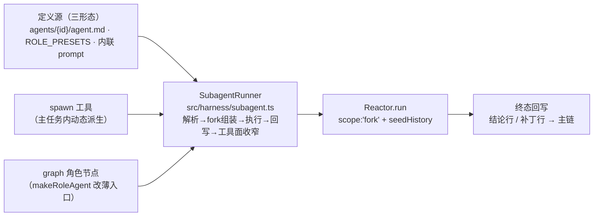

# 子 agent 执行单元（SubagentRunner + spawn 双入口）设计

- 日期：2026-09-14
- 状态：设计已评审定稿（六节呈现 + 调用语义修订经用户确认）
- 上游规格：`docs/superpowers/specs/2026-09-14-context-fork-design.md`（fork 语义 §5——本设计是其「子 agent」落地的专项设计）
- 上游计划：`docs/superpowers/plans/2026-09-14-context-fork.md`（Task 2 reactor 双作用域为本设计前置；Task 4 graph fork 化由本设计吸收）

## 1. 背景与问题

fork 设计（d734e60）定稿了「单一基座 + fork」上下文模型：graph 节点与未来子 agent 是仅有的两类 fork 单元，`fork = chainView() 快照 + [角色行 + 节点任务行]`，私有步骤不回主链、终态只回写一行结论/补丁行。但截至 HEAD（2b7df25，计划入库）代码零落地：

1. **现存子 agent 仅 graph 四角色**（planner/developer/tester/reviewer，`src/graph/agents.ts`），形态为「共享主任务同一个 ContextManager 重新起 Reactor」——无 seed 隔离、无结论回写，fork 语义未实现（P3 原问题仍在）；
2. **主任务运行中按需动态派生子 agent**（对标 Claude Code Task 子代理）完全缺位；
3. 若 spawn 工具与 graph 节点各自拼装 fork（解析/fork 组装/预算换算/结论回写/工具面收窄五处逻辑 × 2 份），必重演拼装漂移（memory 每步双写击穿前缀即先例）。

## 2. 目标与非目标

**目标（v1）**

1. fork 执行单元基座：`SubagentRunner` 单一权威，spawn 工具与 graph 节点双入口同批交付；
2. 三定义形态：目录注册制（`agents/{id}/agent.md`）+ 预设四角色 + 内联临时；
3. 执行边界缺省收窄（深度 1 层、工具面剔除 spawn），显式放开；
4. 调用语义：同步 + 同轮批量并行。

**非目标（v1，接口不封死）**

- background 两段式（runId 句柄 + 收束工具 + 父终止取消语义）——后批开通；
- 跨会话 / 跨进程子代理；
- 子代理专属模型档位协商（tier 继承父级，不进提示词）。

## 3. 关键裁决（用户逐项确认）

| # | 裁决点 | 结论 |
|---|--------|------|
| D1 | 应用形态 | 一个基座两种入口：先落 fork 执行单元基座，动态 spawn 工具与 graph 节点双形态同批交付 |
| D2 | 定义形态 | 三形态：目录注册制 + 预设角色 + 内联临时 |
| D3 | 执行边界 | 缺省收窄：子 agent 工具面剔除 spawn（深度 1 层），可显式放开指定工具 |
| D4 | 实现落位 | Runner 收敛：`src/harness/subagent.ts` 单一权威，双入口共用 |
| D5 | 调用语义 | v1 同步 + 同轮 `tools` 批量并行；graph 节点恒同步；background 仅登记预留语义 |

## 4. 架构总览



- `SubagentRunner` 是子代理生命周期的唯一权威；spawn 工具与 graph 节点都是薄入口，只传参不拼装。
- 执行依赖 fork 实施计划 Task 2 的 reactor 双作用域契约（`scope:'fork'` + `seedHistory`，缺省 `seed = chainView()`）。

## 5. 定义解析与 spawn 工具契约

### 5.1 三定义形态

| 形态 | 来源 | 解析规则 |
|------|------|----------|
| 目录注册制 | `agents/{id}/agent.md`（frontmatter：name/description/version；正文：角色框定） | 装配期一次性加载、fail-fast，运行期不增删（对齐 skills/plugins/MCP 纪律） |
| 预设角色 | 复用 `ROLE_PRESETS` 四角色 | `agent_id` 直取角色 id，framing 经 `rolePreset()` 运行期求值（i18n 纪律） |
| 内联临时 | spawn 入参 `prompt` | 必须自包含，协议约束禁止「如上所述」类指代 |

解析优先级：显式 `agent_id` → 注册表（预设四角色内建注册，目录注册制同表加载）；未命中报「未找到智能体：`<id>`」，不静默回退。仅 `prompt` → 内联临时子 agent。

### 5.2 spawn 工具契约

工具名 `spawn`，category `subagent`（新类；非 exec，可参与同轮并行）。入参：

```json
{
  "agent_id": "可选；注册 id 或角色 id（与 prompt 可同传：框定 + 任务）",
  "prompt": "可选；自包含任务说明",
  "label": "可选；时间线卡片短标题",
  "tools": "可选；子代理工具名子集（缺省 = 父全量 − spawn）",
  "background": "预留语义位；v1 传 true 报 NOT_SUPPORTED（两段式后批开通）"
}
```

- 校验：`agent_id` 与 `prompt` 皆缺 → `INVALID_ARG`；`tools` 含未知工具名 → `INVALID_ARG`（fail-fast，不静默剔除）。
- 审批语义：spawn 本身无直接 IO 副作用，manual 模式不弹卡；子代理内部每个工具调用独立过安全链（manual 下 write/exec 照常审批，审批卡带子代理 label 标识）。

## 6. fork 组装与回写语义（fork 规格 §5 落地）

- **组合**：`fork = chainView() 快照 + [角色行 + 任务行]`；上游节点结论行已在链上，不重复拼行；并发同层各 fork 命中同一基线前缀。
- **行构成**：目录注册制/预设角色 → 角色行 = name + description/framing；仅 `prompt`（内联临时）→ 无角色行，fork 尾追仅一行任务行 = prompt；`agent_id + prompt` 同传 → 角色行 + prompt 任务行两行。
- **执行**：`reactor.run({ goal: 任务行 }, { scope: 'fork', seedHistory: [...chainView(), 角色行, 任务行], budget, ... })`。
- **回写（子代理返回制）**：私有步骤（全量工具观察）零主链污染；成功 → `appendChain(节点结论行)`（reply 一行摘要）；失败/取消 → `appendChain(补丁行)`。
- **fork 内压缩**：只折叠私有段，不触主链基座（并发 fork 不互写）。

## 7. 调用语义、执行边界、预算与并发

**调用语义（D5）**

- spawn 恒同步：作为普通工具调用，父循环阻塞至子代理终稿，**报告 = 该轮工具观察**——零协议新增嵌入既有「信封→观察」闭环；同轮 `tools` 数组批量并行（各自私有 fork）。
- graph 节点恒同步：DAG 语义即「完成才放行下游」，并发由 Kahn 分层调度表达。
- 同步/异步由入口参数显式声明，不做自动判断：机制收敛在 Runner（同步 = await；异步 = 持句柄 + 收束），`background: true` 在 v1 报 `NOT_SUPPORTED`（禁静默降级）；后批开通两段式（runId 句柄 + 收束工具 + 父任务终止时未收束子任务的取消/补丁行语义）。

**边界 / 预算 / 并发（D3 + 护栏）**

- 深度缺省 1 层：子代理工具面 = 父全量 − `spawn`；显式 `tools` 可收窄或放开指定工具，`tools` 含 `spawn` 即显式允许二层嵌套（每层都须显式，无静默递归）。
- 预算：子预算 = 父剩余预算换算（对齐既有 `toReactorBudget` 口径），消耗挂同一 ledger（`runs/<id>` 条目，父账本可见）；spawn 不暴露预算入参（对标 Claude Code Task 无预算参数，YAGNI）；tier 继承父级（run 级常量不进提示词）。
- 并发：同层并发 fork 上限 4（新护栏常量），超限该次 spawn 返回拒绝（预算护栏，不静默排队）。

## 8. 错误边界与事件流

- 子代理失败不炸父任务：Runner 捕获 → 回写补丁行 → spawn 观察返回失败摘要，父模型自行决策续跑/换路/重派。
- 事件流：子代理 SessionEvent 经 `onEvent` 透传，带子代理标识（label 前缀），TUI 时间线可见（对标 Claude Code 子代理卡片）；私有步骤文本不回主链，仅遥测可见。

## 9. 测试与验收矩阵

| 验收项 | 断言 |
|--------|------|
| 主链↔fork 首帧 | 子首帧 = 主链末帧严格前缀 + 尾追（capture 适配器取帧） |
| 同层并发 fork | 两 spawn 首帧共享 chainView 基线前缀 |
| 私有性 | fork 内步骤零主链回写；终态恰好一行结论/补丁行 |
| 工具面收窄 | 子 registry 无 spawn；越界工具 INVALID_TOOL；`tools` 显式含 spawn 可二层 |
| 注册表 | `agent_id` 未命中 fail-fast；`agent_id`+`prompt` 双缺 INVALID_ARG |
| 预算/并发 | 父剩余换算正确；超 4 并发拒绝 |
| 同步报告 | 子终稿 = 父信封该轮工具观察；graph 节点 status 映射（done→pass）不变 |

## 10. 前置依赖与落点

**前置**：fork 实施计划 Task 2（reactor `scope`/`seedHistory` 双作用域）须先行。本设计实施时**吸收计划 Task 4**：`makeRoleAgent` 改为调用 Runner，Task 4 既定断言（fork 首帧严格前缀、并发共享基线、结论回写）并入 §9 矩阵。

| 落点 | 改动 |
|------|------|
| `src/harness/subagent.ts`（新增） | SubagentRunner：三形态解析、fork 组装、预算换算、结论回写、工具面收窄 |
| `src/harness/tools/builtin.ts` | 注册 spawn 工具（父级清单；category `subagent`） |
| `src/harness/tools.ts` | 子代理 registry 派生面（克隆/剔除/收窄） |
| `src/graph/agents.ts` | `makeRoleAgent` 改薄入口调 Runner |
| `src/types.ts` | SubagentSpec / SpawnInput 等共享类型登记；ToolCategory 扩展 `subagent` 类（并行闸门按 category 判别，新类须显式登记方可参与批量并行） |
| `agents/`（目录约定） | 注册制物料与示例（`agents/{id}/agent.md`） |
| 文档同步 | CLAUDE.md §3 目录结构与 §6 规范补 agents/ 约定、README、TUI-MANUAL；无新增环境变量 |

## 11. 否决备选

| 备选 | 否决理由 |
|------|----------|
| 薄调用方（spawn 工具与 graph 节点各自组装 fork） | 五处逻辑 ×2 份必漂移（memory 双写击穿先例） |
| v1 直接含 background 两段式 | 句柄协议 + 收束工具 + 取消语义面宽一圈；fork 基座路径应最小可验，接口不封死后开通 |
| 子 agent 独立模型通道 / 档位协商 | 违反 §11 不变量④（档位用户级、模型不自调）；tier 继承即可 |
| 子代理共享父 ContextManager、全量步骤 appendChain 回主链 | 违反 fork 私有性（P3 复发）；观察重复回主链击穿前缀 |

## 12. §11 自答（前缀缓存）

- fork 尾追段（角色行 + 任务行）位于 fork 私有上下文尾部，主链零变化；主链↔fork 首帧严格前缀连续由 §9 矩阵断言。
- `spawn` 进入工具清单：主任务清单按名排序插入、子代理清单剔除——清单属稳定段，装配期冻结、运行期零增删（同 MCP 纪律），会话内字节形态不变，击穿面 ≈ 0。
